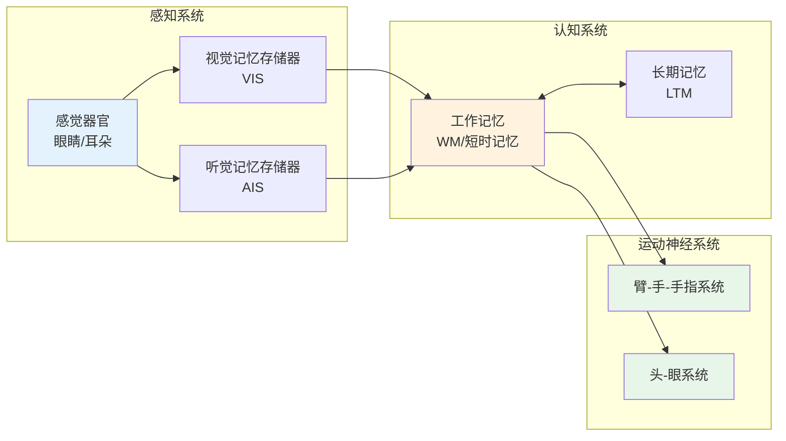
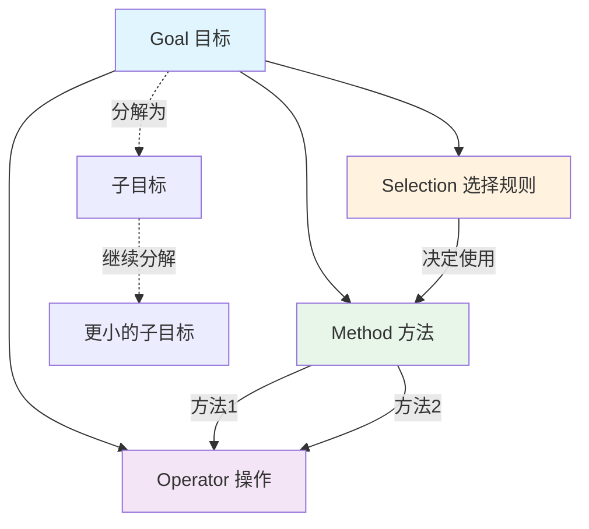
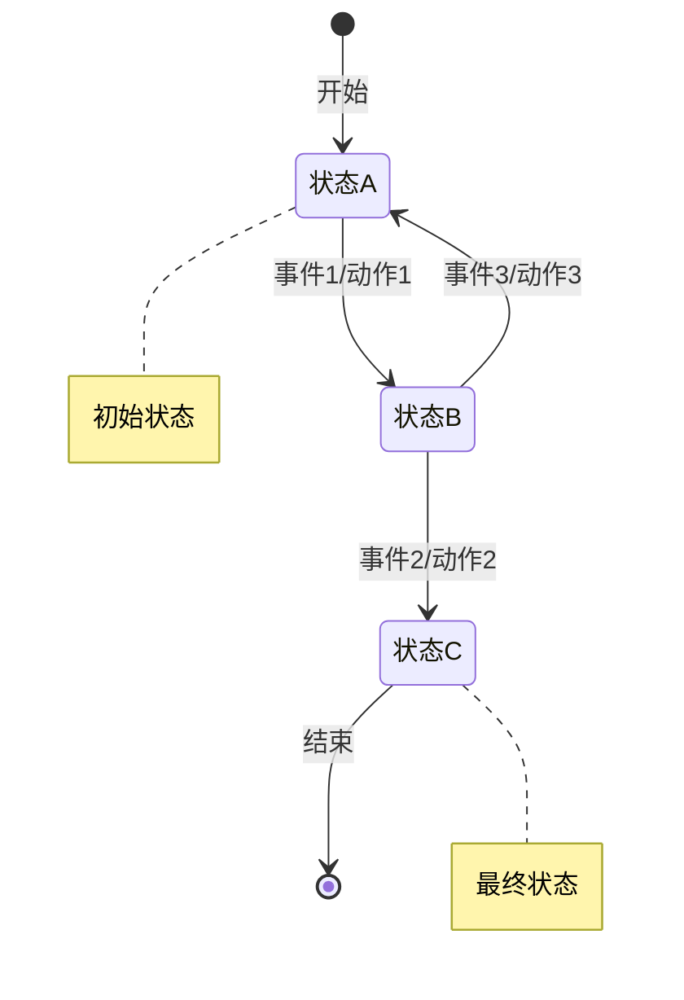
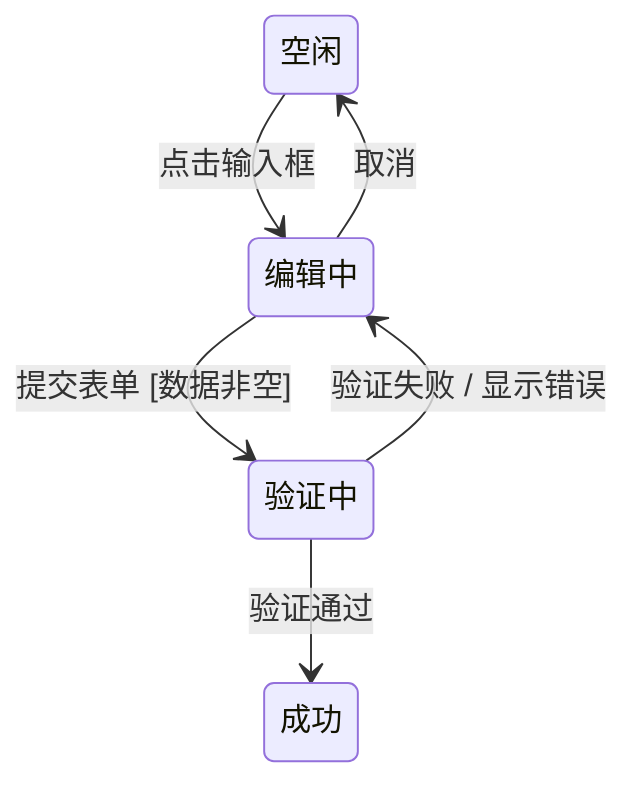
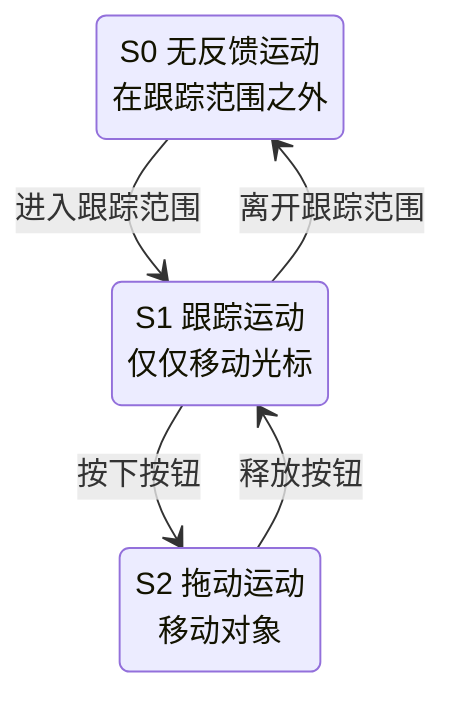
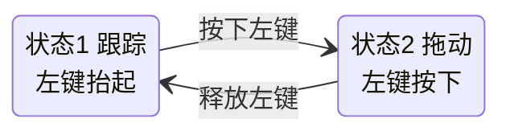
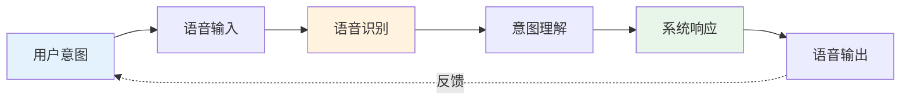

---
tags:
  - Knowledge/Interaction-Design
created: 2025-12-14
author:
  - ln1
status: Done
---

# 交互设计模型与理论

## 交互设计模型概述

### 模型的作用
- **形成想法、表达想法、评估测试想法**
- 帮助设计者理解和预测用户行为
- 为交互设计提供理论基础和实践指导

### 模型分类

#### 预测模型
- 也称功能模式或性能模型，是**先验模型**
- 能在将真实用户引入测试环境前，给出对用户行为的估计
- 主要包括：
  - 人类处理器模型（MHP）
  - 击键模型（KLM）
  - GOMS模型

#### 描述模型
- 提供了思考用户交互的框架
- 如状态网络和三态模型
- 可以帮助理解用户如何与动态系统进行交互

### 应用领域
- **计算用户完成任务的时间**：KLM
- **描述交互过程中系统状态的变化**：动态转移网络
- **探讨任务的执行方法**：GOMS

---

## 一、人类处理器模型（MHP）

### 基本概念
- **Model Human Processor**
- 是一种预测模型
- 提供一种描述人类信息处理的方法
- 能对人的行为做出一般性预测
- 使用一组按照原则（操作原则）运行的存储器和处理器来表现人类的处理系统

### 三个子系统



#### 感知系统
- 处理来自外部世界的感官刺激
- 包含：感觉器官（眼睛和耳朵）、视觉记忆存储器（VIS）、听觉记忆存储器（AIS）

#### 认知系统
- 作必要的处理来连接另两个子系统
- 包含：工作记忆（WM）—短时记忆、长期记忆（LTM）

#### 运动神经系统
- 控制人的动作
- 包含：臂-手-手指系统、头-眼系统

### 记忆系统特性

| 记忆系统 | 操作时间 | 容量 | 编码类型 | 遗忘机制 |
|---------|---------|------|---------|---------|
| 感觉记忆 | 一秒钟的几分之几 | 只限于感受器所接受的 | 瞬时形象记忆和声象记忆（直接编码） | 消极的衰退 |
| 短时记忆 | 少于一分钟 | 只有5-9个项目 | 间接编码 | 消极的衰退 |
| 长时记忆 | 一分钟以上到许多年 | 很大，几乎无限 | 复杂的编码 | 干扰、压抑和遗忘 |

### 工作记忆特性
- **片语信息（Chunking information）**
  - 来自长期记忆的被激活的元素称为片语
  - 由更短的单元组成，就像单词中的字母
  - 也可由若干单词组成，如同短语
  - 片语也可以嵌套

### 操作原则
- **P0. 认知处理器的识别—行动循环**：工作记忆的内容激活长期记忆中相关的内容
- **P1. 可变感知处理器速率原则**：感知处理器循环时间与刺激因素强度大小成反比
- **P2. 编码-特定性规则**：对感知内容的特定编码决定了存储内容
- **P3. 区分原则**：记忆中的候选项和检索线索之间的关系决定了检索难度
- **P4. 可变认知处理器速率原则**：任务需求越多、信息符合越大，认知处理器循环时间就越短

---

## 二、击键层次模型（KLM）

### 基本概念
- **Keystroke-Level Model**
- 是一种实用的设计工具
- 目的是获取或计算用户完成特定任务所采取的行动
- 可用来确定最有效的方法及该方法在特定上下文中的适用性

### 前提条件
- 一项任务（可能包含多个子任务）
- 系统的命令语言
- 用户的运动技能参数
- 系统的响应时间参数
- 完成任务的方法

### 预测目标
专家用户使用给定的系统按照给定的方法无差错的执行给定任务需要的时间

### KLM操作符

| 操作符 | 含义 | 时间 |
|--------|------|------|
| K | 按键盘键或点击鼠标 | - |
| P | 将鼠标移动到屏幕上的一个目标 | 1.1秒 |
| H | 手放置到键盘或其他设备上 | 0.4秒 |
| D | 绘制一条线段 | - |
| M | 心理准备 | - |
| R | 系统响应 | - |

### 编码方法
- **普通表达版本**：详细列出每个操作
- **简略表达版本**：合并相似操作
- **执行时间预测**：Texecute = TK + TP + TH + TD + TM + TR

### 应用实例
**替换文字编辑器中长度为5个字符的单词**：
1. 任务准备 M
2. 将手放在鼠标上 Hmouse
3. 将鼠标移到单词 Pword
4. 选择单词 K
5. 回到键盘 Hkeyboard
6. 准备键入 M
7. 键入新的5字符单词 5Kword

**计算时间**：Texecute = 2TM + TP + 2TH + 6TK = 6.28s

### KLM的局限性
- 没考虑错误
- 没考虑学习性
- 没考虑功能性
- 没考虑回忆
- 没考虑专注程度
- 没考虑可接受性

---

## 三、Fitts定律

### 基本概念
- 点中一个目标的时间是目标大小和目标距离的函数
- 能够预测使用某种定位设备指向某个目标的时间
- 根据目标大小及至目标的距离，计算指向该目标的时间

### 三个基本部分

#### 困难指数（ID）
```
ID = log₂(A/W + 1) (bits)
```
- A为振幅（与目标的距离）
- W为目标宽度
- 对任务困难程度的量化

#### 运动时间（MT）
```
MT = a + b × ID (secs)
```
- 在ID基础上将完成任务的时间量化
- 常数a和b来自线性回归

#### 性能指数（IP）
```
IP = ID/MT (bits/sec)
```
- 也称吞吐量（TP）
- 基于MT和ID的关系

### 设计建议
1. **大目标、小距离具有优势**
2. **屏幕元素应该尽可能多的占据屏幕空间**
3. **最好的像素是光标所处的像素**
4. **屏幕元素应尽可能利用屏幕边缘的优势**
5. **大菜单，如饼型菜单，比其他类型的菜单使用简单**

### 应用实例

#### Mac OS vs Windows XP菜单设计
- **Mac OS**：菜单沿着屏幕边缘排列
  - MT = 50 + 150 log₂(80/50+1) = 256毫秒
- **Windows OS**：菜单位于标题栏下面
  - MT = 50 + 150 log₂(80/5+1) = 663毫秒

#### Mac OS "dock"工具栏
- 工具栏组件大小可以动态改变
- 为用户提供了一个放大的目标区域
- 可显示更多图标

---

## 四、GOMS模型

### 基本概念
用户的交互定义为用户为完成一项任务需要执行的动作序列

### 四个组成部分



- **目标（Goal）**：任务分解为一组目标和子目标
- **操作（Operator）**：执行的动作完成任务
- **方法（Method）**：完成任务的多种实现方法
- **选择规则（Selection）**：用户选择哪一种方法由选择规则决定

### GOMS采用"分而治之"的思想
将一个任务进行多层次的细化

### CMN-GOMS分析

#### 目标（Goals）
- 目标就是用户执行任务最终想要得到的结果
- 可以在不同的层次中进行定义

#### 操作（Operators）
- 操作是任务分析到最低层时的行为
- 是用户为了完成任务所必须执行的基本动作
- 操作不能再被分解——原子动作
- 操作的执行需要时间

#### 方法（Methods）
- 方法是描述如何完成目标的过程
- 本质上是内部的算法
- 用来确定子目标序列及完成目标所需要的操作

#### 选择（Selection）
- 选择是用户要遵守的判定规则
- 以确定在特定环境下所要使用的方法
- 根据特定用户、系统的状态、目标的细节来预测要选择哪种方法

### 其他GOMS模型

#### NGOMSL（自然GOMS语言）
- 为GOMS分析提供了一种结构化的自然语言表示法
- 描述了完成GOMS分析的步骤
- 提供了测量学习特定操作方法所需时间的方法

#### CPM-GOMS
- 感知（Cognitive）
- 认知（Perceptual）
- 运动神经（Motor operators）
- 使用计划评审技术（PERT）图
- 假定感知、认知、运动神经处理器是并行处理

### GOMS的局限性
- 没有清楚的描述错误处理的过程
- 假设用户完全按一种正确的方式进行人机交互
- 只针对那些不犯任何错误的专家用户
- 对于任务之间的关系描述过于简单
- 把所有的任务都看作是面向操作目标的

---

## 五、时序规则语言（LOTOS）

### 基本概念
- **Language Of Temporal Ordering Specification**
- 国际标准形式描述语言
- 适于描述具有并发、交互、反馈和不确定性等特点的并发系统中的行为
- 开始作为一种描述网络协议的语言

### 基本思想
- 系统的外部可见行为可以看作是由一个有时序关系的交互序列组成
- 系统由一系列进程组成
- 进程同环境之间通过称为"关口"（gates）的交互点进行交互
- 用进程之间的约束关系来描述交互子任务之间的关系

### 基本算符

| 算符 | 含义 |
|------|------|
| T1 \|\|\| T2 | 交替（Interleaving）：两个任务相互独立执行 |
| T1 [] T2 | 选择（Choice）：需要在T1，T2中选择一个执行 |
| T1 \|[a1,...,an]\| T2 | 同步（Synchronization）：必须在动作处保持同步 |
| T1 [> T2 | 禁止（Deactivation）：一旦T2被执行，T1便无效 |
| T1 >> T2 | 允许（Enabling）：当T1成功结束后才允许T2执行 |

### LOTOS与GOMS的结合
- LOTOS很好的描述了任务之间的时序约束关系
- GOMS描述任务的分解过程
- 用LOTOS给出子任务之间的约束关系
- 增加两种表示模型的表示能力

---

## 六、UAN模型

### 基本概念
- **User Action Notation 用户行为表示**
- 一种简单的符号语言
- 主要描述用户的行为序列以及在执行任务时所用的界面物理对象
- 兼有行为模型和结构模型的一些特点

### 基本思想
- 预定义一些标识符：用户动作标识符、条件选择标识符
- 采用一种表格结构来表示任务
- 界面被分解成一些类似层次结构的异步任务

### 表格结构
```
任务（task）：任务名称（the name of task）
| 用户行为 | 界面反馈 | 界面状态 |
```

### 动作标识符（部分）
- **~[X]**：在某个图形对象上移动鼠标
- **£**：按下鼠标
- **¢**：释放鼠标
- **!**：使对象高亮显示
- **-!**：取消对象的高亮显示

### 条件选择标识符
- **while(condition) TASK**：当条件为真时，循环执行任务
- **if(condition) then TASK**：如果条件满足，则执行任务
- **iteration A* or A+**：表示迭代操作
- **waiting**：表示等待

### UAN总结
- 更接近于实现
- 界面状态和界面反馈用一般的程序语言描述
- 实现起来比较方便
- 在精确刻画各成分之间的各种并行和串行的时序关系方面尚显不足

---

## 七、Hick定律

### 基本概念
从n个候选项中选择一项花费的时间与以2为底的候选项数加1的对数成比例：
```
T = a + b log₂(n+1)
```

### 前提条件
- 每个候选项被选择的概率相同
- 系数的值来自实验设计的经验值
- Raskin (2000)：a=50, b=150

### 不确定原则
决定时间T随着所做判断或决定的不确定性的增大而增大：
```
T = Ic × H
```
- H是所做决定的信息熵
- Ic = 150[0-157]微秒/比特

### 广度和深度
- **深度**：需要遍历的菜单层次的数据
- **广度**：在每层次上，菜单包含的候选项的数目
- 根据Hick定律：广度优先的菜单结构比深度优先的菜单结构更有效

### 实际应用
- 菜单项的顺序必须是合乎逻辑并相关联的
- 菜单需要按照某些规则进行分组
- 如果规则是有意义的，用户可以使用分组件进行搜索

---

## 八、动态特性建模

### 状态转移网络（STN）

#### 基本概念
- **State Transition Network**
- 系统定义为一个具有一定数量状态的转换机
- 称之为有限状态机（Finite State Machine, FSM）
- FSM从外部世界中接收到事件，并能使FSM从一个状态转换到另一个状态

#### 基本组成
- **状态**（用圆圈表示）
- **转移**（带方向箭头的线）
- **伪状态**（开始、结束）



#### 带条件的状态转换
- 需要对触发条件进行管理（状态 + 条件）
- 包含：条件（转换需要的条件）、动作（状态改变时将执行的动作）



#### 扩展的状态转换网络
- 层次状态转换网络
- 带有取消功能的状态转换图
- 带有帮助功能的状态转换

---

## 九、三态模型（TSM）

### 基本概念
- **Three-State Model**
- Buxton提出的，用于对指点设备建模
- 将指点设备的操作使用状态转移来描述
- 描述指点运动中的3种不同状态

### 三种状态



- **S0：无反馈运动**：在跟踪范围之外
- **S1：跟踪运动**：仅仅移动光标
- **S2：拖动运动**：移动对象

### 不同设备的三态模型

#### 鼠标的三态模型



- **跟踪状态（1）**：左键抬起，拖动鼠标跟踪鼠标运动并更新鼠标位置
- **拖动状态（2）**：左键按下，文件夹在屏幕范围内被拖动

#### 触摸板的三态模型


- **无反馈状态（0）**：手指不接触触摸板，系统不跟踪手指运动
- **跟踪状态（1）**：手指接触触摸板，系统跟踪手指运动
- 在没有其他组件配合的条件下触摸板没有状态2

### 位置依赖性
- **位置独立s0**：鼠标或触摸板，系统保存设备被拿起前的位置
- **位置依赖s0**：手写笔或光笔，重新参与到系统后指示设备当时的位置依赖于设备的位置

### 预览模型
- 当笔和手指接触到屏幕并且进入状态2后，非常明确地表示了自己的位置反馈
- 建议在压力敏感的直接输入设备中引入预览功能和撤销命令

### 应用场景
- 平移和缩放界面
- 三维世界导航
- 绘图程序中颜色选择
- 体积控制
- 窗口控制
- 滚动条操纵

---

## 十、模型的实际应用案例

### 案例1：ATM机界面设计优化

#### 使用KLM模型分析取款流程

**传统ATM取款流程**：
1. 插入银行卡 (H + K)
2. 输入密码 (4K)
3. 选择取款 (M + P + K)
4. 选择金额 (M + P + K)
5. 确认交易 (M + P + K)
6. 等待出钞 (R)
7. 取钞票和卡 (2H)

**计算时间**：
- H = 0.4秒，K = 0.2秒，M = 1.35秒，P = 1.1秒，R = 2秒
- 总时间 ≈ 12.25秒

**优化后的流程**：
- 预设常用金额按钮，减少输入步骤
- 优化界面布局，减少鼠标移动距离
- 优化后时间 ≈ 8.5秒，提升30%效率

> **学习要点**：KLM模型可以量化地比较不同设计方案的效率，为设计决策提供数据支持。

### 案例2：手机APP导航设计

#### 使用Fitts定律优化按钮布局

**问题**：用户经常误触返回按钮，导致操作中断

**分析**：
- 返回按钮太小（24×24px）
- 位置在屏幕顶部，距离拇指较远
- 与其他按钮距离太近

**解决方案**：
- 增大按钮尺寸到44×44px
- 移动到屏幕下方拇指热区
- 增加按钮间距到8px以上

**效果**：误触率降低60%，用户满意度提升

> **实际应用**：Fitts定律不仅适用于鼠标操作，在触摸屏设计中同样重要。

### 案例3：电商网站搜索功能设计

#### 使用GOMS模型分析用户搜索行为

**目标**：在电商网站找到想要的商品

**方法1：直接搜索**
- 操作：输入关键词 → 点击搜索 → 浏览结果
- 适用：用户明确知道想要什么

**方法2：分类浏览**
- 操作：选择分类 → 选择子分类 → 浏览商品
- 适用：用户想要浏览和比较

**选择规则**：
- 如果用户有明确目标 → 使用搜索
- 如果用户想要探索 → 使用分类浏览
- 如果搜索结果太多 → 结合筛选功能

**设计启示**：
- 提供多种查找方式
- 根据用户行为智能推荐
- 优化搜索结果的展示方式

---

## 十一、模型的局限性与改进

### 人类处理器模型的局限性

#### 模型假设的问题：
1. **假设人是理性的信息处理器**
   - 实际：人会受情绪、疲劳、压力影响
   - 改进：考虑情境因素和个体差异

2. **忽略了学习和适应过程**
   - 实际：用户会学习和形成习惯
   - 改进：引入学习曲线和经验效应

3. **过于简化认知过程**
   - 实际：认知过程更加复杂和动态
   - 改进：结合认知心理学最新研究

> **理解要点**：模型是简化的工具，不能完全代替真实的用户研究和测试。

### KLM模型的改进方向

#### 扩展操作符：
- **触摸操作（T）**：适应触屏设备
- **语音操作（V）**：语音交互时间
- **眼动操作（E）**：视觉搜索时间
- **思考操作（C）**：复杂决策时间

#### 情境因素考虑：
- **设备类型**：手机、平板、电脑的差异
- **使用环境**：安静办公室 vs 嘈杂地铁
- **用户状态**：专注 vs 分心，熟练 vs 新手

### 现代交互模型的发展

#### 多模态交互模型：
- **语音+触摸**：智能手机的Siri + 屏幕操作
- **手势+视觉**：VR/AR环境中的交互
- **脑机接口**：未来的直接思维控制

#### 情感计算模型：
- **情绪识别**：通过面部表情、语音识别用户情绪
- **情感响应**：系统根据用户情绪调整交互方式
- **情感设计**：设计能引发特定情感的界面

---

## 十二、新兴交互模式的建模

### 语音交互建模

#### 语音交互的特殊性：
- **时间性**：语音是线性的，不能"回看"
- **模糊性**：语音识别可能出错
- **情境性**：环境噪音影响识别效果

#### 语音交互模型：



**关键参数**：
- **识别准确率**：影响用户体验的关键因素
- **响应时间**：用户期望快速响应
- **错误恢复**：识别错误时的处理机制

> **设计启示**：语音界面需要更多的确认和反馈机制，因为用户无法"看到"系统的理解过程。

### 手势交互建模

#### 手势交互的分类：
- **触摸手势**：点击、滑动、捏合等
- **空中手势**：挥手、指向、抓取等
- **眼动手势**：注视、眨眼等

#### 手势识别模型：

```mermaid
graph LR
    A[物理动作] --> B[传感器捕获]
    B 

**设计考虑**：
- **自然性**：手势要符合人的自然行为
- **一致性**：相同手势在不同场景下含义一致
- **可发现性**：用户能够发现和学习手势

### 脑机接口建模

#### 基本原理：
- **脑电信号采集**：通过电极检测大脑活动
- **信号处理**：过滤噪音，提取有用信号
- **意图识别**：将脑电信号转换为控制命令

#### 应用前景：
- **医疗康复**：帮助瘫痪患者控制设备
- **增强现实**：直接通过思维控制虚拟对象
- **高效输入**：比传统输入方式更快速

> **未来展望**：虽然目前技术还不成熟，但脑机接口代表了人机交互的终极形态。

---

## 十三、模型在设计实践中的应用策略

### 设计阶段的模型选择

#### 需求分析阶段：
- **用户研究**：了解用户的心理模型
- **任务分析**：使用HTA分解复杂任务
- **场景建模**：构建用户使用场景

#### 概念设计阶段：
- **信息架构**：组织内容和功能
- **交互流程**：设计用户操作路径
- **状态转换**：定义系统状态变化

#### 详细设计阶段：
- **界面布局**：应用Fitts定律优化布局
- **操作效率**：使用KLM预测操作时间
- **错误处理**：设计错误恢复机制

#### 测试验证阶段：
- **可用性测试**：验证设计假设
- **性能测试**：测量实际操作时间
- **用户反馈**：收集主观评价

### 模型组合使用策略

#### 多模型验证：
- **不同角度分析**：用多个模型分析同一个设计问题
- **交叉验证**：模型预测与实际测试结果对比
- **综合决策**：结合多个模型的结果做决策

#### 迭代优化：
- **快速原型**：用简单模型快速评估设计
- **精细建模**：对关键功能进行详细建模
- **持续改进**：根据使用数据更新模型参数

---

## 十四、模型工具与软件

### 建模工具推荐

#### 任务分析工具：
- **ConcurTaskTrees**：层次化任务分析工具
- **GOMS-KLM Calculator**：KLM时间计算器
- **TaskArchitect**：任务建模和分析工具

#### 原型工具：
- **Figma**：支持交互原型和状态管理
- **Principle**：专注于交互动画设计
- **Framer**：代码化的高保真原型工具

#### 分析工具：
- **Google Analytics**：用户行为数据分析
- **Hotjar**：用户行为热图分析
- **Maze**：可用性测试和分析平台

### 自制建模工具

#### 简单计算器：
```python
# KLM时间计算器示例
def calculate_klm_time(operations):
    times = {
        'K': 0.2,  # 按键时间
        'P': 1.1,  # 指向时间
        'H': 0.4,  # 手部移动时间
        'M': 1.35, # 心理准备时间
        'R': 2.0   # 系统响应时间
    }
    
    total_time = 0
    for op, count in operations.items():
        total_time += times[op] * count
    
    return total_time

# 使用示例
operations = {'K': 5, 'P': 2, 'H': 1, 'M': 2}
time = calculate_klm_time(operations)
print(f"预计完成时间: {time:.2f}秒")
```

---

## 十五、模型研究的前沿发展

### 人工智能与交互建模

#### AI辅助建模：
- **自动任务分析**：AI分析用户行为日志，自动生成任务模型
- **智能参数调优**：根据实际数据自动调整模型参数
- **个性化建模**：为不同用户群体建立专门的模型

#### 机器学习在交互预测中的应用：
- **行为预测**：预测用户下一步可能的操作
- **性能预测**：预测界面设计的可用性指标
- **错误预测**：预测用户可能犯的错误

### 跨文化交互建模

#### 文化因素的影响：
- **认知模式差异**：东西方用户的思维方式不同
- **交互习惯差异**：不同文化对界面布局的偏好
- **色彩理解差异**：颜色在不同文化中的含义

#### 跨文化设计策略：
- **本地化建模**：为不同文化建立专门的交互模型
- **通用设计原则**：寻找跨文化的通用交互规律
- **适应性设计**：系统能够根据用户文化背景调整

### 可持续交互设计

#### 环境友好的交互设计：
- **能耗建模**：计算不同交互方式的能源消耗
- **碳足迹评估**：评估数字产品的环境影响
- **绿色设计原则**：设计更环保的交互方式

---

## 小结

### 交互设计模型的核心价值
1. **科学化设计**：用量化方法指导设计决策
2. **预测用户行为**：在设计阶段就能预估用户体验
3. **优化设计效率**：避免盲目试错，提高设计效率
4. **标准化流程**：建立可重复的设计和评估流程

### 模型应用的最佳实践
1. **选择合适的模型**：根据设计阶段和问题类型选择
2. **结合实际测试**：模型预测要与用户测试相结合
3. **持续更新模型**：根据新数据和新技术更新模型
4. **跨学科合作**：结合心理学、计算机科学等多学科知识

### 未来发展趋势
1. **智能化建模**：AI辅助的自动化建模工具
2. **多模态融合**：支持语音、手势、眼动等多种交互方式
3. **个性化模型**：为不同用户群体定制的专门模型
4. **实时优化**：基于实时数据动态调整交互设计

### 学习建议
1. **理论与实践结合**：不要只学理论，要动手应用
2. **关注新技术**：跟上VR、AR、AI等新技术的发展
3. **跨领域学习**：学习心理学、认知科学等相关知识
4. **批判性思维**：理解模型的局限性，不盲目依赖

> **最终目标**：通过科学的建模方法，设计出更符合人类认知规律、更高效易用的交互系统，让技术真正服务于人类的需求和福祉。