学号：2023112573
姓名：张春冉

---

## 1. 简化设计策略应用分析

**案例对象**：微信APP

### 1.1 产品简介
微信是一款社交通讯软件，功能包括聊天、朋友圈、支付、小程序等。本次分析以微信的"发现"页面为例，运用简化设计的四策略进行分析。

### 1.2 简化设计方案

运用简化设计四策略（删除、组织、隐藏、转移），对微信"发现"页面进行分析：

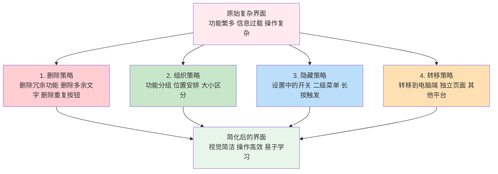

**策略选择决策流程**：

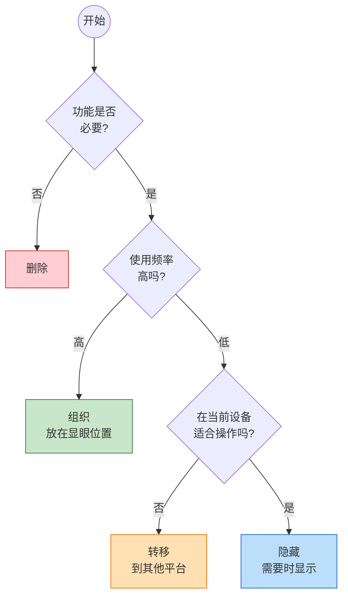

#### (1) 删除策略 (Delete)

**课程原理**：
- 最明显的简化设计方法
- 删除杂乱的特性，让设计师专注于把有限的重要问题解决好
- 思维转变：从"为什么应该去掉它"转变为"为什么要留着它？"
- 避免"沉没成本误区"

**微信的删除实践**：

| 删除内容 | 删除理由 | 效果 |
|---------|---------|------|
| 删除冗余的功能入口 | 64%的软件功能从未使用或极少使用 | 界面更简洁 |
| 删除过多的文字说明 | Steve Krug法则："把文字删掉一半，再删掉一半" | 信息更聚焦 |
| 删除重复的操作按钮 | 减少视觉噪点 | 操作更清晰 |

**删减文字的方法**：
- 不使用介词（对于/根据/为了/基于/通过/关于）
- 把被动句式转换为主动句式
- 删除索然无味的开头，开门见山

#### (2) 组织策略 (Organize)

**课程原理**：
- 最快捷的简化设计方式
- 分块：可对命令分块，如菜单
- 围绕行为进行组织
- 确定清晰的分类标准
- 重要的元素要大一些，不太重要的界面元素应该小一些
- 规则：如果一个元素的重要性为1/2，那就把它的大小做成1/4

**微信的组织实践**：

| 组织方式 | 具体应用 | 设计原理 |
|---------|---------|---------|
| 功能分组 | 朋友圈、视频号、直播放在一起（社交内容类） | 按照用户心理模型分组 |
| 位置安排 | 朋友圈放在最上方 | 高频功能放在显眼位置 |
| 大小区分 | 主要功能图标更大 | 重要元素更大更显眼 |

#### (3) 隐藏策略 (Hide)

**课程原理**：
- 隐藏是一种低成本的简化方案
- 用户不会因不常用的功能分散注意力
- 隐藏主流用户很少使用，但自身需要更新的功能
- 渐进展示：核心功能供主流用户使用，扩展功能为专家用户准备

**微信的隐藏实践**：

| 隐藏内容 | 隐藏方式 | 触发条件 |
|---------|---------|---------|
| 发现页管理 | 设置中的开关 | 用户主动进入设置 |
| 小程序详细设置 | 二级菜单 | 长按小程序图标 |
| 朋友圈高级功能 | 长按触发 | 用户长按相关区域 |

#### (4) 转移策略 (Displace)

**课程原理**：
- 将功能转移到其他设备、平台或服务上
- 减轻主要产品的复杂性

**微信的转移实践**：

| 转移内容 | 转移目标 | 转移理由 |
|---------|---------|---------|
| 文件传输 | 微信文件传输助手/电脑端 | 大文件处理更适合电脑 |
| 公众号管理 | 公众号后台网页版 | 复杂编辑需要大屏幕 |
| 支付管理 | 微信支付独立页面 | 金融功能需要独立安全环境 |

### 1.3 简化前后对比分析

| 维度 | 简化前（假设） | 简化后（当前设计） | 分析依据 |
|------|--------------|------------------|---------|
| **视觉负荷** | 所有功能平铺展示 | 分层展示，核心功能突出 | 减轻短时记忆负担（Shneiderman黄金规则第8条） |
| **操作效率** | 需要多次点击找功能 | 高频功能一步到达 | 符合Fitts定律：大目标、小距离具有优势 |
| **学习成本** | 功能多难以记忆 | 符合用户心理模型 | 依赖识别而非记忆（Nielsen第6条） |
| **错误率** | 容易误触 | 危险操作有确认 | 预防并处理错误（Shneiderman第5条） |

---

## 2. G-U-L模型分析：绘制圆功能

**功能模块**：交互式绘图软件中的"绘制圆"功能

### 2.1 任务描述
用户使用鼠标在画布上绘制一个圆形。操作方式：点击确定圆心位置，拖动确定半径，释放完成绘制。

### 2.2 GOMS分析

GOMS模型包含四个组成部分：
- **目标（Goal）**：任务分解为一组目标和子目标
- **操作（Operator）**：执行的动作完成任务（原子动作，不能再分解）
- **方法（Method）**：完成任务的多种实现方法
- **选择规则（Selection）**：用户选择哪一种方法由选择规则决定

#### 目标层次分解 (Goals)

GOMS模型采用"分而治之"思想，将绘制圆任务进行多层次细化：

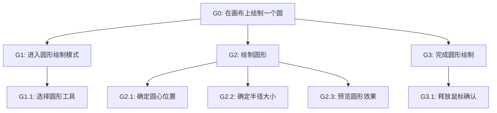

**目标层次与对应操作**：

| 目标 | 描述 | KLM操作符 |
|------|------|----------|
| G0 | 在画布上绘制一个圆（顶层目标） | - |
| G1 | 进入圆形绘制模式 | - |
| G1.1 | 选择圆形工具 | P + K |
| G2 | 绘制圆形 | - |
| G2.1 | 确定圆心位置 | P + K↓ |
| G2.2 | 确定半径大小 | D(拖动) |
| G2.3 | 预览圆形效果 | 橡皮筋技术 |
| G3 | 完成圆形绘制 | - |
| G3.1 | 释放鼠标确认 | K↑ |

#### 操作符 (Operators)

KLM模型的操作符定义：

| 操作符 | 含义 | 预估时间 |
|--------|------|---------|
| K | 按键盘键或点击鼠标 | 0.2秒 |
| P | 将鼠标移动到屏幕上的一个目标 | 1.1秒 |
| H | 手放置到键盘或其他设备上 | 0.4秒 |
| M | 心理准备 | 1.35秒 |
| D | 绘制一条线段（拖动） | 变量 |

#### 方法 (Methods)

**方法M1：圆心-半径法绘制圆**
```
1. M    - 心理准备：决定绘制圆形
2. P    - 移动鼠标到圆形工具图标
3. K    - 点击选择圆形工具
4. M    - 心理准备：确定圆心位置
5. P    - 移动鼠标到画布目标位置（圆心）
6. K↓   - 按下鼠标（确定圆心）
7. D    - 拖动鼠标（确定半径，橡皮筋效果）
8. K↑   - 释放鼠标（完成绘制）
```


#### 选择规则 (Selection Rules)

```
规则1：如果用户想要绘制精确尺寸的圆
       则 使用数值输入方式（输入圆心坐标和半径值）

规则2：如果用户想要快速绘制大致的圆
       则 使用鼠标拖动方式

规则3：如果用户想要绘制正圆（而非椭圆）
       则 按住Shift键同时拖动
```

### 2.3 LOTOS分析

LOTOS（Language Of Temporal Ordering Specification）用于描述任务之间的时序约束关系。

#### 基本算符

| 算符 | 含义 | 说明 |
|------|------|------|
| T1 >> T2 | 允许（Enabling） | 当T1成功结束后才允许T2执行 |
| T1 [] T2 | 选择（Choice） | 需要在T1，T2中选择一个执行 |
| T1 \|\|\| T2 | 交替（Interleaving） | 两个任务相互独立执行，可任意顺序 |
| T1 [> T2 | 禁止（Deactivation） | 一旦T2被执行，T1便无效 |

#### 绘制圆的LOTOS描述

**LOTOS时序关系图**：

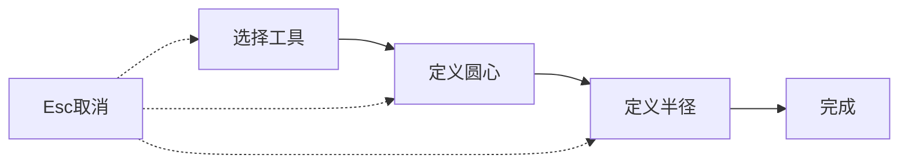

**时序关系说明**：
- 实线箭头(→)：允许关系(>>)，前一步完成后才能执行下一步
- 虚线箭头(--->)：禁止关系([>)，Esc可中断任意步骤

**LOTOS形式化描述**：

```lotos
-- 绘制圆任务的LOTOS形式化描述

GOAL: DrawCircle
    SelectTool >> DefineCenter >> DefineRadius >> Finish

-- 选择工具（必须先完成）
SelectTool:
    MoveToIcon >> ClickIcon

-- 定义圆心（选择工具后才能执行）
DefineCenter:
    MoveToPosition >> MouseDown

-- 定义半径（定义圆心后才能执行）
DefineRadius:
    DragMouse

-- 完成绘制
Finish:
    MouseUp

-- 整体任务结构（带取消功能）
CompleteTask:
    (SelectTool >> DefineCenter >> DefineRadius >> Finish)
    [>  -- 可被取消操作中断（禁止关系）
    PressEsc
```

#### LOTOS分析说明

LOTOS与GOMS的结合可以：
- LOTOS很好的描述了任务之间的**时序约束关系**
- GOMS描述任务的**分解过程**
- 用LOTOS给出子任务之间的**约束关系**
- 增加两种表示模型的表示能力

**时序关系分析**：
1. **顺序关系（>>）**：必须先选择工具，才能定义圆心；必须先定义圆心，才能定义半径
2. **禁止关系（[>）**：按Esc可以在任何时候取消绘制操作

### 2.4 UAN分析

UAN（User Action Notation）是一种简单的符号语言，主要描述用户的行为序列以及在执行任务时所用的界面物理对象。

#### UAN符号

| 符号 | 含义 |
|------|------|
| ~[X] | 在某个图形对象X上移动鼠标 |
| M↓ 或 £ | 按下鼠标 |
| M↑ 或 ¢ | 释放鼠标 |
| ! | 使对象高亮显示 |
| -! | 取消对象的高亮显示 |

#### 绘制圆的UAN表格

**任务：DrawCircle（绘制圆）**

| 步骤 | 用户行为 | 界面反馈 | 界面状态 |
|------|---------|---------|---------|
| **1. 选择工具** | | | |
| 1.1 | ~[CircleIcon] | CircleIcon! (图标高亮) | hover_state |
| 1.2 | M↓M↑ (单击) | 图标凹陷, 光标变为十字(+) | mode = DRAW_CIRCLE |
| **2. 确定圆心** | | | |
| 2.1 | ~[Canvas(x,y)] | 显示坐标提示(x,y) | cursor_pos = (x,y) |
| 2.2 | M↓ (按下鼠标) | 显示圆心标记点 | center = (x,y) |
| **3. 确定半径** | | | |
| 3.1 | ~[Canvas] (拖动) | 橡皮筋圆形实时显示, 显示半径数值 | radius = distance(center, current) |
| **4. 完成绘制** | | | |
| 4.1 | M↑ (释放鼠标) | 橡皮筋变为实线圆形, 显示选中状态 | create_circle(center, radius) |

### 2.5 G-U-L模型综合分析

#### 三种模型的关系与互补性

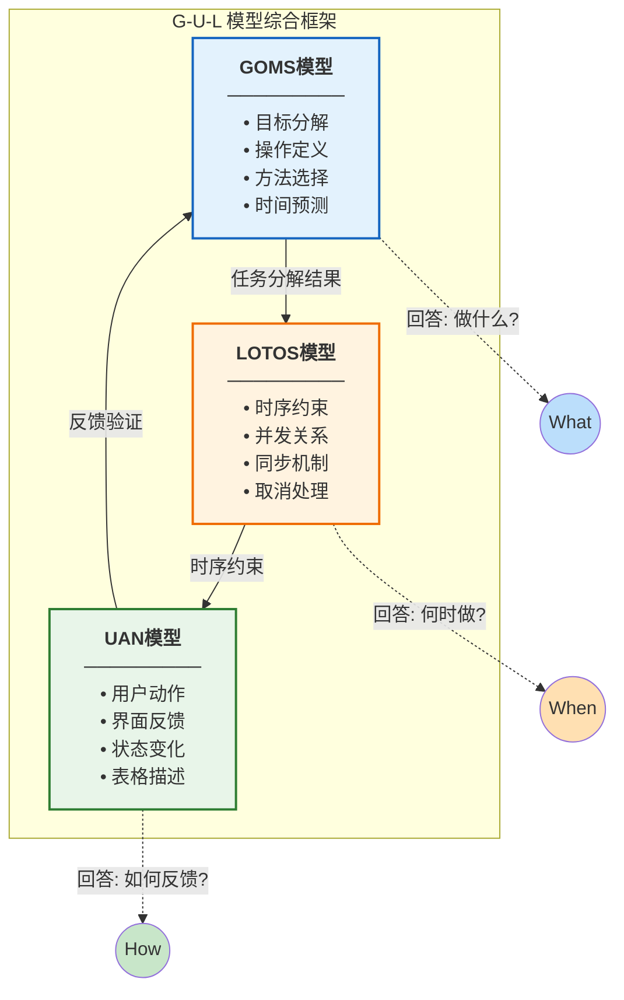

#### 模型对比分析

| 模型 | 关注点 | 核心问题 | 在绘制圆中的应用 |
|------|--------|---------|-----------------|
| GOMS | 任务分解、操作时间预测 | 做什么？多久？ | 分析绘制圆的步骤和时间(≈5.3秒) |
| LOTOS | 任务间的时序约束关系 | 何时做？顺序？ | 描述选择工具→定义圆心→定义半径的顺序约束 |
| UAN | 用户动作与系统反馈的对应 | 如何反馈？ | 详细描述每个操作的界面反馈 |

#### 设计启示

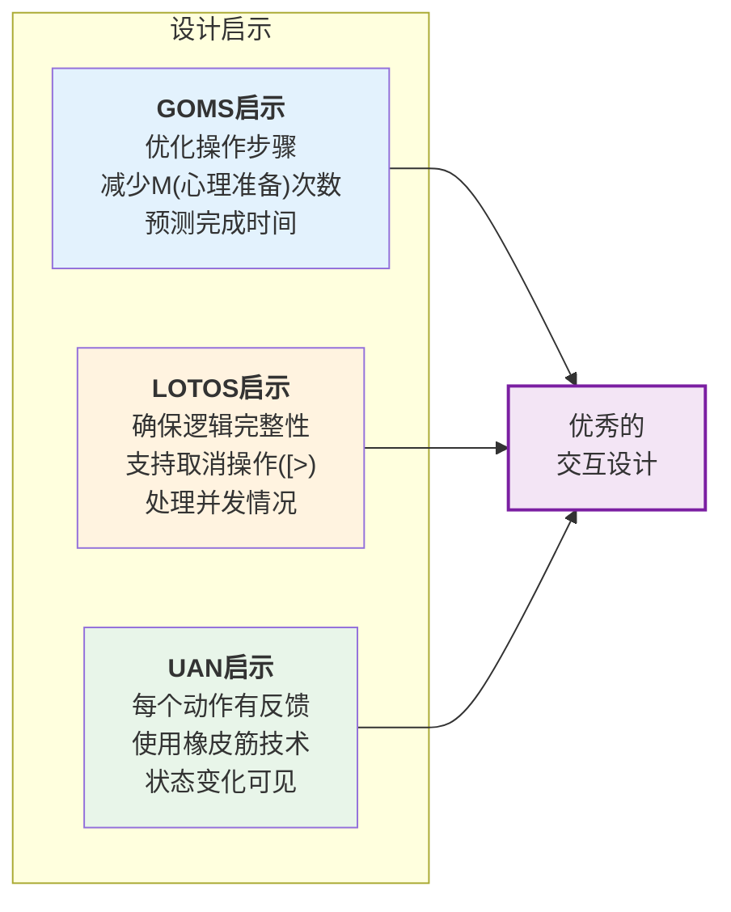

---

## 3. 基于鼠标三态模型的交互分析

**分析场景**：类似 Microsoft Word 的绘图功能，分析图形对象的选择、移动、缩放、旋转操作

**软件参考**：Word、PowerPoint、Visio 等 Office 绘图工具

### 3.1 鼠标三态模型理论基础

三态模型（TSM, Three-State Model）由 Buxton 提出，用于对指点设备建模。

#### 鼠标扩展状态转换模型

鼠标的状态转换模型可以扩展为包含悬停、跟踪、左键拖动、右键拖动、拖放等多种状态：

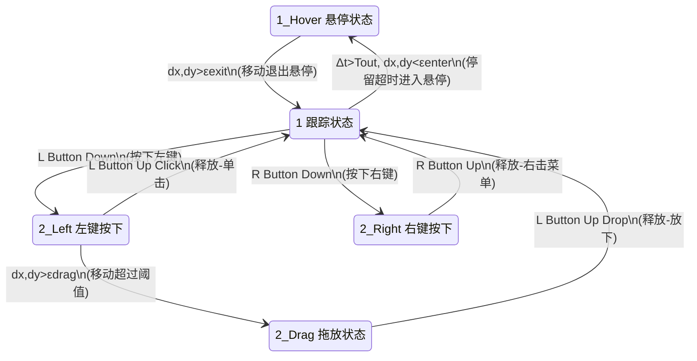

#### 状态说明

| 状态 | 名称 | 进入条件 | 退出条件 | 在Word绘图中的作用 |
|------|------|---------|---------|-------------------|
| **1** | 跟踪状态 | 鼠标移动 | 按下按钮/停留超时 | 移动光标，预览对象 |
| **1_Hover** | 悬停状态 | 停留时间 > Tout 且位移 < εenter | 位移 > εexit | 显示工具提示、对象高亮 |
| **2_Left** | 左键按下 | 按下左键 | 释放左键(单击)/移动超阈值 | 选中对象 |
| **2_Right** | 右键按下 | 按下右键 | 释放右键 | 显示右键菜单 |
| **2_Drag** | 拖放状态 | 左键按下且移动 > εdrag | 释放左键(放下) | 移动/缩放/旋转对象 |

#### 参数说明

| 参数 | 含义 | 典型值 |
|------|------|--------|
| dx, dy | 鼠标位移量 | - |
| Δt | 停留时间 | - |
| Tout | 悬停超时阈值 | 约500ms |
| εenter | 进入悬停的位移阈值 | 约2-3像素 |
| εexit | 退出悬停的位移阈值 | 约5像素 |
| εdrag | 进入拖放的位移阈值 | 约4像素 |

#### 鼠标的三态模型特点

- **跟踪状态（1）**：左键抬起，系统跟踪鼠标运动并更新光标位置
- **悬停状态（1_Hover）**：鼠标停留一段时间后进入，用于显示提示信息
- **左键按下（2_Left）**：左键按下但未移动，用于选中对象
- **拖放状态（2_Drag）**：左键按下并移动超过阈值，用于移动/缩放/旋转对象
- **右键按下（2_Right）**：右键按下，通常用于显示上下文菜单

### 3.2 Word绘图中的对象选择（状态分析）

#### 场景描述
用户在 Word 文档中插入了一个矩形形状，现在要选中它进行编辑。

#### 选择对象的状态转换流程

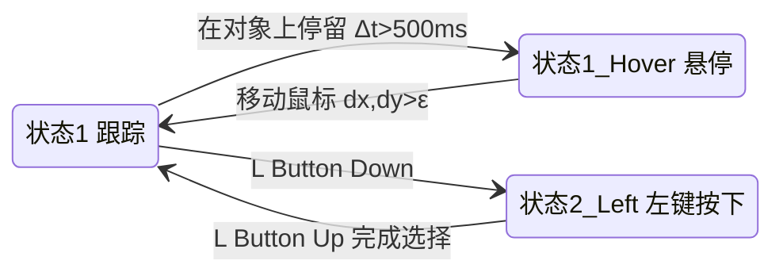

#### S1状态（跟踪）的交互设计

| 鼠标位置 | 光标形状 | 视觉反馈 | 设计依据 |
|---------|---------|---------|---------|
| 文档空白区域 | I 型光标 | 无 | 表示可输入文本 |
| 形状内部 | 四向箭头 ✥ | 形状边框高亮 | 表示可移动对象 |
| 形状边框线上 | 四向箭头 ✥ | 边框加粗显示 | 提示可选中 |
| 控制手柄上 | 双向箭头 ↔↕ | 手柄放大高亮 | 表示可缩放 |
| 旋转手柄上 | 旋转光标 ↻ | 手柄高亮 | 表示可旋转 |

#### S1→S2状态转换：单击选中对象

**用户动作**：在形状上单击鼠标左键（M↓M↑）

**系统响应**：
1. 形状显示选中状态（蓝色边框）
2. 显示8个缩放控制手柄（四角+四边中点）
3. 显示1个旋转控制手柄（顶部上方）
4. 右侧属性面板显示形状属性
5. 功能区切换到"形状格式"选项卡

### 3.3 Word绘图中的对象移动（状态分析）

#### 场景描述
用户已选中一个矩形，现在要将它拖动到文档的另一个位置。

#### 移动对象的状态转换流程


**关键状态转换说明**：
- **状态1 → 2_Left**：按下左键，准备操作
- **2_Left → 状态1**：直接释放，仅完成选中（Click）
- **2_Left → 2_Drag**：移动超过阈值εdrag，进入拖放
- **2_Drag → 状态1**：释放左键，完成移动（Drop）

#### S2状态（拖动）的交互设计

| 交互元素 | 具体表现 | 设计原理 |
|---------|---------|---------|
| **实时跟随** | 对象实时跟随鼠标位置移动 | 直接操纵原则 |
| **半透明预览** | 移动时对象显示为半透明 | 区分操作中与完成状态 |
| **智能对齐线** | 靠近页边距/其他对象时显示绿色虚线 | 预防错误（Shneiderman第5条） |
| **自动吸附** | 接近对齐位置时自动吸附 | 提高精确度 |
| **位置提示** | 显示当前坐标或相对位移 | 系统状态可见性（Nielsen第1条） |
| **Shift约束** | 按住Shift键限制为水平/垂直移动 | 提供快捷方式（Nielsen第7条） |

### 3.4 Word绘图中的对象缩放（状态分析）

#### 场景描述
用户已选中一个矩形，现在要通过拖动控制手柄来调整其大小。
#### 缩放操作的状态转换

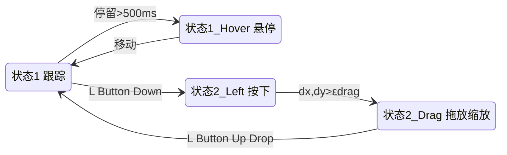

#### 不同手柄的状态行为对比

| 手柄类型 | 状态1(跟踪) | 状态1_Hover(悬停) | 状态2_Drag(拖放) |
|---------|------------|-------------------|------------------|
| **角手柄 ●** | 光标: ↘↗ 或 ↙↖ | 手柄放大+提示"拖动调整大小" | 等比例缩放 |
| **边中手柄 ●** | 光标: ↔ 或 ↕ | 手柄放大+提示 | 单向缩放(宽或高) |
| **旋转手柄 ○** | 光标: ↻ | 手柄放大+提示"拖动旋转" | 绕中心旋转 |

#### 缩放操作的详细状态分析

| 阶段 | 状态 | 用户动作 | 系统反馈 |
|------|------|---------|---------|
| **悬停** | 1_Hover | 在手柄上停留 | 光标变化，手柄高亮放大 |
| **按下** | 2_Left | L Button Down | 准备缩放，等待位移判断 |
| **缩放中** | 2_Drag | 拖动鼠标 | 对象实时缩放，显示尺寸(如: 5.2cm × 3.1cm) |
| **约束缩放** | 2_Drag | 拖动 + Shift | 保持原始宽高比例 |
| **中心缩放** | 2_Drag | 拖动 + Ctrl | 以对象中心为基准缩放 |
| **完成** | 1 | L Button Up | 确认新尺寸，加入撤销栈 |

### 3.5 Word绘图中的对象旋转（状态分析）

#### 场景描述
用户已选中一个矩形，现在要通过旋转手柄将其旋转一定角度。

#### 旋转操作的状态转换

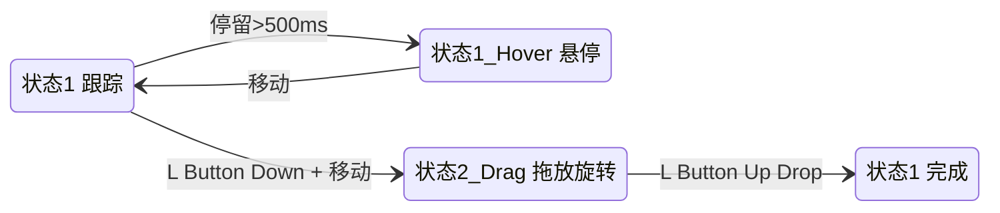

#### 旋转操作的约束功能

| 操作方式 | 旋转行为 | 应用场景 |
|---------|---------|---------|
| 普通拖动 | 自由旋转，任意角度 | 需要精确角度时 |
| Shift + 拖动 | 限制为15°的倍数(0°, 15°, 30°, 45°...) | 快速对齐到常用角度 |
| 输入数值 | 在属性面板直接输入角度值 | 需要精确到小数的角度 |

### 3.6 综合状态模型图

#### Word绘图对象操作的完整状态转换模型

Word 绘图功能的完整鼠标状态转换模型：

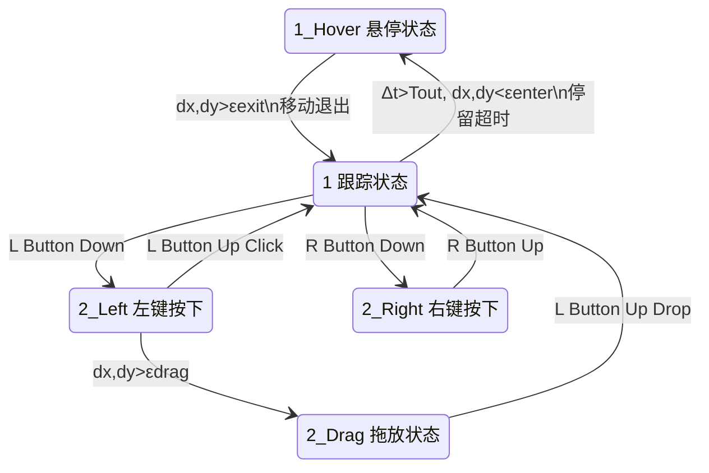

#### 状态转换条件汇总

| 转换 | 触发条件 | Word绘图中的含义 |
|------|---------|-----------------|
| 1 → 1_Hover | Δt > Tout 且 dx,dy < εenter | 鼠标停留超过500ms，显示工具提示 |
| 1_Hover → 1 | dx,dy > εexit | 鼠标移动，隐藏提示 |
| 1 → 2_Left | L Button Down | 按下左键，准备选中或操作 |
| 2_Left → 1 | L Button Up (Click) | 释放左键，完成单击选中 |
| 2_Left → 2_Drag | dx,dy > εdrag | 移动超过阈值，进入拖放操作 |
| 2_Drag → 1 | L Button Up (Drop) | 释放左键，完成移动/缩放/旋转 |
| 1 → 2_Right | R Button Down | 按下右键 |
| 2_Right → 1 | R Button Up (R Click) | 释放右键，显示上下文菜单 |

#### 各状态在Word绘图中的具体应用

| 状态 | 在对象上 | 在手柄上 | 在空白区域 |
|------|---------|---------|-----------|
| **1 跟踪** | 光标✥，边框预览 | 光标↔↕↘↻ | 光标I型 |
| **1_Hover 悬停** | 显示对象信息 | 显示"拖动调整大小" | 无 |
| **2_Left 左键按下** | 选中对象 | 准备缩放/旋转 | 准备框选 |
| **2_Drag 拖放** | 移动对象 | 缩放/旋转对象 | 框选多个对象 |
| **2_Right 右键** | 显示对象菜单 | 显示手柄菜单 | 显示文档菜单 |

### 3.7 三态模型的设计优化建议

总结 Word 绘图功能的状态模型设计优化：

#### S1状态（跟踪）优化

| 优化点 | Word中的实现 | 设计依据 |
|-------|-------------|---------|
| **光标语义化** | 不同位置显示不同光标形状 | 系统状态可见性 |
| **悬停预览** | 鼠标悬停时对象边框高亮 | 依赖识别而非记忆 |
| **手柄放大** | 悬停在手柄上时手柄放大 | Fitts定律：增大目标 |
| **工具提示** | 悬停显示"拖动以调整大小" | 帮助和文档 |

#### S2状态（拖动）优化

| 优化点 | Word中的实现 | 设计依据 |
|-------|-------------|---------|
| **实时反馈** | 操作过程中持续显示数值 | 提供信息丰富的反馈 |
| **智能辅助** | 对齐线、吸附、网格 | 预防错误 |
| **约束操作** | Shift/Ctrl修饰键 | 使用的灵活性和高效性 |
| **支持取消** | 拖动中按Esc取消 | 用户控制与自由 |

#### 状态转换优化

| 优化点 | Word中的实现 | 设计依据 |
|-------|-------------|---------|
| **平滑过渡** | 状态切换有微动画 | 一致性 |
| **操作确认** | 释放鼠标时有视觉确认 | 设计对话框以生成结束信息 |
| **支持撤销** | Ctrl+Z撤销任何操作 | 让操作容易撤销 |
| **多选支持** | Shift+点击多选对象 | 减轻短时记忆负担 |

### 3.8 UAN表格描述（移动对象）

使用UAN表格结构描述Word中移动对象的交互：

**任务：MoveObject（移动形状对象）**

| 步骤 | 用户行为 | 界面反馈 | 界面状态 |
|------|---------|---------|---------|
| **1. 定位对象** | | | |
| 1.1 | ~[Shape] | Shape边框高亮, 光标变为✥ | hover_state = true |
| **2. 开始移动** | | | |
| 2.1 | M↓ (按下鼠标) | Shape显示选中状态 | selected = true |
| **3. 拖动移动** | | | |
| 3.1 | ~[Document] (拖动) | Shape跟随移动, 显示对齐线 | position = (x, y) |
| **4. 完成移动** | | | |
| 4.1 | M↑ (释放鼠标) | 对齐线消失, 位置确认 | undoStack.push(move) |

### 3.9 小结

三态模型分析 Word 绘图功能的设计要点：

1. **充分利用S1状态**：通过光标变化和视觉高亮，让用户在操作前就能预知操作结果
2. **S2状态提供丰富反馈**：实时显示数值、对齐线、约束提示等
3. **状态转换要平滑**：使用动画过渡，提供明确的操作确认
4. **支持多种操作方式**：普通操作 + 修饰键约束，满足不同用户需求
5. **始终支持撤销**：任何操作都可以撤销，降低用户的操作焦虑

---

## 4. 启发式评估报告

**评估对象**：网易云音乐APP
**评估方法**：基于Nielsen十项启发式规则
**评估日期**：2025年12月

### 4.1 评估规则定义

采用**Nielsen十项启发式规则**：

| 编号 | 原则名称 | 具体含义 |
|------|---------|---------------------|
| H1 | 系统状态的可见度 | 对于任何预期超过3-5秒的活动，给用户状态反馈 |
| H2 | 系统和现实世界的吻合 | 使用用户的语言，不使用专业术语 |
| H3 | 用户享有控制权和自主权 | 提供"返回路径"（如撤销、重做） |
| H4 | 一致性和标准化 | 不要在不同地方对同一功能使用多个词汇 |
| H5 | 避免出错 | 避免用户犯错的可能性 |
| H6 | 依赖识别而非记忆 | 让用户从选项中识别，而不是记住命令 |
| H7 | 使用的灵活性和高效性 | 为新手和专家用户提供不同的交互方式 |
| H8 | 审美感和最小化设计 | 不要在对话框中放置太多无关信息 |
| H9 | 帮助用户识别、诊断和恢复错误 | 错误消息应该用简单语言表达 |
| H10 | 帮助和文档 | 必须提供帮助/手册/用户指南 |

### 4.2 可用性问题严重程度等级

可用性问题严重程度定义：

| 等级 | 名称 | 定义 |
|------|------|------|
| 0 | 无问题 | 不是可用性问题 |
| 1 | 美容问题 | 仅影响美观，不影响使用 |
| 2 | 小问题 | 轻微影响使用，用户容易克服 |
| 3 | 主要问题 | 重要功能障碍，用户会感到挫败 |
| 4 | 灾难性问题 | 无法完成核心任务 |

### 4.3 问题修复难度等级

| 等级 | 名称 | 定义 |
|------|------|------|
| 1 | 简单 | CSS/文案修改 |
| 2 | 中等 | 逻辑/交互修改 |
| 3 | 困难 | 架构重构 |

### 4.4 评估执行过程

启发式评估的要点：
- 研究表明，能够发现许多可用性问题
- 为避免个人的偏见，应当让多个不同的人来进行经验性评估
- **5名专家能够发现约80%的可用性问题**

### 4.5 可用性问题分析列表

#### 问题#1：播放状态反馈不明确

| 项目       | 内容                                                            |
| -------- | ------------------------------------------------------------- |
| **问题ID** | NC-001                                                        |
| **违反原则** | H1 系统状态的可见度                                                   |
| **问题描述** | 在网络不稳定时，歌曲加载状态不明确。用户不知道是在缓冲还是加载失败。                            |
| **发现场景** | 在地铁等网络信号差的环境下播放音乐，进度条不动，但没有明确提示。                              |
| **严重程度** | 3（主要问题）                                                       |
| **修复难度** | 2（中等）                                                         |
| **改进建议** | 1. 显示明确的"正在缓冲..."提示<br>2. 显示缓冲进度百分比<br>3. 网络异常时显示"网络不稳定，正在重试" |


#### 问题#2：歌单管理操作隐藏过深

| 项目       | 内容                                                   |
| -------- | ---------------------------------------------------- |
| **问题ID** | NC-002                                               |
| **违反原则** | H6 依赖识别而非记忆                                          |
| **问题描述** | 歌单的"批量管理"、"排序"等功能隐藏在多级菜单中，用户需要记住操作路径。                |
| **发现场景** | 想要批量删除歌单中的歌曲，需要点击"..."→"编辑歌单"→"批量操作"，路径过长。           |
| **严重程度** | 2（小问题）                                               |
| **修复难度** | 2（中等）                                                |
| **改进建议** | 1. 在歌单页面直接显示"编辑"按钮<br>2. 长按歌曲直接进入多选模式<br>3. 提供操作引导提示 |


#### 问题#3：删除歌曲无确认

| 项目       | 内容                                                                |
| -------- | ----------------------------------------------------------------- |
| **问题ID** | NC-003                                                            |
| **违反原则** | H5 避免出错                                                           |
| **问题描述** | 在歌单中左滑删除歌曲时，直接删除没有确认步骤，容易误操作。                                     |
| **发现场景** | 滑动浏览歌单时，手指滑动幅度过大导致误删歌曲。                                           |
| **严重程度** | 3（主要问题）                                                           |
| **修复难度** | 1（简单）                                                             |
| **改进建议** | 1. 删除前显示确认对话框<br>2. 删除后显示"已删除，撤销"的Toast提示<br>3. 提供撤销功能（符合H3用户控制权） |


#### 问题#4：界面元素不一致

| 项目       | 内容                                             |
| -------- | ---------------------------------------------- |
| **问题ID** | NC-004                                         |
| **违反原则** | H4 一致性和标准化                                     |
| **问题描述** | 不同页面的"收藏"按钮样式不一致：有的是心形图标，有的是星形图标，有的是"+"号。      |
| **发现场景** | 在歌曲详情页是心形，在专辑页是"+"号，在歌单页又是不同样式。                |
| **严重程度** | 2（小问题）                                         |
| **修复难度** | 1（简单）                                          |
| **改进建议** | 1. 统一使用心形图标表示收藏<br>2. 统一收藏按钮的位置<br>3. 统一交互反馈效果 |


#### 问题#5：错误信息不友好

| 项目       | 内容                                                    |
| -------- | ----------------------------------------------------- |
| **问题ID** | NC-005                                                |
| **违反原则** | H9 帮助用户识别、诊断和恢复错误                                     |
| **问题描述** | 网络错误时显示"Error: -1001"等技术代码，用户无法理解。                    |
| **发现场景** | 网络断开时，弹出"请求失败：-1001"的提示。                              |
| **严重程度** | 2（小问题）                                                |
| **修复难度** | 1（简单）                                                 |
| **改进建议** | 1. 改为"网络连接失败，请检查网络设置"<br>2. 提供"重试"按钮<br>3. 提供"离线模式"选项 |


#### 问题#6：新手引导不足

| 项目       | 内容                                                    |
| -------- | ----------------------------------------------------- |
| **问题ID** | NC-006                                                |
| **违反原则** | H10 帮助和文档                                             |
| **问题描述** | 新用户首次使用时，没有功能引导，很多特色功能（如私人FM、心动模式）不知道如何使用。            |
| **发现场景** | 新用户不知道"心动模式"是什么，也不知道如何开启。                             |
| **严重程度** | 2（小问题）                                                |
| **修复难度** | 2（中等）                                                 |
| **改进建议** | 1. 首次使用时提供功能引导<br>2. 在特色功能旁添加"?"帮助图标<br>3. 提供"新手教程"入口 |


### 4.6 问题统计与分析

#### 问题严重程度分布

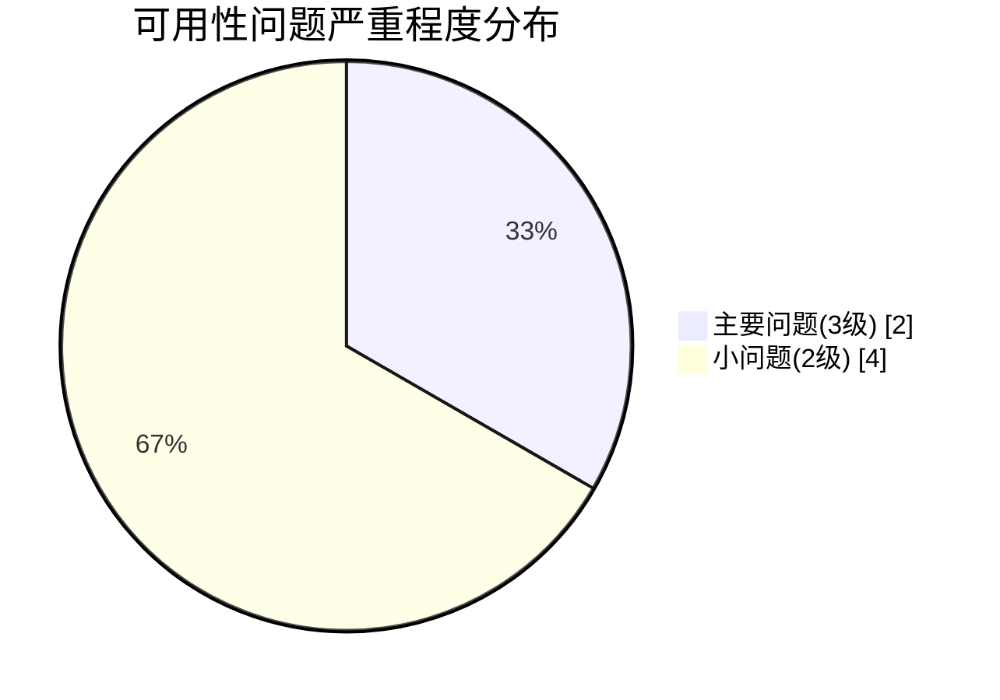

| 严重程度 | 数量 | 占比 |
|---------|------|------|
| 灾难性(4) | 0 | 0% |
| 主要问题(3) | 2 | 33% |
| 小问题(2) | 4 | 67% |
| 美容问题(1) | 0 | 0% |

#### 违反原则分布

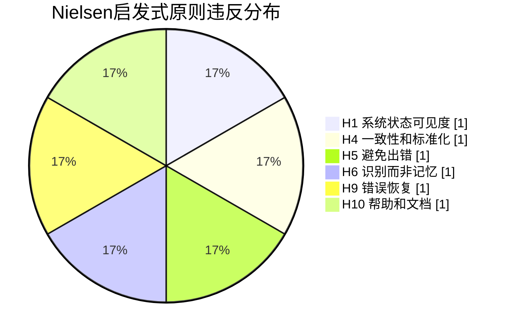

| 原则 | 违反次数 |
|------|---------|
| H1 系统状态的可见度 | 1 |
| H4 一致性和标准化 | 1 |
| H5 避免出错 | 1 |
| H6 依赖识别而非记忆 | 1 |
| H9 帮助用户识别、诊断和恢复错误 | 1 |
| H10 帮助和文档 | 1 |

#### 修复优先级建议

按可用性目标（易学性、高效率、易记性、少出错、主观满意度）排序：

| 优先级 | 问题ID | 理由 |
|--------|--------|------|
| 高 | NC-003 | 影响"少出错"目标，可能导致数据丢失 |
| 高 | NC-001 | 影响"主观满意度"，用户体验差 |
| 中 | NC-005 | 影响"易学性"，用户无法理解错误 |
| 中 | NC-002 | 影响"高效率"，操作路径过长 |
| 中 | NC-004 | 影响"易记性"，不一致导致混淆 |
| 低 | NC-006 | 影响"易学性"，但不影响核心功能 |

### 4.7 总结与改进建议

#### 整体评价

网易云音乐作为一款成熟的音乐应用，整体可用性较好。从可用性五个方面评价：

| 可用性属性 | 评价 | 说明 |
|-----------|------|------|
| 易学性 | 中等 | 核心功能易学，但特色功能缺乏引导 |
| 高效率 | 良好 | 常用功能操作便捷 |
| 易记性 | 中等 | 部分界面不一致影响记忆 |
| 少出错 | 需改进 | 缺少确认机制和撤销功能 |
| 主观满意度 | 良好 | 界面美观，但反馈机制需加强 |

#### 核心改进建议

应用**Shneiderman黄金规则**：

1. **尽可能保证一致**：统一收藏按钮样式和交互方式
2. **提供信息丰富的反馈**：加强加载状态和操作结果的反馈
3. **预防并处理错误**：为删除等危险操作添加确认步骤
4. **让操作容易撤销**：提供撤销功能
5. **减轻短时记忆负担**：简化操作路径，提供功能引导