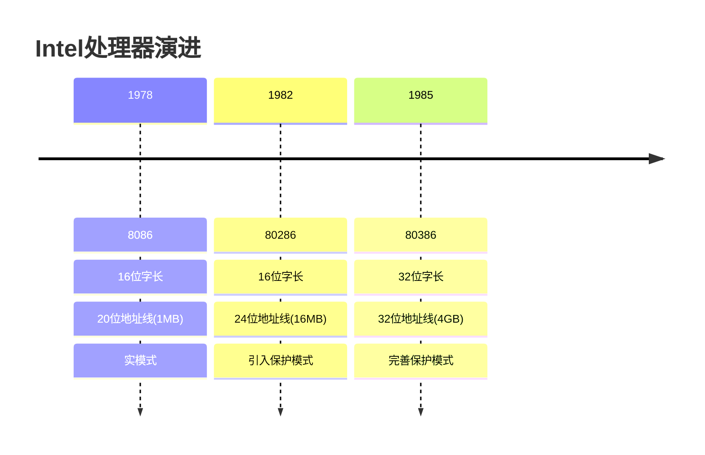
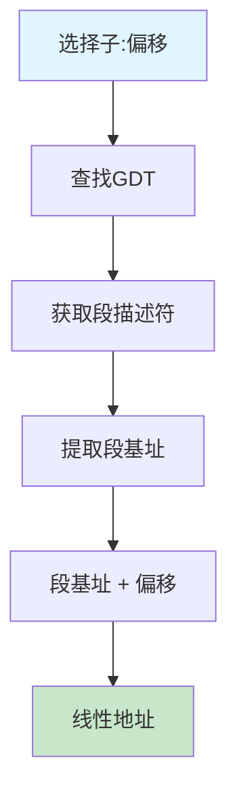
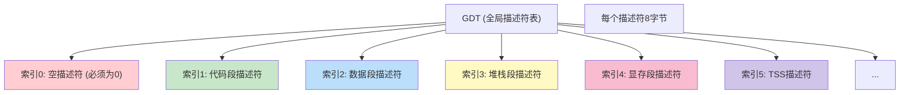
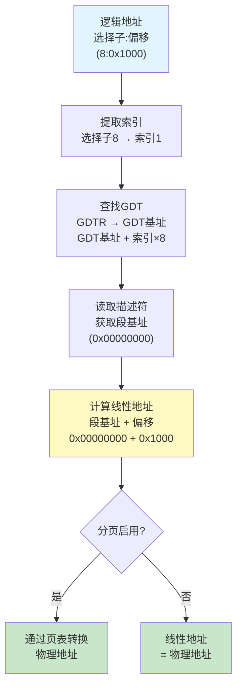

# 01 - 保护模式基础

**本章目标**：理解什么是保护模式，以及GDT、描述符、选择子这些核心概念

---

## 目录
1. [从8086到80386的演进](#从8086到80386的演进)
2. [实模式 vs 保护模式](#实模式-vs-保护模式)
3. [GDT - 全局描述符表](#gdt---全局描述符表)
4. [描述符 - Descriptor](#描述符---descriptor)
5. [选择子 - Selector](#选择子---selector)
6. [地址转换过程](#地址转换过程)

---

## 从8086到80386的演进

### 📅 历史时间线



### 为什么需要保护模式？

**实模式的问题**：
- 任何程序都可以访问任何内存
- 一个程序崩溃可能导致整个系统崩溃
- 没有内存保护机制
- 不支持多任务

**保护模式的优势**：
- 内存保护：程序只能访问自己的内存
- 特权级：区分操作系统和应用程序
- 虚拟内存：支持分页机制
- 多任务：安全地运行多个程序

---

## 实模式 vs 保护模式

### 实模式 (Real Mode)


**特点**：
- 直接访问物理内存
- 最大寻址1MB（20位地址）
- 没有保护机制
- 所有CPU启动时都先进入实模式

**特点**：
- 直接访问物理内存
- 最大寻址1MB（20位地址）
- 没有保护机制
- 所有CPU启动时都先进入实模式

### 保护模式 (Protected Mode)



**特点**：
- 通过描述符表间接访问内存
- 最大寻址4GB（32位地址）
- 有完善的保护机制
- 支持虚拟内存和多任务

---

## GDT - 全局描述符表

### 什么是GDT？

**GDT (Global Descriptor Table)** = 全局描述符表

**简单理解**：GDT就是一个数组，数组的每个元素是一个段描述符（8字节）



### GDTR寄存器

CPU通过**GDTR寄存器**来定位GDT：

```
┌─────────────────────────────────────┐
│  GDTR 寄存器结构 (48位)              │
├─────────────────────────────────────┤
│                                     │
│  ┌──────────┬──────────────────┐   │
│  │ 16位限界 │  32位基地址       │   │
│  └──────────┴──────────────────┘   │
│       ↓              ↓              │
│    GDT大小-1     GDT在内存中的地址  │
│                                     │
└─────────────────────────────────────┘
```

**加载GDTR的指令**：
```asm
lgdt [GdtPtr]    ; 加载GDT
sgdt [GdtPtr]    ; 保存GDT（很少用）
```

### 代码示例

```asm
; 定义GDT
[SECTION .gdt]
LABEL_GDT:
    ; 索引0：空描述符（Intel规定必须为0）
    Descriptor 0, 0, 0
    
    ; 索引1：代码段描述符
    ; 基址=0, 限界=0xFFFFF, 属性=可执行+32位
    Descriptor 0, 0FFFFFh, DA_C + DA_32
    
    ; 索引2：数据段描述符
    ; 基址=0, 限界=0xFFFFF, 属性=可读写
    Descriptor 0, 0FFFFFh, DA_DRW
    
    ; 索引3：显存段描述符
    ; 基址=0xB8000, 限界=0xFFFF, 属性=可读写
    Descriptor 0B8000h, 0FFFFh, DA_DRW

; 计算GDT的长度和基地址
GdtLen equ $ - LABEL_GDT        ; GDT长度
GdtPtr dw GdtLen - 1            ; GDT限界（长度-1）
       dd 0                     ; GDT基地址（运行时填写）
```

**注意**：
- `$` 表示当前地址
- `equ` 定义常量
- GDT的第一个描述符（索引0）必须是空描述符

---

## 描述符 - Descriptor

### 什么是描述符？

**描述符 (Descriptor)** = 段的"身份证"

**简单理解**：描述符包含了一个段的所有信息：在哪里、多大、什么权限

### 描述符结构（8字节 = 64位）

```
描述符结构（从低到高）：

字节0-1: 段界限 0-15位
字节2-3: 基地址 0-15位
字节4:   基地址 16-23位
字节5:   属性字节1
         ├─ P (1位): Present，段是否在内存
         ├─ DPL (2位): 特权级 (0-3)
         ├─ S (1位): 0=系统段, 1=代码/数据段
         └─ Type (4位): 段类型
字节6:   属性字节2 + 段界限 16-19位
         ├─ G (1位): 粒度，0=字节，1=4KB
         ├─ D (1位): 0=16位段，1=32位段
         ├─ AVL (1位): 可用位
         └─ 段界限 16-19位 (4位)
字节7:   基地址 24-31位
```

### 详细图解

```
┌────────────────────────────────────────────────────────────┐
│  低32位                                                     │
├────────────────────────────────────────────────────────────┤
│  31        24 23        16 15         8 7          0       │
│  ┌───────────┬────────────┬────────────┬───────────┐      │
│  │ 基地址    │  基地址    │  段界限    │  段界限   │      │
│  │ (0-15)    │            │            │  (0-15)   │      │
│  └───────────┴────────────┴────────────┴───────────┘      │
└────────────────────────────────────────────────────────────┘

┌────────────────────────────────────────────────────────────┐
│  高32位                                                     │
├────────────────────────────────────────────────────────────┤
│  31        24 23  20 19  16 15  14 13 12 11    8 7      0  │
│  ┌───────────┬──┬──┬──┬───┬──┬─────┬──┬────────┬────────┐ │
│  │ 基地址    │G │D │0 │AVL│界限│ P │DPL │S │Type│基地址  │ │
│  │ (24-31)   │  │  │  │   │16-19│  │    │  │    │(16-23) │ │
│  └───────────┴──┴──┴──┴───┴────┴──┴─────┴──┴────┴────────┘ │
└────────────────────────────────────────────────────────────┘
```

### 关键字段说明

| 字段 | 位数 | 说明 | 示例 |
|------|------|------|------|
| **基地址** | 32位 | 段在内存中的起始地址 | 0x00000000 |
| **段界限** | 20位 | 段的大小 | 0xFFFFF (4GB) |
| **G** | 1位 | 粒度：0=字节，1=4KB | 1 → 段界限×4KB |
| **D** | 1位 | 默认操作数大小：0=16位，1=32位 | 1 → 32位段 |
| **P** | 1位 | Present：段是否在内存 | 1 → 在内存中 |
| **DPL** | 2位 | 特权级：0-3 | 0=Ring 0, 3=Ring 3 |
| **S** | 1位 | 段类型：0=系统段，1=代码/数据段 | 1 → 代码/数据 |
| **Type** | 4位 | 具体类型和访问权限 | 见下表 |

### Type字段详解

**代码段 (S=1, Type的E位=1)**：
```
Type = 1 0 1 0
       │ │ │ └─ A: Accessed (是否被访问过)
       │ │ └─── R: Readable (是否可读)
       │ └───── C: Conforming (是否一致)
       └─────── E: Executable (1=代码段)
```

**数据段 (S=1, Type的E位=0)**：
```
Type = 0 0 1 0
       │ │ │ └─ A: Accessed
       │ │ └─── W: Writable (是否可写)
       │ └───── ED: Expand Down (向下扩展)
       └─────── E: Executable (0=数据段)
```

### 常用属性常量

```asm
; 段属性
DA_32    equ 4000h    ; 32位段
DA_DPL0  equ 00h      ; DPL = 0 (Ring 0)
DA_DPL3  equ 60h      ; DPL = 3 (Ring 3)

; 代码段类型
DA_C     equ 98h      ; 只执行代码段
DA_CR    equ 9Ah      ; 可执行可读代码段

; 数据段类型
DA_DR    equ 90h      ; 只读数据段
DA_DRW   equ 92h      ; 可读写数据段
DA_DRWA  equ 93h      ; 已访问可读写数据段
```

---

## 选择子 - Selector

### 什么是选择子？

**选择子 (Selector)** = GDT的"索引"

**简单理解**：选择子就是指向GDT中某个描述符的指针

### 选择子结构（16位）

```
┌─────────────────────────────────────┐
│  选择子结构 (16位)                   │
├─────────────────────────────────────┤
│                                     │
│  15              3  2  1  0         │
│  ┌────────────────┬───┬────┐       │
│  │   索引 (13位)  │TI │RPL │       │
│  └────────────────┴───┴────┘       │
│         ↓          ↓    ↓          │
│    在GDT中的位置  表  请求特权级    │
│                                     │
└─────────────────────────────────────┘
```

### 字段说明

| 字段 | 位数 | 说明 |
|------|------|------|
| **索引** | 13位 | 在GDT/LDT中的索引（0-8191） |
| **TI** | 1位 | Table Indicator：0=GDT，1=LDT |
| **RPL** | 2位 | Requested Privilege Level：请求特权级(0-3) |

### 选择子计算示例

```
例1：选择子 = 8 (二进制: 0000 0000 0000 1000)
     ├─ 索引 = 1 (二进制前13位: 0000000000001)
     ├─ TI = 0 (GDT)
     └─ RPL = 0 (Ring 0)
     → 指向GDT中的第1个描述符

例2：选择子 = 16 (二进制: 0000 0000 0001 0000)
     ├─ 索引 = 2
     ├─ TI = 0 (GDT)
     └─ RPL = 0
     → 指向GDT中的第2个描述符

例3：选择子 = 27 (二进制: 0000 0000 0001 1011)
     ├─ 索引 = 3
     ├─ TI = 0 (GDT)
     └─ RPL = 3 (Ring 3)
     → 指向GDT中的第3个描述符，请求特权级为3
```

### 代码示例

```asm
; 定义选择子
SelectorCode32  equ  LABEL_DESC_CODE32 - LABEL_GDT
SelectorData    equ  LABEL_DESC_DATA - LABEL_GDT
SelectorVideo   equ  LABEL_DESC_VIDEO - LABEL_GDT

; 如果代码段描述符在GDT中索引为1，则：
; SelectorCode32 = 1 × 8 = 8
; (因为每个描述符8字节)

; 使用选择子
mov  ax, SelectorData
mov  ds, ax          ; 将数据段选择子加载到DS
```

---

## 地址转换过程

### 完整的地址转换流程



### 实际例子

假设：
- GDT基址 = 0x00090000
- 选择子 = 16 (索引=2, TI=0, RPL=0)
- 偏移 = 0x1234
- GDT中索引2的描述符的段基址 = 0x00100000

**转换过程**：
```
1. 选择子16 → 索引2
2. 描述符地址 = 0x00090000 + 2×8 = 0x00090010
3. 从0x00090010读取描述符 → 段基址 = 0x00100000
4. 线性地址 = 0x00100000 + 0x1234 = 0x00101234
```

---

## 本章小结

### 核心概念
1. **GDT**：全局描述符表，是一个数组
2. **描述符**：段的"身份证"，包含基址、界限、属性
3. **选择子**：GDT的"索引"，指向某个描述符
4. **GDTR**：CPU用来定位GDT的寄存器

### 关键公式
```
线性地址 = 段基址 + 偏移

其中：
- 段基址从描述符中获取
- 描述符通过选择子在GDT中查找
- GDT的位置由GDTR指定
```

### 记忆技巧
- **GDT** = 电话簿（存放所有段的信息）
- **描述符** = 电话簿中的一条记录
- **选择子** = 页码（告诉你去哪一页找）
- **GDTR** = 电话簿的封面（告诉你电话簿在哪里）

---

## 自我检查

- [ ] 能说出实模式和保护模式的主要区别
- [ ] 能画出GDT的结构
- [ ] 能解释描述符的各个字段
- [ ] 能计算选择子对应的GDT索引
- [ ] 能描述从逻辑地址到线性地址的转换过程

---

**下一章**：[02-特权级机制.md](02-特权级机制.md) - 学习CPL、DPL、RPL
