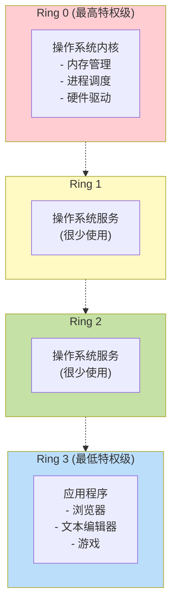
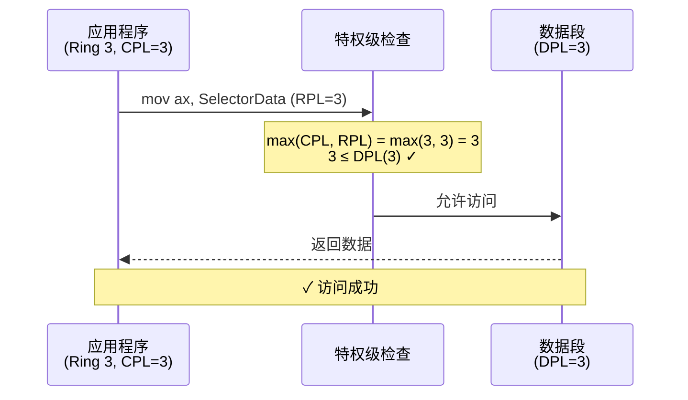
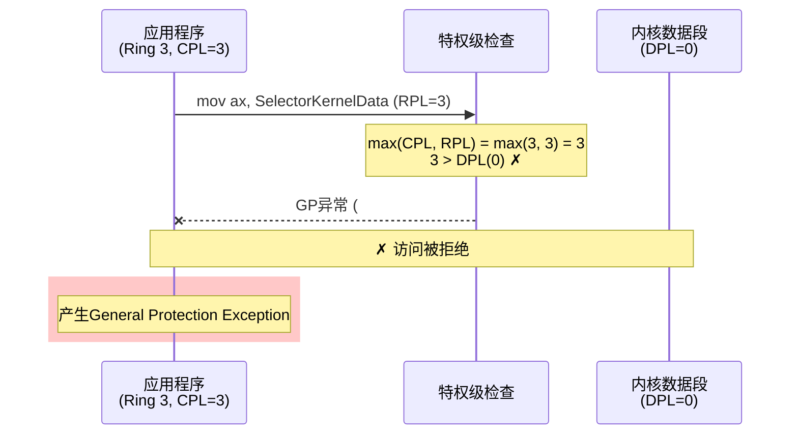

# 02 - 特权级机制

> 💡 **本章目标**：理解保护模式的核心——特权级机制，掌握CPL、DPL、RPL的含义和检查规则

> ⚠️ **重要程度**：⭐⭐⭐⭐⭐（考试必考！）

---

## 📖 目录
1. [为什么需要特权级](#为什么需要特权级)
2. [四个特权级环](#四个特权级环)
3. [三种特权级：CPL、DPL、RPL](#三种特权级cpl-dpl-rpl)
4. [特权级检查规则](#特权级检查规则)
5. [实际例子](#实际例子)

---

## 为什么需要特权级？

### 🤔 问题场景

想象一下，如果没有特权级保护：

```
❌ 应用程序可以：
   - 直接修改操作系统的内存
   - 关闭中断
   - 修改GDT
   - 访问其他程序的内存
   - 直接操作硬件

结果：
   → 一个程序崩溃，整个系统崩溃
   → 恶意程序可以为所欲为
   → 无法实现多任务
```

### ✅ 特权级的作用

```
有了特权级保护：

Ring 0 (操作系统内核)
   ✓ 可以做任何事情
   ✓ 管理硬件
   ✓ 管理内存
   ✓ 管理其他程序

Ring 3 (应用程序)
   ✗ 不能直接访问硬件
   ✗ 不能修改系统数据
   ✓ 只能通过系统调用请求服务
   ✓ 只能访问自己的内存

结果：
   → 系统稳定
   → 程序隔离
   → 安全可靠
```

---

## 四个特权级环

### 🎯 特权级环结构



**特权级数字越小，权限越大：0 > 1 > 2 > 3**

### 📝 实际使用情况

在Linux和Windows中：
- **Ring 0**：操作系统内核 ✅ 大量使用
- **Ring 1**：几乎不用 ❌
- **Ring 2**：几乎不用 ❌
- **Ring 3**：应用程序 ✅ 大量使用

> 💡 **简化理解**：实际上只用两个级别
> - Ring 0 = 内核态 = 特权模式
> - Ring 3 = 用户态 = 非特权模式

---

## 三种特权级：CPL、DPL、RPL

### 1️⃣ CPL - Current Privilege Level (当前特权级)

**定义**：当前正在执行的代码的特权级

**存储位置**：CS和SS寄存器的最低2位（bit 0-1）

```
┌─────────────────────────────────────┐
│  CS寄存器 (代码段选择子)             │
├─────────────────────────────────────┤
│  15              3  2  1  0         │
│  ┌────────────────┬───┬────┐       │
│  │   索引         │TI │CPL │       │
│  └────────────────┴───┴────┘       │
│                        ↑            │
│                    当前特权级        │
└─────────────────────────────────────┘
```

**例子**：
```asm
; 如果CS = 8 (二进制: 0000 0000 0000 1000)
; CPL = 0 (最低2位是00)
; → 当前运行在Ring 0

; 如果CS = 27 (二进制: 0000 0000 0001 1011)
; CPL = 3 (最低2位是11)
; → 当前运行在Ring 3
```

> 💡 **记忆技巧**：CPL = **C**urrent = 当前的特权级

---

### 2️⃣ DPL - Descriptor Privilege Level (描述符特权级)

**定义**：段或门的特权级，定义在描述符中

**存储位置**：描述符的DPL字段（2位）

```
┌─────────────────────────────────────┐
│  段描述符                            │
├─────────────────────────────────────┤
│  ...                                │
│  ┌──┬─────┬──┬────────┬────────┐   │
│  │P │ DPL │S │  Type  │  ...   │   │
│  └──┴─────┴──┴────────┴────────┘   │
│       ↑                             │
│   描述符特权级                       │
└─────────────────────────────────────┘
```

**不同类型段的DPL含义**：

#### 数据段的DPL

**含义**：DPL表示"可以访问此段的最低特权级"

**理解**：数字越小，特权级越高。如果你的特权级足够高（数字≤DPL），就能访问。

```
例子：数据段DPL = 1

谁能访问？
Ring 0 (CPL=0)：能访问，因为 0 ≤ 1（特权级够高）
Ring 1 (CPL=1)：能访问，因为 1 ≤ 1（特权级刚好）
Ring 2 (CPL=2)：不能访问，因为 2 > 1（特权级不够）
Ring 3 (CPL=3)：不能访问，因为 3 > 1（特权级不够）

规则：CPL ≤ DPL 才能访问
```

**实际应用**：
- 内核数据段：DPL=0，只有Ring 0能访问
- 用户数据段：DPL=3，所有特权级都能访问

---

#### 非一致代码段的DPL

**含义**：DPL表示"访问此段的特权级必须相等"

**理解**：这是最严格的检查，必须完全匹配。用于保护关键代码。

```
例子：内核代码段DPL = 0

谁能访问？
Ring 0 (CPL=0)：能访问，因为 0 = 0（完全匹配）
Ring 1 (CPL=1)：不能访问，因为 1 ≠ 0（不匹配）
Ring 2 (CPL=2)：不能访问，因为 2 ≠ 0（不匹配）
Ring 3 (CPL=3)：不能访问，因为 3 ≠ 0（不匹配）

规则：CPL = DPL 才能访问（不通过调用门）
```

**为什么这样设计？**
- 防止低特权级代码直接跳转到高特权级代码
- 必须通过调用门等机制才能进行特权级转移

---

#### 一致代码段的DPL

**含义**：DPL表示"访问此段的最高特权级"

**理解**：这是反过来的！特权级越低（数字越大）才能访问。用于共享代码。

```
例子：共享库代码段DPL = 2

谁能访问？
Ring 0 (CPL=0)：不能访问，因为 0 < 2（特权级太高）
Ring 1 (CPL=1)：不能访问，因为 1 < 2（特权级太高）
Ring 2 (CPL=2)：能访问，因为 2 ≥ 2（特权级刚好）
Ring 3 (CPL=3)：能访问，因为 3 ≥ 2（特权级够低）

规则：CPL ≥ DPL 才能访问
```

**为什么这样设计？**
- 允许低特权级代码调用共享的库函数
- 调用后CPL不变，仍然保持原来的特权级
- 避免特权级提升的安全风险

---

#### 三种情况对比

| 段类型 | DPL含义 | 访问规则 | 典型用途 | 转移后CPL |
|--------|---------|----------|----------|-----------|
| **数据段** | 最低特权级 | CPL ≤ DPL | 内核数据、用户数据 | 不变 |
| **非一致代码段** | 必须相等 | CPL = DPL | 内核代码、用户代码 | 变为目标DPL |
| **一致代码段** | 最高特权级 | CPL ≥ DPL | 共享库、数学库 | 不变 |

**用图理解**：

```
数据段 (DPL=1)：
Ring 0 ──✓──> 数据段    (0 ≤ 1，能访问)
Ring 1 ──✓──> 数据段    (1 ≤ 1，能访问)
Ring 2 ──✗──> 数据段    (2 > 1，不能访问)
Ring 3 ──✗──> 数据段    (3 > 1，不能访问)

非一致代码段 (DPL=0)：
Ring 0 ──✓──> 代码段    (0 = 0，能访问)
Ring 1 ──✗──> 代码段    (1 ≠ 0，不能访问)
Ring 2 ──✗──> 代码段    (2 ≠ 0，不能访问)
Ring 3 ──✗──> 代码段    (3 ≠ 0，不能访问)

一致代码段 (DPL=2)：
Ring 0 ──✗──> 代码段    (0 < 2，不能访问)
Ring 1 ──✗──> 代码段    (1 < 2，不能访问)
Ring 2 ──✓──> 代码段    (2 ≥ 2，能访问)
Ring 3 ──✓──> 代码段    (3 ≥ 2，能访问)
```

**记忆技巧**：
- **数据段**：高特权级能访问低特权级的数据（向下兼容）
- **非一致代码段**：必须门当户对（严格匹配）
- **一致代码段**：低特权级能用高特权级的代码（共享库）

**生活化比喻**：

把特权级想象成公司的职位等级（数字越小，职位越高）：

1. **数据段（文件柜）**：DPL=1表示"经理级别的文件柜"
   - 总监(Ring 0)：能看，因为职位够高
   - 经理(Ring 1)：能看，因为职位刚好
   - 主管(Ring 2)：不能看，职位不够
   - 员工(Ring 3)：不能看，职位不够
   
2. **非一致代码段（办公室）**：DPL=0表示"总监办公室"
   - 总监(Ring 0)：能进，因为是自己的办公室
   - 经理(Ring 1)：不能进，不是自己的办公室
   - 其他人：都不能进
   - 想进？必须通过"预约"（调用门）
   
3. **一致代码段（公共会议室）**：DPL=2表示"主管级会议室"
   - 总监(Ring 0)：不能用，太高级了，用自己的会议室
   - 经理(Ring 1)：不能用，太高级了
   - 主管(Ring 2)：能用，刚好
   - 员工(Ring 3)：能用，可以借用
   - 注意：员工用了会议室，还是员工身份（CPL不变）

**实际例子**：
```
场景1：Ring 0的内核要读取Ring 3的用户数据
- 用户数据段DPL=3
- 内核CPL=0
- 检查：0 ≤ 3，允许访问

场景2：Ring 3的应用程序想直接跳转到Ring 0的内核代码
- 内核代码段DPL=0（非一致）
- 应用程序CPL=3
- 检查：3 ≠ 0，拒绝访问（必须通过调用门）

场景3：Ring 3的应用程序调用数学库（一致代码段）
- 数学库代码段DPL=2（一致）
- 应用程序CPL=3
- 检查：3 ≥ 2，允许访问
- 调用后CPL仍为3（不提升特权级）
```

---

### 3️⃣ RPL - Requested Privilege Level (请求特权级)

**定义**：选择子中指定的请求特权级

**存储位置**：选择子的最低2位（bit 0-1）

```
┌─────────────────────────────────────┐
│  选择子                              │
├─────────────────────────────────────┤
│  15              3  2  1  0         │
│  ┌────────────────┬───┬────┐       │
│  │   索引         │TI │RPL │       │
│  └────────────────┴───┴────┘       │
│                        ↑            │
│                    请求特权级        │
└─────────────────────────────────────┘
```

**作用**：提供额外的安全检查

**例子**：
```
场景：Ring 0的系统调用代码要访问一个数据段

情况1：直接访问
   CPL = 0 (系统调用运行在Ring 0)
   数据段DPL = 2
   → CPL(0) ≤ DPL(2)，可以访问 ✓
   
   问题：如果这个数据段是应用程序的，
        系统调用不应该能访问！

情况2：使用RPL
   CPL = 0
   RPL = 3 (应用程序传入的选择子)
   数据段DPL = 2
   → max(CPL, RPL) = max(0, 3) = 3
   → 3 > 2，不能访问 ✗
   
   结果：即使系统调用特权级高，
        也不能访问应用程序无权访问的段
```

> 💡 **记忆技巧**：RPL = **R**equested = 请求的特权级
> 
> **RPL的本质**：让高特权级代码"假装"成低特权级

---

## 特权级检查规则

### 📋 访问数据段

```
┌─────────────────────────────────────┐
│  访问数据段的规则                    │
├─────────────────────────────────────┤
│                                     │
│  max(CPL, RPL) ≤ DPL                │
│                                     │
│  解释：                              │
│  - 当前特权级和请求特权级中         │
│    较低的那个（数字较大）           │
│  - 必须 ≤ 数据段的DPL               │
│                                     │
└─────────────────────────────────────┘
```

**例子**：
```
数据段DPL = 2

情况1：CPL = 0, RPL = 0
      max(0, 0) = 0 ≤ 2  ✓ 可以访问

情况2：CPL = 0, RPL = 3
      max(0, 3) = 3 > 2  ✗ 不能访问

情况3：CPL = 2, RPL = 1
      max(2, 1) = 2 ≤ 2  ✓ 可以访问

情况4：CPL = 3, RPL = 3
      max(3, 3) = 3 > 2  ✗ 不能访问
```

### 📋 访问非一致代码段（不通过调用门）

```
┌─────────────────────────────────────┐
│  访问非一致代码段的规则              │
├─────────────────────────────────────┤
│                                     │
│  CPL = DPL  且  RPL ≤ DPL           │
│                                     │
│  解释：                              │
│  - 当前特权级必须等于代码段特权级   │
│  - 请求特权级不能比代码段特权级低   │
│                                     │
└─────────────────────────────────────┘
```

**例子**：
```
代码段DPL = 0

情况1：CPL = 0, RPL = 0
      CPL = DPL ✓  且  RPL ≤ DPL ✓
      → 可以访问

情况2：CPL = 0, RPL = 3
      CPL = DPL ✓  但  RPL > DPL ✗
      → 不能访问

情况3：CPL = 3, RPL = 3
      CPL ≠ DPL ✗
      → 不能访问
```

### 📋 访问一致代码段

```
┌─────────────────────────────────────┐
│  访问一致代码段的规则                │
├─────────────────────────────────────┤
│                                     │
│  CPL ≥ DPL                          │
│  (不检查RPL)                        │
│                                     │
│  解释：                              │
│  - 当前特权级必须 ≥ 代码段特权级    │
│  - 转移后CPL不变                    │
│                                     │
└─────────────────────────────────────┘
```

**例子**：
```
一致代码段DPL = 2

情况1：CPL = 0
      0 < 2  ✗ 不能访问

情况2：CPL = 2
      2 ≥ 2  ✓ 可以访问，转移后CPL仍为2

情况3：CPL = 3
      3 ≥ 2  ✓ 可以访问，转移后CPL仍为3
```

---

## 实际例子

### 例1：应用程序访问数据



### 例2：应用程序试图访问内核数据



### 例3：系统调用访问用户数据

```
场景：Ring 0的系统调用要访问Ring 3的用户数据

┌─────────────────────────────────────┐
│  系统调用 (Ring 0)                   │
│  CPL = 0                            │
├─────────────────────────────────────┤
│  ; 用户传入的选择子，RPL = 3        │
│  mov ax, UserDataSelector          │
│  mov ds, ax                         │
│  mov al, [0x1000]                   │
└─────────────────────────────────────┘
         ↓ 访问
┌─────────────────────────────────────┐
│  用户数据段                          │
│  DPL = 3                            │
└─────────────────────────────────────┘

检查：max(CPL, RPL) = max(0, 3) = 3
     3 ≤ 3  ✓ 允许访问
     
说明：虽然系统调用在Ring 0，但因为RPL = 3，
     所以只能访问DPL ≥ 3的段
```

---

## 🎯 本章小结

### 核心概念

| 特权级 | 含义 | 存储位置 | 作用 |
|--------|------|----------|------|
| **CPL** | 当前特权级 | CS/SS的bit 0-1 | 表示当前代码的特权级 |
| **DPL** | 描述符特权级 | 描述符中 | 限制谁可以访问这个段 |
| **RPL** | 请求特权级 | 选择子的bit 0-1 | 提供额外的安全检查 |

### 检查规则速查

```
访问数据段：
   max(CPL, RPL) ≤ DPL

访问非一致代码段（不通过调用门）：
   CPL = DPL  且  RPL ≤ DPL

访问一致代码段：
   CPL ≥ DPL  (不检查RPL)
```

### 💡 记忆口诀

```
CPL是当前，DPL是目标，RPL是请求
数据段看最大，代码段要相等
一致段反过来，特权低的能访问
```

---

## ✅ 自我检查

- [ ] 能说出CPL、DPL、RPL的含义
- [ ] 能说出它们分别存储在哪里
- [ ] 能写出访问数据段的检查规则
- [ ] 能写出访问代码段的检查规则
- [ ] 能判断给定CPL、DPL、RPL时是否允许访问
- [ ] 能解释RPL的作用

---

**下一章**：[03-调用门与栈切换.md](03-调用门与栈切换.md) - 学习如何实现特权级转移
