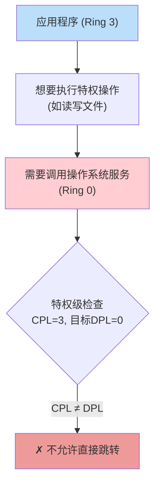
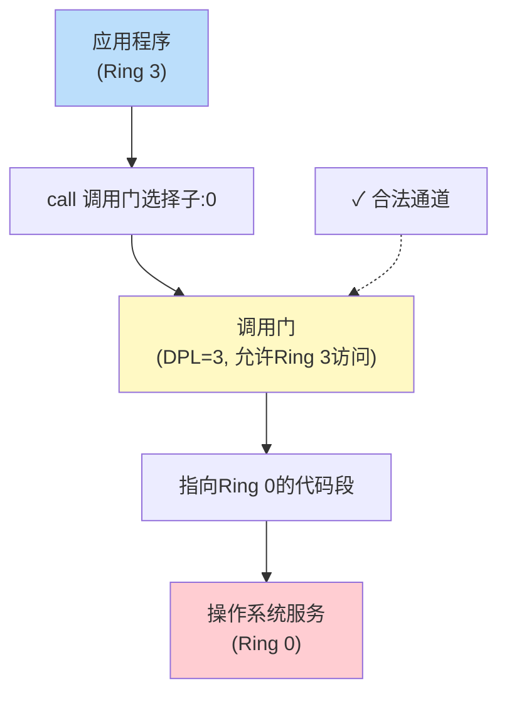
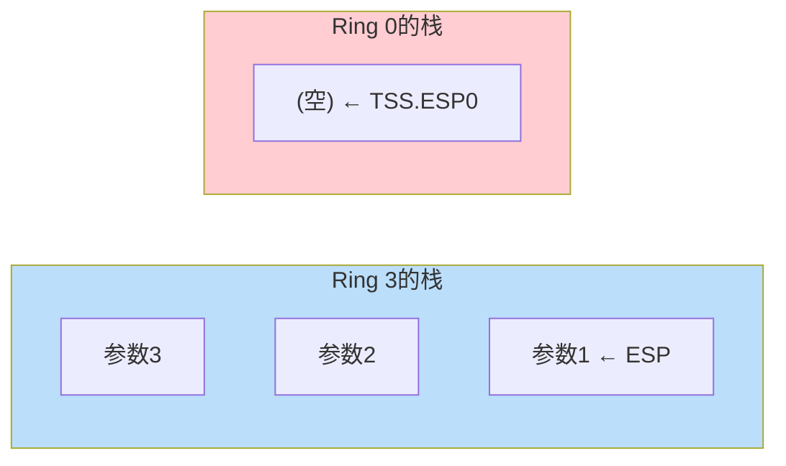

# 03 - 调用门与栈切换

> 💡 **本章目标**：理解如何通过调用门实现特权级转移，掌握栈切换的原理和过程

> ⚠️ **重要程度**：⭐⭐⭐⭐⭐（考试重点！必须理解！）

---

## 📖 目录
1. [为什么需要调用门](#为什么需要调用门)
2. [调用门的结构](#调用门的结构)
3. [调用门的特权级检查](#调用门的特权级检查)
4. [为什么需要栈切换](#为什么需要栈切换)
5. [TSS - 任务状态段](#tss---任务状态段)
6. [栈切换的完整过程](#栈切换的完整过程)
7. [从高到低的特权级转移](#从高到低的特权级转移)

---

## 为什么需要调用门？

### 🤔 问题：如何从Ring 3进入Ring 0？



### ❌ 不能直接跳转

```asm
; 这样做会失败！
mov  ax, SelectorKernelCode  ; Ring 0的代码段
jmp  ax:0                    ; ✗ GP异常！
```

**原因**：
- 非一致代码段要求 `CPL = DPL`
- 当前CPL = 3，目标DPL = 0
- 3 ≠ 0，不允许访问

### ✅ 解决方案：调用门



> 💡 **比喻**：调用门就像"安检通道"
> - 应用程序不能随便进入内核
> - 但可以通过调用门这个"安检通道"
> - 调用门会检查权限，然后引导到正确的内核代码

---

## 调用门的结构

### 📊 调用门描述符（8字节）

```
┌────────────────────────────────────────────────────────────┐
│  低32位                                                     │
├────────────────────────────────────────────────────────────┤
│  31              16 15                                  0   │
│  ┌─────────────────┬──────────────────────────────────┐   │
│  │  段选择子       │  偏移量 (0-15)                    │   │
│  └─────────────────┴──────────────────────────────────┘   │
│         ↓                    ↓                              │
│   目标代码段        目标代码段内的偏移                      │
└────────────────────────────────────────────────────────────┘

┌────────────────────────────────────────────────────────────┐
│  高32位                                                     │
├────────────────────────────────────────────────────────────┤
│  31              16 15 14 13 12  8 7   5 4       0         │
│  ┌─────────────────┬──┬─────┬──┬─────┬─────┬────────────┐ │
│  │ 偏移量(16-31)   │P │ DPL │0 │1100 │参数 │  保留      │ │
│  └─────────────────┴──┴─────┴──┴─────┴─────┴────────────┘ │
│         ↓           ↓    ↓       ↓      ↓                  │
│    目标偏移高位    在内存 特权级 类型  参数个数             │
└────────────────────────────────────────────────────────────┘
```

### 📝 字段详解

| 字段 | 大小 | 说明 |
|------|------|------|
| **段选择子** | 16位 | 指向目标代码段的选择子 |
| **偏移量** | 32位 | 目标代码段内的入口点偏移 |
| **P** | 1位 | Present：1=调用门有效 |
| **DPL** | 2位 | 调用门的特权级（谁可以使用这个门） |
| **类型** | 4位 | 1100 = 386调用门 |
| **参数计数** | 5位 | 栈切换时要复制的参数个数（0-31） |

### 💻 定义调用门的宏

```asm
; Gate宏：定义门描述符
; 参数1：目标段选择子
; 参数2：目标偏移
; 参数3：参数个数
; 参数4：属性
%macro Gate 4
    dw  (%2 & 0FFFFh)                    ; 偏移低16位
    dw  %1                               ; 段选择子
    dw  (%3 & 1Fh) | ((%4 << 8) & 0FF00h)  ; 参数计数+属性
    dw  ((%2 >> 16) & 0FFFFh)            ; 偏移高16位
%endmacro

; 使用示例
LABEL_CALL_GATE_TEST:
    Gate SelectorCodeDest, 0, 0, DA_386CGate + DA_DPL3

; 参数说明：
; - SelectorCodeDest: 目标代码段选择子
; - 0: 目标代码段内的偏移
; - 0: 参数个数（栈切换时复制的参数数量）
; - DA_386CGate + DA_DPL3: 386调用门，DPL=3（Ring 3可用）
```

### 🎯 调用门的选择子

```asm
; 定义调用门选择子
SelectorCallGate equ LABEL_CALL_GATE_TEST - LABEL_GDT + SA_RPL3
; 计算方式：
; - LABEL_CALL_GATE_TEST - LABEL_GDT: 调用门在GDT中的偏移
; - + SA_RPL3: 加上RPL=3

; 使用调用门
call SelectorCallGate:0
; 说明：
; - SelectorCallGate: 调用门选择子
; - 0: 偏移（会被忽略，实际偏移由调用门描述符决定）
```

> 💡 **注意**：
> - 调用门的偏移参数会被忽略
> - 实际偏移由调用门描述符中的偏移字段决定

---

## 调用门的特权级检查

### 📋 检查规则

使用调用门时，涉及**4个特权级**：

```
┌─────────────────────────────────────────┐
│  1. CPL：当前特权级                      │
│  2. 调用门选择子的RPL                    │
│  3. 调用门的DPL                          │
│  4. 目标代码段的DPL                      │
└─────────────────────────────────────────┘
```

### 🔍 两步检查

```
第一步：能否访问调用门？
┌─────────────────────────────────────┐
│  max(CPL, RPL) ≤ 调用门DPL          │
└─────────────────────────────────────┘
   ↓ 如果通过
   
第二步：能否转移到目标代码段？
┌─────────────────────────────────────┐
│  目标代码段DPL ≤ CPL                │
│  (从低特权级向高特权级转移)          │
└─────────────────────────────────────┘
```

### 📝 实际例子

#### 例1：Ring 3调用Ring 0

```
场景：应用程序通过调用门调用系统服务

┌─────────────────────────────────────┐
│  应用程序 (Ring 3)                   │
│  CPL = 3                            │
├─────────────────────────────────────┤
│  call SelectorCallGate:0            │
│       (RPL = 3)                     │
└─────────────────────────────────────┘
         ↓
┌─────────────────────────────────────┐
│  调用门                              │
│  DPL = 3                            │
│  指向：SelectorKernelCode:0x1000    │
└─────────────────────────────────────┘
         ↓
┌─────────────────────────────────────┐
│  内核代码段                          │
│  DPL = 0                            │
└─────────────────────────────────────┘

检查过程：
1. 能否访问调用门？
   max(CPL, RPL) = max(3, 3) = 3
   3 ≤ 3  ✓ 可以访问调用门

2. 能否转移到目标代码段？
   目标DPL = 0, CPL = 3
   0 ≤ 3  ✓ 可以转移（从低到高）

结果：✓ 允许，CPL变为0
```

#### 例2：调用门DPL设置不当

```
场景：调用门DPL = 0，Ring 3无法使用

┌─────────────────────────────────────┐
│  应用程序 (Ring 3)                   │
│  CPL = 3                            │
├─────────────────────────────────────┤
│  call SelectorCallGate:0            │
│       (RPL = 3)                     │
└─────────────────────────────────────┘
         ↓
┌─────────────────────────────────────┐
│  调用门                              │
│  DPL = 0  ← 问题在这里！             │
└─────────────────────────────────────┘

检查过程：
1. 能否访问调用门？
   max(CPL, RPL) = max(3, 3) = 3
   3 > 0  ✗ 不能访问调用门

结果：✗ GP异常
```

### 💡 设计原则

```
调用门DPL的设置：
- 如果希望Ring 3能用 → DPL = 3
- 如果只允许Ring 0用 → DPL = 0

目标代码段DPL的设置：
- 系统服务代码 → DPL = 0
```

---

## 为什么需要栈切换？

### 🤔 问题场景

```
假设不切换栈：

Ring 3应用程序
   ↓ 使用Ring 3的栈
   call 调用门
   ↓
Ring 0系统服务
   ↓ 还是使用Ring 3的栈？

问题：
❌ Ring 3的栈可能很小，系统服务可能栈溢出
❌ Ring 3的程序可以修改栈上的数据，破坏系统服务
❌ 系统服务的返回地址在Ring 3的栈上，不安全
```

### ✅ 解决方案：栈切换

```
Ring 3应用程序
   ↓ 使用Ring 3的栈
   call 调用门
   ↓
   [自动切换到Ring 0的栈]
   ↓
Ring 0系统服务
   ↓ 使用Ring 0的栈
   ret
   ↓
   [自动切换回Ring 3的栈]
   ↓
Ring 3应用程序继续执行
```

### 🎯 栈切换的好处

```
✓ 安全性：
  - Ring 3无法访问Ring 0的栈
  - 系统服务的数据受保护

✓ 稳定性：
  - 每个特权级有独立的栈空间
  - 避免栈溢出影响其他特权级

✓ 隔离性：
  - 不同特权级的栈互不干扰
```

---

## TSS - 任务状态段

### 🎯 什么是TSS？

**TSS (Task-State Segment)** = 任务状态段

> 💡 **作用**：保存各个特权级的栈指针，用于栈切换

### 📊 TSS结构（关键部分）

```
┌────────────────────────────────────────┐
│  TSS 结构 (104字节)                     │
├────────────────────────────────────────┤
│  偏移   内容                            │
├────────────────────────────────────────┤
│  +00h   Back Link (前一个任务)          │
│  +04h   ESP0  ← Ring 0的栈指针          │
│  +08h   SS0   ← Ring 0的栈段选择子      │
│  +0Ch   ESP1  ← Ring 1的栈指针          │
│  +10h   SS1   ← Ring 1的栈段选择子      │
│  +14h   ESP2  ← Ring 2的栈指针          │
│  +18h   SS2   ← Ring 2的栈段选择子      │
│  +1Ch   CR3   (页目录基址)              │
│  +20h   EIP                             │
│  +24h   EFLAGS                          │
│  +28h   EAX                             │
│  +2Ch   ECX                             │
│  +30h   EDX                             │
│  +34h   EBX                             │
│  +38h   ESP                             │
│  +3Ch   EBP                             │
│  +40h   ESI                             │
│  +44h   EDI                             │
│  +48h   ES                              │
│  +4Ch   CS                              │
│  +50h   SS                              │
│  +54h   DS                              │
│  +58h   FS                              │
│  +5Ch   GS                              │
│  +60h   LDT选择子                       │
│  +64h   调试陷阱标志                    │
│  +66h   I/O位图基址                     │
└────────────────────────────────────────┘
```

### 💻 定义TSS

```asm
[SECTION .tss]
ALIGN 32
LABEL_TSS:
    DD  0                   ; Back Link
    DD  TopOfStack          ; ESP0 ← Ring 0的栈顶
    DD  SelectorStack       ; SS0  ← Ring 0的栈段
    DD  0                   ; ESP1
    DD  0                   ; SS1
    DD  0                   ; ESP2
    DD  0                   ; SS2
    DD  0                   ; CR3
    DD  0                   ; EIP
    DD  0                   ; EFLAGS
    DD  0                   ; EAX
    DD  0                   ; ECX
    DD  0                   ; EDX
    DD  0                   ; EBX
    DD  0                   ; ESP
    DD  0                   ; EBP
    DD  0                   ; ESI
    DD  0                   ; EDI
    DD  0                   ; ES
    DD  0                   ; CS
    DD  0                   ; SS
    DD  0                   ; DS
    DD  0                   ; FS
    DD  0                   ; GS
    DD  0                   ; LDT
    DW  0                   ; 调试陷阱标志
    DW  $ - LABEL_TSS + 2   ; I/O位图基址
    DB  0FFh                ; I/O位图结束标志

TSSLen equ $ - LABEL_TSS
```

### 📝 在GDT中定义TSS描述符

```asm
; 在GDT中
LABEL_DESC_TSS:
    Descriptor 0, TSSLen-1, DA_386TSS

; 参数说明：
; - 0: TSS基址（运行时会填写实际地址）
; - TSSLen-1: TSS的长度限界
; - DA_386TSS: TSS类型

; TSS选择子
SelectorTSS equ LABEL_DESC_TSS - LABEL_GDT
```

### 🔧 加载TSS

```asm
; 初始化TSS描述符的基址
xor  eax, eax
mov  ax, ds
shl  eax, 4
add  eax, LABEL_TSS              ; 计算TSS的物理地址
mov  word [LABEL_DESC_TSS + 2], ax
shr  eax, 16
mov  byte [LABEL_DESC_TSS + 4], al
mov  byte [LABEL_DESC_TSS + 7], ah

; 加载TSS到TR寄存器
mov  ax, SelectorTSS
ltr  ax                          ; Load Task Register
```

> 💡 **重要**：
> - TSS必须在进入保护模式后、进行特权级转移前加载
> - 使用`ltr`指令加载TSS选择子到TR寄存器
> - 每个任务只需要一个TSS

### ❓ 为什么TSS中没有Ring 3的栈信息？

```
因为不可能发生这种情况：
Ring 0/1/2 通过CALL跳转到 Ring 3

只会发生：
Ring 0/1/2 通过RET返回到 Ring 3

返回时，Ring 3的栈信息已经保存在当前栈上了
```

---

## 栈切换的完整过程

### 📋 从Ring 3调用Ring 0（通过调用门）

#### 调用前的状态



#### CPU自动执行的步骤

```
步骤1：检查特权级
   ✓ 检查通过，需要切换栈

步骤2：从TSS获取Ring 0的栈信息
   ESP0 = TSS.ESP0
   SS0  = TSS.SS0

步骤3：切换到Ring 0的栈
   SS  ← SS0
   ESP ← ESP0

步骤4：保存Ring 3的栈信息到Ring 0的栈
   push SS_Ring3
   push ESP_Ring3

步骤5：复制参数（如果调用门的参数计数>0）
   从Ring 3的栈复制参数到Ring 0的栈

步骤6：保存返回地址
   push CS_Ring3
   push EIP_Ring3

步骤7：跳转到目标代码
   CS  ← 调用门中的段选择子
   EIP ← 调用门中的偏移
   CPL ← 目标代码段的DPL (变为0)
```

#### 调用后的状态

```
Ring 3的栈：
┌──────────────┐
│  参数3       │
│  参数2       │
│  参数1       │ ← 保存的ESP_Ring3
└──────────────┘

Ring 0的栈：
┌──────────────┐
│  SS_Ring3    │ ← 保存的Ring 3栈段
│  ESP_Ring3   │ ← 保存的Ring 3栈指针
│  参数1       │ ← 如果参数计数>0，复制的参数
│  参数2       │
│  参数3       │
│  CS_Ring3    │ ← 返回的代码段
│  EIP_Ring3   │ ← 返回地址
└──────────────┘ ← ESP (Ring 0)
```

### 📋 返回过程（RETF）

```
步骤1：从栈上弹出返回地址
   pop EIP
   pop CS

步骤2：检查CS的RPL(返回到的特权级)
   如果RPL > CPL，需要切换栈 

步骤3：如果RETF有参数，跳过参数
   ESP += 参数字节数

步骤4：恢复Ring 3的栈
   pop ESP_Ring3
   pop SS_Ring3

步骤5：切换回Ring 3
   SS  ← SS_Ring3
   ESP ← ESP_Ring3
   CPL ← CS的RPL (变为3)

步骤6：如果RETF有参数，跳过Ring 3栈上的参数
   ESP += 参数字节数
```

### 🎨 完整流程图

```
┌─────────────────────────────────────────────────────────┐
│  Ring 3 应用程序                                         │
│  ┌─────────────────┐                                    │
│  │ push 参数3      │                                    │
│  │ push 参数2      │                                    │
│  │ push 参数1      │                                    │
│  │ call 调用门:0   │                                    │
│  └─────────────────┘                                    │
└─────────────────────────────────────────────────────────┘
                    ↓
        [CPU自动切换栈，保存上下文]
                    ↓
┌─────────────────────────────────────────────────────────┐
│  Ring 0 系统服务                                         │
│  ┌─────────────────┐                                    │
│  │ 执行系统调用    │                                    │
│  │ ...             │                                    │
│  │ retf            │                                    │
│  └─────────────────┘                                    │
└─────────────────────────────────────────────────────────┘
                    ↓
        [CPU自动切换回Ring 3的栈]
                    ↓
┌─────────────────────────────────────────────────────────┐
│  Ring 3 应用程序继续执行                                 │
└─────────────────────────────────────────────────────────┘
```

---

## 从高到低的特权级转移

### 🎯 如何从Ring 0转到Ring 3？

**方法**：使用RETF指令

> 💡 **原理**：RETF会检查栈上的CS的RPL，如果RPL > CPL，就会进行栈切换

### 💻 代码实现

```asm
; 在Ring 0中，准备转到Ring 3

; 1. 准备Ring 3的栈信息
push SelectorStack3      ; Ring 3的栈段选择子 (RPL=3)
push TopOfStack3         ; Ring 3的栈顶指针

; 2. 准备Ring 3的代码信息
push SelectorCodeRing3   ; Ring 3的代码段选择子 (RPL=3)
push 0                   ; Ring 3的代码偏移

; 3. 执行远返回
retf                     ; 转到Ring 3
```

### 📊 栈的变化

#### 执行RETF前

```
Ring 0的栈：
┌──────────────────┐
│ SelectorStack3   │ ← Ring 3的SS
│ TopOfStack3      │ ← Ring 3的ESP
│ SelectorCodeRing3│ ← Ring 3的CS (RPL=3)
│ 0                │ ← Ring 3的EIP
└──────────────────┘ ← ESP (Ring 0)
```

#### RETF执行过程

```
1. pop EIP  → EIP = 0
2. pop CS   → CS = SelectorCodeRing3
3. 检查CS的RPL = 3 > CPL = 0
   → 需要切换栈
4. pop ESP  → ESP = TopOfStack3
5. pop SS   → SS = SelectorStack3
6. CPL变为3
```

#### 执行RETF后

```
现在在Ring 3：
- CS = SelectorCodeRing3 (CPL=3)
- EIP = 0
- SS = SelectorStack3
- ESP = TopOfStack3
```

### 📝 完整示例

```asm
; 定义Ring 3的代码段和栈段
LABEL_DESC_CODE_RING3:
    Descriptor 0, SegCodeRing3Len-1, DA_C+DA_32+DA_DPL3
    ; DA_C: 代码段
    ; DA_32: 32位段
    ; DA_DPL3: DPL=3（Ring 3）

LABEL_DESC_STACK3:
    Descriptor 0, TopOfStack3, DA_DRWA+DA_32+DA_DPL3
    ; DA_DRWA: 可读写，已访问
    ; DA_32: 32位段
    ; DA_DPL3: DPL=3（Ring 3）

; 选择子（注意RPL=3）
SelectorCodeRing3 equ LABEL_DESC_CODE_RING3 - LABEL_GDT + SA_RPL3
SelectorStack3    equ LABEL_DESC_STACK3 - LABEL_GDT + SA_RPL3
; SA_RPL3: 设置RPL=3，表示请求特权级为Ring 3

; 在Ring 0中转到Ring 3
push SelectorStack3
push TopOfStack3
push SelectorCodeRing3
push 0
retf                    ; 历史性的转移！
```

---

## 🎯 本章小结

### 核心概念

| 概念 | 说明 |
|------|------|
| **调用门** | 实现特权级转移的"合法通道" |
| **栈切换** | 不同特权级使用不同的栈 |
| **TSS** | 保存各特权级的栈指针 |

### 关键流程

```
从低到高（Ring 3 → Ring 0）：
   call 调用门 → CPU自动切换栈 → 执行Ring 0代码

从高到低（Ring 0 → Ring 3）：
   准备Ring 3的栈和代码信息 → retf → 转到Ring 3
```

### 调用门特权级检查

```
1. max(CPL, RPL) ≤ 调用门DPL
2. 目标代码段DPL ≤ CPL
```

### 栈切换的关键点

```
✓ TSS必须提前设置好各特权级的栈指针
✓ 使用ltr指令加载TSS
✓ CPU会自动保存和恢复栈信息
✓ 参数会根据调用门的参数计数自动复制
```

### 💡 记忆技巧

```
调用门 = 安检通道
TSS = 更衣室（存放各特权级的"衣服"）
栈切换 = 换衣服（进入不同特权级要换不同的栈）
```

---

## ✅ 自我检查

- [ ] 能说出为什么需要调用门
- [ ] 能画出调用门的结构
- [ ] 能写出调用门的特权级检查规则
- [ ] 能解释为什么需要栈切换
- [ ] 能说出TSS的作用
- [ ] 能描述从Ring 3到Ring 0的完整过程
- [ ] 能描述从Ring 0到Ring 3的方法
- [ ] 能画出栈切换前后的栈结构

---

**下一章**：[04-分页机制.md](04-分页机制.md) - 学习虚拟内存的实现
