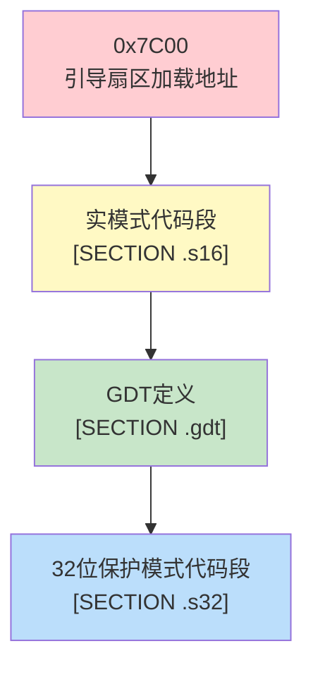
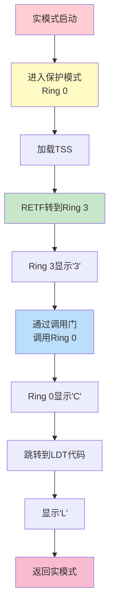

# 07 - 实验代码详解

> 💡 **本章目标**：通过分析pmtest1和pmtest5，理解保护模式和特权级转移的实际应用

> ⚠️ **重要程度**：⭐⭐⭐⭐（理解代码，能够修改）

---

## 📖 目录
1. [pmtest1 - 进入保护模式](#pmtest1---进入保护模式)
2. [pmtest5 - 特权级转移](#pmtest5---特权级转移)
3. [关键代码段解析](#关键代码段解析)
4. [常见问题和调试技巧](#常见问题和调试技巧)

---

## pmtest1 - 进入保护模式

### 🎯 功能概述

**pmtest1.asm** 是最基础的保护模式示例：
- ✅ 从16位实模式启动
- ✅ 构造GDT
- ✅ 进入32位保护模式
- ✅ 在屏幕显示字符'P'

### 📊 内存布局



### 📝 代码结构

```asm
%include "pm.inc"        ; 包含常量和宏定义

org 07c00h               ; 引导扇区加载到0x7C00
    jmp LABEL_BEGIN

; ========== 第1部分：定义GDT ==========
[SECTION .gdt]
LABEL_GDT:
    Descriptor 0, 0, 0                          ; 空描述符
LABEL_DESC_CODE32:
    Descriptor 0, SegCode32Len-1, DA_C+DA_32   ; 32位代码段
LABEL_DESC_VIDEO:
    Descriptor 0B8000h, 0ffffh, DA_DRW         ; 显存段

GdtLen equ $ - LABEL_GDT
GdtPtr dw GdtLen - 1
       dd 0

; 定义选择子
SelectorCode32 equ LABEL_DESC_CODE32 - LABEL_GDT
SelectorVideo  equ LABEL_DESC_VIDEO - LABEL_GDT

; ========== 第2部分：16位实模式代码 ==========
[SECTION .s16]
[BITS 16]
LABEL_BEGIN:
    ; 1. 初始化段寄存器
    mov ax, cs
    mov ds, ax
    mov es, ax
    mov ss, ax
    mov sp, 0100h

    ; 2. 初始化32位代码段描述符
    xor eax, eax
    mov ax, cs
    shl eax, 4                    ; 段地址×16
    add eax, LABEL_SEG_CODE32     ; 加上段内偏移
    mov word [LABEL_DESC_CODE32 + 2], ax
    shr eax, 16
    mov byte [LABEL_DESC_CODE32 + 4], al
    mov byte [LABEL_DESC_CODE32 + 7], ah

    ; 3. 初始化GDT基址
    xor eax, eax
    mov ax, ds
    shl eax, 4
    add eax, LABEL_GDT
    mov dword [GdtPtr + 2], eax

    ; 4. 加载GDTR
    lgdt [GdtPtr]

    ; 5. 关中断
    cli

    ; 6. 打开A20地址线
    in  al, 92h
    or  al, 00000010b
    out 92h, al

    ; 7. 设置CR0的PE位
    mov eax, cr0
    or  eax, 1
    mov cr0, eax

    ; 8. 跳转到保护模式
    jmp dword SelectorCode32:0

; ========== 第3部分：32位保护模式代码 ==========
[SECTION .s32]
[BITS 32]
LABEL_SEG_CODE32:
    ; 设置段寄存器
    mov ax, SelectorVideo
    mov gs, ax

    ; 在屏幕显示'P'
    mov edi, (80 * 11 + 79) * 2    ; 第11行，第79列
    mov ah, 0Ch                     ; 黑底红字
    mov al, 'P'
    mov [gs:edi], ax

    ; 死循环
    jmp $

SegCode32Len equ $ - LABEL_SEG_CODE32
```

### 🔍 关键步骤详解

#### 步骤1：初始化描述符基址

```asm
; 为什么要初始化？
; 因为描述符中的基址字段在编译时是0，
; 需要在运行时填写实际的物理地址

xor eax, eax
mov ax, cs              ; 获取当前代码段
shl eax, 4              ; 段地址×16 = 物理地址
add eax, LABEL_SEG_CODE32  ; 加上段内偏移

; 填写描述符的基址字段（分散在3个位置）
mov word [LABEL_DESC_CODE32 + 2], ax    ; 基址0-15位
shr eax, 16
mov byte [LABEL_DESC_CODE32 + 4], al    ; 基址16-23位
mov byte [LABEL_DESC_CODE32 + 7], ah    ; 基址24-31位
```

**为什么基址分散存储？**
- Intel为了向后兼容，保持描述符结构的历史设计
- 基址32位被分成3段：低16位、中8位、高8位

#### 步骤2：打开A20地址线

```asm
in  al, 92h
or  al, 00000010b
out 92h, al
```

**什么是A20地址线？**
- 8086只有20根地址线（A0-A19），最大寻址1MB
- 80286有24根地址线，但为了兼容，A20默认关闭
- 必须手动打开A20才能访问1MB以上的内存

**为什么是端口92h？**
- 这是快速A20门的端口
- bit 1控制A20：0=关闭，1=打开

#### 步骤3：进入保护模式

```asm
mov eax, cr0
or  eax, 1        ; 设置PE位（bit 0）
mov cr0, eax
```

**CR0寄存器的PE位**：
- PE = Protection Enable
- PE=0：实模式
- PE=1：保护模式

#### 步骤4：跳转到32位代码

```asm
jmp dword SelectorCode32:0
```

**为什么要用jmp？**
- 刷新指令预取队列
- 加载新的CS（包含CPL）
- 开始执行32位代码

### 💻 显存操作

```asm
mov ax, SelectorVideo
mov gs, ax                      ; GS指向显存段

mov edi, (80 * 11 + 79) * 2    ; 计算显存偏移
mov ah, 0Ch                     ; 属性：黑底红字
mov al, 'P'                     ; 字符
mov [gs:edi], ax                ; 写入显存
```

**显存地址计算**：
- 文本模式显存起始地址：0xB8000
- 80列×25行
- 每个字符2字节：字符+属性
- 位置 = (行×80 + 列) × 2

**属性字节格式**：
```
7  6  5  4  3  2  1  0
│  │  │  │  │  │  │  │
└──┴──┴──┘  └──┴──┴──┘
   背景色      前景色

0Ch = 0000 1100
      ││││ ││││
      背景  前景
      黑色  红色
```

---

## pmtest5 - 特权级转移

### 🎯 功能概述

**pmtest5.asm** 演示完整的特权级转移：
- ✅ 从实模式进入保护模式（Ring 0）
- ✅ 通过RETF从Ring 0转到Ring 3
- ✅ 通过调用门从Ring 3调用Ring 0
- ✅ 使用LDT
- ✅ 演示栈切换

### 📊 执行流程



### 📝 GDT结构

| 索引 | 描述符 | DPL | 说明 |
|------|--------|-----|------|
| 0 | 空描述符 | - | Intel保留 |
| 1 | 代码段(32位) | 0 | Ring 0代码 |
| 2 | 数据段 | 0 | Ring 0数据 |
| 3 | 堆栈段 | 0 | Ring 0栈 |
| 4 | 堆栈段 | 3 | Ring 3栈 |
| 5 | 代码段(Ring 3) | 3 | Ring 3代码 |
| 6 | TSS | 0 | 任务状态段 |
| 7 | LDT | 0 | 局部描述符表 |
| 8 | 显存段 | 3 | 显存 |
| 9 | 调用门 | 3 | 用于特权级转移 |

### 🔑 关键代码段

#### 1. 定义TSS

```asm
[SECTION .tss]
ALIGN 32
LABEL_TSS:
    DD  0                   ; Back Link
    DD  TopOfStack          ; ESP0 ← Ring 0的栈顶
    DD  SelectorStack       ; SS0  ← Ring 0的栈段
    DD  0                   ; ESP1
    DD  0                   ; SS1
    DD  0                   ; ESP2
    DD  0                   ; SS2
    DD  0                   ; CR3
    DD  0                   ; EIP
    DD  0                   ; EFLAGS
    ; ... 其他寄存器 ...
    DD  0                   ; LDT
    DW  0                   ; 调试陷阱标志
    DW  $ - LABEL_TSS + 2   ; I/O位图基址
    DB  0FFh                ; I/O位图结束标志

TSSLen equ $ - LABEL_TSS
```

**TSS的作用**：
- 保存Ring 0/1/2的栈指针
- 特权级转移时自动切换栈

#### 2. 加载TSS

```asm
; 在GDT中定义TSS描述符
LABEL_DESC_TSS:
    Descriptor 0, TSSLen-1, DA_386TSS

; 初始化TSS描述符的基址
xor eax, eax
mov ax, ds
shl eax, 4
add eax, LABEL_TSS
mov word [LABEL_DESC_TSS + 2], ax
shr eax, 16
mov byte [LABEL_DESC_TSS + 4], al
mov byte [LABEL_DESC_TSS + 7], ah

; 加载TSS到TR寄存器
mov ax, SelectorTSS
ltr ax                      ; Load Task Register
```

**为什么要加载TSS？**
- 特权级转移时需要切换栈
- CPU从TSS中获取目标特权级的栈指针

#### 3. 从Ring 0转到Ring 3

```asm
; 准备Ring 3的栈和代码信息
push SelectorStack3      ; Ring 3的SS
push TopOfStack3         ; Ring 3的ESP
push SelectorCodeRing3   ; Ring 3的CS (RPL=3)
push 0                   ; Ring 3的EIP

; 执行远返回
retf                     ; 转到Ring 3
```

**栈的变化**：

执行RETF前（Ring 0的栈）：
```
高地址
┌──────────────────┐
│ SelectorStack3   │ ← Ring 3的SS
│ TopOfStack3      │ ← Ring 3的ESP
│ SelectorCodeRing3│ ← Ring 3的CS
│ 0                │ ← Ring 3的EIP
└──────────────────┘ ← ESP
低地址
```

执行RETF后：
- CS = SelectorCodeRing3 (CPL=3)
- EIP = 0
- SS = SelectorStack3
- ESP = TopOfStack3
- 现在在Ring 3运行！

#### 4. Ring 3代码

```asm
[SECTION .ring3]
[BITS 32]
LABEL_CODE_RING3:
    ; 设置显存段
    mov ax, SelectorVideo
    mov gs, ax

    ; 显示'3'表示在Ring 3
    mov edi, (80 * 14 + 0) * 2
    mov ah, 0Ch
    mov al, '3'
    mov [gs:edi], ax

    ; 通过调用门调用Ring 0
    call SelectorCallGate:0

    ; 死循环
    jmp $

SegCodeRing3Len equ $ - LABEL_CODE_RING3
```

#### 5. 定义调用门

```asm
; 在GDT中定义调用门
LABEL_CALL_GATE_TEST:
    Gate SelectorCodeDest, 0, 0, DA_386CGate + DA_DPL3
    ;    ↑                 ↑  ↑  ↑
    ;    目标代码段         |  |  DPL=3，Ring 3可用
    ;    偏移=0            |  386调用门
    ;    参数个数=0

; 调用门选择子
SelectorCallGate equ LABEL_CALL_GATE_TEST - LABEL_GDT + SA_RPL3
```

**调用门的特权级检查**：
```
Ring 3调用：
  CPL = 3
  调用门选择子的RPL = 3
  调用门的DPL = 3
  目标代码段的DPL = 0

检查：
  1. max(CPL, RPL) ≤ 调用门DPL
     max(3, 3) = 3 ≤ 3  ✓
  
  2. 目标代码段DPL ≤ CPL
     0 ≤ 3  ✓

结果：允许，CPL变为0
```

#### 6. 调用门目标代码

```asm
[SECTION .sdest]
[BITS 32]
LABEL_SEG_CODE_DEST:
    ; 显示'C'表示通过调用门
    mov ax, SelectorVideo
    mov gs, ax
    mov edi, (80 * 12 + 0) * 2
    mov ah, 0Ch
    mov al, 'C'
    mov [gs:edi], ax

    ; 加载LDT
    mov ax, SelectorLDT
    lldt ax

    ; 跳入LDT描述的代码段
    jmp SelectorLDTCodeA:0

SegCodeDestLen equ $ - LABEL_SEG_CODE_DEST
```

---

## 关键代码段解析

### 🔧 Descriptor宏

```asm
; 描述符宏：自动填写描述符的各个字段
; 参数1：基址(32位)
; 参数2：界限(20位)
; 参数3：属性(12位)
%macro Descriptor 3
    dw  %2 & 0FFFFh                    ; 段界限1(低16位)
    dw  %1 & 0FFFFh                    ; 段基址1(低16位)
    db  (%1 >> 16) & 0FFh              ; 段基址2(中8位)
    dw  ((%2 >> 8) & 0F00h) | (%3 & 0F0FFh)  ; 属性+段界限2
    db  (%1 >> 24) & 0FFh              ; 段基址3(高8位)
%endmacro

; 使用示例
Descriptor 0, 0FFFFFh, DA_C + DA_32
; 基址=0, 界限=0xFFFFF, 属性=代码段+32位
```

### 🔧 Gate宏

```asm
; 门描述符宏
; 参数1：目标段选择子
; 参数2：目标偏移
; 参数3：参数个数
; 参数4：属性
%macro Gate 4
    dw  (%2 & 0FFFFh)                  ; 偏移低16位
    dw  %1                             ; 段选择子
    dw  (%3 & 1Fh) | ((%4 << 8) & 0FF00h)  ; 参数计数+属性
    dw  ((%2 >> 16) & 0FFFFh)          ; 偏移高16位
%endmacro

; 使用示例
Gate SelectorCode, 0x1000, 2, DA_386CGate + DA_DPL3
; 目标：SelectorCode:0x1000
; 参数个数：2
; 属性：386调用门，DPL=3
```

### 🔧 选择子属性

```asm
; RPL (Requested Privilege Level)
SA_RPL0 equ 0    ; RPL = 0
SA_RPL1 equ 1    ; RPL = 1
SA_RPL2 equ 2    ; RPL = 2
SA_RPL3 equ 3    ; RPL = 3

; TI (Table Indicator)
SA_TIG  equ 0    ; GDT
SA_TIL  equ 4    ; LDT

; 使用示例
SelectorCodeRing3 equ LABEL_DESC_CODE_RING3 - LABEL_GDT + SA_RPL3
;                     ↑                                    ↑
;                     在GDT中的偏移                        RPL=3
```

---

## 常见问题和调试技巧

### ❓ 问题1：进入保护模式后立即崩溃

**可能原因**：
1. GDT没有正确初始化
2. 描述符基址没有填写
3. 选择子计算错误

**调试方法**：
```asm
; 在关键位置显示字符
mov ax, SelectorVideo
mov gs, ax
mov byte [gs:0], 'A'    ; 如果看到'A'，说明到这里了
```

### ❓ 问题2：通用保护异常(GP)

**常见原因**：

| 原因 | 检查方法 |
|------|----------|
| 访问不存在的段 | 检查选择子是否正确 |
| 特权级检查失败 | 检查CPL、DPL、RPL |
| 段界限越界 | 检查偏移是否超出段界限 |
| 写只读段 | 检查段属性 |

**调试技巧**：
```asm
; 设置GP异常处理程序
LABEL_DESC_IDT_GP:
    Gate SelectorCode32, _gp_handler, 0, DA_386IGate

_gp_handler:
    ; 显示错误信息
    mov ax, SelectorVideo
    mov gs, ax
    mov byte [gs:0], 'G'
    mov byte [gs:2], 'P'
    jmp $    ; 死循环，方便调试
```

### ❓ 问题3：栈切换失败

**检查清单**：
- [ ] TSS是否正确定义
- [ ] TSS描述符是否在GDT中
- [ ] TSS是否已加载（ltr指令）
- [ ] TSS中的ESP0和SS0是否正确
- [ ] 目标特权级的栈是否已分配

### ❓ 问题4：调用门不工作

**检查清单**：
- [ ] 调用门DPL是否允许当前CPL访问
- [ ] 目标代码段DPL是否≤CPL
- [ ] 调用门选择子的RPL是否正确
- [ ] 目标代码段是否存在

### 🔍 调试技巧总结

#### 1. 使用显存输出调试信息

```asm
; 定义调试宏
%macro DEBUG_CHAR 2
    push ax
    push gs
    mov ax, SelectorVideo
    mov gs, ax
    mov byte [gs:%1], %2
    pop gs
    pop ax
%endmacro

; 使用
DEBUG_CHAR 0, 'A'    ; 在屏幕左上角显示'A'
```

#### 2. 单步调试

```asm
; 在关键位置插入死循环
mov byte [gs:0], 'X'
jmp $    ; 停在这里，观察状态
```

#### 3. 检查寄存器

```asm
; 显示寄存器值（十六进制）
mov eax, [some_value]
call DisplayHex    ; 自己实现的显示函数
```

#### 4. 使用Bochs调试器

```bash
# 在bochs配置文件中启用调试
display_library: x, options="gui_debug"

# 常用命令
b 0x7c00        # 设置断点
c               # 继续执行
s               # 单步执行
r               # 显示寄存器
x /10 0x7c00    # 查看内存
info gdt        # 显示GDT
info idt        # 显示IDT
```

---

## 🎯 本章小结

### pmtest1核心步骤

1. 定义GDT
2. 初始化描述符基址
3. 加载GDTR
4. 打开A20
5. 设置CR0.PE
6. 跳转到保护模式

### pmtest5核心步骤

1. 进入保护模式
2. 定义和加载TSS
3. 通过RETF转到Ring 3
4. 通过调用门回到Ring 0
5. 使用LDT
6. 返回实模式

### 关键宏

| 宏 | 用途 |
|---|------|
| Descriptor | 定义段描述符 |
| Gate | 定义门描述符 |
| SA_RPL3 | 设置RPL=3 |
| DA_C | 代码段属性 |
| DA_DRW | 数据段属性 |

---

## ✅ 自我检查

- [ ] 能说出进入保护模式的完整步骤
- [ ] 能解释为什么要初始化描述符基址
- [ ] 能解释A20地址线的作用
- [ ] 能说出TSS的作用
- [ ] 能写出从Ring 0到Ring 3的代码
- [ ] 能定义调用门
- [ ] 能使用调试技巧定位问题

---

**下一章**：[08-考点总结.md](08-考点总结.md) - 期中考试重点和答题技巧
