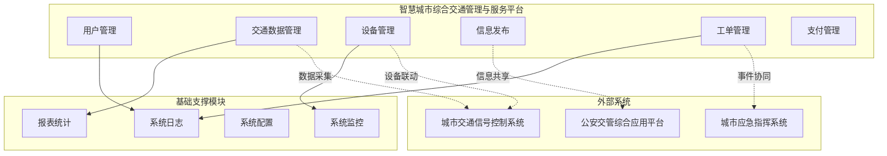
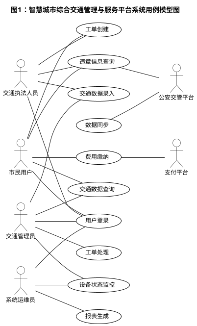
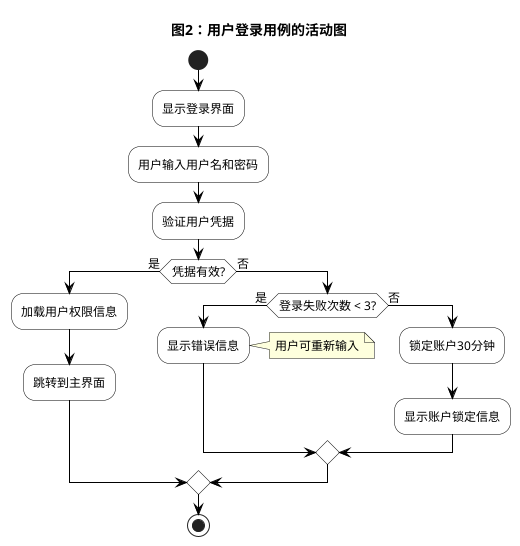
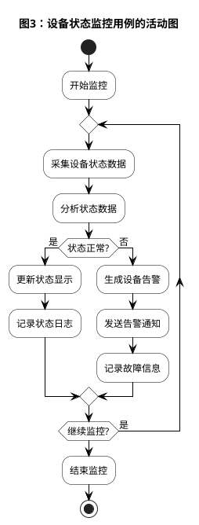

# 智慧城市综合交通管理与服务平台需求规约说明书

**智慧城市科技有限公司编制**  
**二O二五年十月**

## 版本历史

| 日期 | 版本 | 说明 | 作者 |
|------|------|------|------|
| 2025-10-24 | V1.0 | 初始版本 | 系统架构师 |
| 2025-10-25 | V1.1 | 需求完善 | 业务分析师 |

**注：本模板的版权归何滨所有。所有人都可以直接使用，而无需支付任何费用。但不得删除本条说明。**

---

## 目录

**一、引言** .................................................... 1  
1.1 编写目的 .................................................. 1  
1.2 背景 ...................................................... 1  
1.3 定义 ...................................................... 1  
1.4 参考资料 .................................................. 2  

**二、任务概述** .............................................. 2  
2.1 目标 ...................................................... 2  
2.2 用户画像 .................................................. 3  
2.3 假定和约束 ................................................ 3  

**三、需求规定** .............................................. 4  
3.1 功能性需求 ................................................ 4  
3.1.1 用例模型主图 ............................................ 4  
3.1.2 用例说明 ................................................ 5  
3.2 非功能性需求 .............................................. 8  
3.2.1 精度（可选） ............................................ 8  
3.2.2 时间特性要求 ............................................ 8  
3.2.3 性能 .................................................... 9  
3.2.4 可靠性 .................................................. 9  
3.2.5 故障处理要求 ............................................ 9  
3.2.6 安全 .................................................... 10  
3.2.7 设计约束 ................................................ 10  
3.2.8 UI设计要求（可选） ...................................... 11  
3.3 人工操作描述（可选） ...................................... 11  

**四、运行环境规定** .......................................... 12  
4.1 硬件设备 .................................................. 12  
4.2 支持软件 .................................................. 12  
4.3 接口 ...................................................... 13  

**五、词汇表** ................................................ 14  

**六、参考文献** .............................................. 15  

---

## 一、引言

### 1.1 编写目的

本文档旨在全面描述智慧城市综合交通管理与服务平台的软件需求规格说明，为系统设计、开发、测试和验收提供详细的技术依据。本文档详细阐述了系统的功能需求、性能需求、接口需求、约束条件等各项技术规格要求。

**预期读者包括：**
- 项目开发团队成员（系统架构师、开发工程师、测试工程师）
- 项目管理人员和产品经理
- 客户方技术人员和业务专家
- 系统运维和技术支持人员
- 质量保证和文档管理人员

### 1.2 背景

**待开发的软件系统名称：** 智慧城市综合交通管理与服务平台

**项目任务提出者：** 市交通管理局

**项目开发者：** 智慧城市科技有限公司

**项目用户：** 市交通管理局、交通执法部门、市民

**实现该软件的计算中心：** 市政务云数据中心

**该软件系统同其他系统的相互关系：**
- 与城市交通信号控制系统：接收交通流量数据和信号灯状态
- 与公安交通管理综合应用平台：双向数据交换，违章数据同步、车辆信息查询
- 与城市应急指挥系统：事件上报和协同处置
- 与智慧停车管理系统：停车数据查询、费用结算
- 与公共交通调度系统：公交运行数据、站点信息共享

### 1.3 定义

| 术语 | 定义 |
|------|------|
| 智慧交通 (ITS) | 运用物联网、云计算、大数据、人工智能等新一代信息技术，实现交通系统的感知、互联、分析、预测、控制等能力 |
| 微服务架构 | 一种将单一应用程序开发为一组小型服务的方法，每个服务运行在自己的进程中 |
| API网关 | 作为系统对外的唯一入口，封装内部系统架构，提供协议转换、安全认证、流量控制等功能 |
| RBAC | 基于角色的访问控制（Role-Based Access Control），通过角色来管理权限 |
| 容器化部署 | 使用容器技术将应用程序及其依赖项打包在一起，实现快速部署和弹性扩展 |

### 1.4 参考资料

1. 《智慧城市 技术参考模型》（GB/T 34678-2017），全国信息技术标准化技术委员会，2017-10-14 发布。
2. 《公安交通集成指挥平台通信协议》（GA/T 1049-2013），公安部，2013-06 发布。
3. 《计算机软件需求规格说明规范》（GB/T 9385-2008），全国信息技术标准化技术委员会，2008-06 发布。
4. 《信息安全技术 网络安全等级保护基本要求》（GB/T 22239-2019），全国网络安全标准化技术委员会，2019-05 发布。
5. "智慧城市综合交通管理系统建设方案"，市政府智慧城市建设领导小组办公室，2025-03。
6. 《城市交通数据标准规范》（JT/T 719-2008），交通运输部，2008-10 发布。
7. 项目合同书：JTGL-2025-001，市交通管理局与智慧城市科技有限公司，2025-03-01 签订。

---

## 二、任务概述

### 2.1 目标

**软件开发的意图：**
建设一个集交通数据采集、处理、分析、应用于一体的综合性交通管理平台，为交通管理部门提供科学决策支持，为市民提供便民交通服务，为城市交通治理提供技术支撑。

**应用目标：**
- 实现交通数据的统一采集、存储、处理和分析
- 建立智能化的交通设备监控和管理体系
- 构建多渠道的交通信息发布和服务平台
- 建立高效的交通服务工单处理和跟踪机制
- 实现交通违法处理和费用管理的电子化
- 建立完善的系统运维监控和日志管理体系

**作用范围：**
本系统覆盖城市交通管理的全业务流程，包括交通流量监测、信号控制优化、交通事件处理、违章执法管理、停车服务管理、公共交通调度、交通信息发布、市民服务受理等核心业务领域。

**与其他软件的关系：**
本软件产品是智慧城市建设的重要组成部分，与城市大脑、政务服务平台、应急指挥系统等形成有机整体。系统组成和接口关系如下图所示：



### 2.2 用户画像

**交通管理人员：**
- 教育水平：大专及以上学历，交通工程、交通管理或相关专业背景
- 技术专长：熟悉交通管理业务流程，具备基本的计算机操作技能和数据分析能力
- 预期使用频度：每日8小时持续使用，属于系统的核心用户群体
- 主要使用功能：交通数据管理、设备监控、信息发布、工单处理、报表查看

**交通执法人员：**
- 教育水平：高中及以上学历，具备交通法规和执法程序的专业知识
- 技术专长：熟悉移动执法设备操作，具备现场执法和证据采集能力
- 预期使用频度：工作时间内频繁使用，主要通过移动端访问
- 主要使用功能：违章处理、现场执法、工单提交、信息查询

**系统运维人员：**
- 教育水平：本科及以上学历，计算机科学、软件工程或相关专业背景
- 技术专长：精通系统运维、数据库管理、网络安全、故障诊断等技术
- 预期使用频度：7×24小时监控，应急响应时集中使用
- 主要使用功能：系统监控、日志管理、配置管理、性能优化

**市民用户：**
- 教育水平：初中及以上学历，具备基本的智能手机和网络使用能力
- 技术专长：熟悉移动应用操作，无需专业技术背景
- 预期使用频度：按需使用，主要用于查询交通信息和办理相关业务
- 主要使用功能：交通信息查询、违章查询、费用缴纳、服务申请

**决策管理层：**
- 教育水平：本科及以上学历，具备管理学、公共管理或相关专业背景
- 技术专长：关注数据分析和决策支持功能，具备基本的数据解读能力
- 预期使用频度：定期查看统计报表和分析数据，用于决策支持
- 主要使用功能：数据报表、趋势分析、决策支持、绩效评估

### 2.3 假定和约束

#### 2.3.1 项目假定

**业务假定：**
- 假定市交通管理局已完成组织架构调整，明确了各部门的职责分工
- 假定现有交通管理业务流程已经过梳理和优化，可作为系统设计的依据
- 假定各外部系统（公安交管平台、支付平台等）的接口规范稳定，不会发生重大变更
- 假定用户已具备基本的计算机操作能力，能够使用Web浏览器和移动APP

**技术假定：**
- 假定政务云平台能够提供足够的计算、存储和网络资源
- 假定网络带宽能够满足系统运行需求，核心网络带宽不低于10Gbps
- 假定现有交通设备支持标准通信协议，能够与新系统对接
- 假定第三方服务（支付、短信、地图等）能够保持稳定可用

**资源假定：**
- 假定项目能够按计划获得足够的资金支持
- 假定能够招聘到具备相应技术能力的开发和运维人员
- 假定客户方能够及时提供业务需求确认和测试验收支持
- 假定能够获得必要的软硬件采购和部署支持

#### 2.3.2 经费限制

**项目总投资预算：**

| 费用类别 | 预算金额（万元） | 占比 | 说明 |
|----------|------------------|------|------|
| 硬件设备 | 2000 | 40% | 服务器、存储、网络设备、终端设备 |
| 软件开发 | 2000 | 40% | 需求分析、设计、开发、测试 |
| 软件采购 | 300 | 6% | 数据库、中间件、安全软件许可 |
| 系统集成 | 300 | 6% | 设备安装、系统部署、接口对接 |
| 培训服务 | 200 | 4% | 用户培训、运维培训、文档编制 |
| 运维保障 | 200 | 4% | 首年运维服务、技术支持 |
| **合计** | **5000** | **100%** | - |

**费用控制要求：**
- 单项费用超支不得超过预算的10%
- 总体费用超支需经项目管理委员会审批
- 费用变更需提交变更申请，说明变更原因和影响

#### 2.3.3 开发期限

**项目里程碑计划：**

| 阶段 | 起止时间 | 工期 | 主要交付物 |
|------|----------|------|------------|
| 项目启动 | 2025.03.01-2025.03.15 | 0.5月 | 项目章程、团队组建 |
| 需求分析 | 2025.03.16-2025.05.15 | 2月 | 需求规约说明书、原型设计 |
| 系统设计 | 2025.05.16-2025.07.15 | 2月 | 概要设计、详细设计、数据库设计 |
| 开发实施 | 2025.07.16-2025.12.15 | 5月 | 源代码、单元测试报告 |
| 系统测试 | 2025.12.16-2026.01.31 | 1.5月 | 测试报告、缺陷修复 |
| 试运行 | 2026.02.01-2026.02.28 | 1月 | 试运行报告、用户手册 |
| 验收交付 | 2026.02.28 | - | 验收报告、项目总结 |

**关键时间节点：**
- 需求冻结时间：2025年5月15日，此后需求变更需走变更控制流程
- 设计评审时间：2025年7月15日，通过评审后方可进入开发阶段
- 功能冻结时间：2025年12月15日，此后不再增加新功能
- 上线时间：2026年2月1日，系统正式投入试运行

#### 2.3.4 技术约束

**架构约束：**
- 必须采用微服务架构，支持服务的独立部署和弹性扩展
- 必须支持容器化部署，使用Docker和Kubernetes进行容器编排
- 必须实现前后端分离，前端采用SPA单页应用架构
- 必须提供RESTful API接口，支持移动端和第三方系统集成

**技术栈约束：**
- 后端开发语言：Java 11或以上版本，禁止使用已停止维护的版本
- 前端开发框架：Vue.js 3.x或React 18.x，需支持TypeScript
- 数据库系统：MySQL 8.0或PostgreSQL 13，需支持主从复制
- 缓存系统：Redis 6.0或以上版本，需支持集群模式

**安全约束：**
- 必须符合国家网络安全等级保护三级要求
- 必须通过等级保护测评，取得测评报告
- 敏感数据必须加密存储和传输
- 必须实现完整的操作审计日志

**部署约束：**
- 必须在市政务云环境中部署，不得使用公有云
- 必须支持同城双活或异地灾备部署模式
- 必须支持7×24小时不间断运行
- 计划内维护窗口不得影响核心业务

**兼容性约束：**
- 必须与现有公安交管平台实现数据对接
- 必须兼容现有交通监控设备的通信协议
- 必须支持主流浏览器（Chrome、Firefox、Edge、Safari）
- 移动端必须支持iOS 14+和Android 9+

#### 2.3.5 人员约束

**项目团队配置：**

| 角色 | 人数 | 职责 | 技能要求 |
|------|------|------|----------|
| 项目经理 | 1 | 项目整体管理、进度控制、风险管理 | PMP认证，5年以上项目管理经验 |
| 系统架构师 | 2 | 技术架构设计、技术选型、技术攻关 | 8年以上开发经验，精通微服务架构 |
| 后端开发工程师 | 8 | 后端服务开发、接口开发、数据库开发 | 3年以上Java开发经验 |
| 前端开发工程师 | 4 | 前端页面开发、移动端开发 | 3年以上前端开发经验，熟悉Vue/React |
| 测试工程师 | 3 | 测试用例设计、功能测试、性能测试 | 3年以上测试经验，熟悉自动化测试 |
| 运维工程师 | 2 | 环境部署、系统运维、监控告警 | 3年以上运维经验，熟悉K8s |
| **合计** | **20** | - | - |

**客户方配套人员：**
- 业务专家：2-3人，负责业务需求确认和验收测试
- IT联络人：1人，负责技术对接和环境协调
- 项目负责人：1人，负责项目验收和资源协调

#### 2.3.6 其他约束

**法规约束：**
- 必须遵守《中华人民共和国网络安全法》
- 必须遵守《中华人民共和国数据安全法》
- 必须遵守《中华人民共和国个人信息保护法》
- 必须遵守《道路交通安全法》及相关法规

**标准约束：**
- 必须遵循GA/T系列公安行业标准
- 必须遵循JT/T系列交通行业标准
- 必须遵循GB/T系列国家标准
- 接口设计必须遵循RESTful API设计规范

**知识产权约束：**
- 项目开发的软件著作权归甲方所有
- 使用的开源软件必须符合其许可协议要求
- 禁止使用存在知识产权争议的第三方组件
- 项目文档和技术资料属于保密信息

---

## 三、需求规定

### 3.1 功能性需求

#### 3.1.1 用例模型主图

**图1：智慧城市综合交通管理与服务平台系统用例模型图**



#### 3.1.2 用例说明

**用例：用户登录（Login）**

- **简单描述（Brief Description）**  
  本用例描述用户如何登录智慧交通管理系统，包括身份认证和权限加载过程。

- **事件流程（Flow of Events）**  
  
  **1. 基本流程（Basic Flow）**  
  当用户需要登录智慧交通管理系统时，本用例开始执行。
  1) 系统显示登录界面，要求用户输入用户名和密码
  2) 用户输入用户名和密码
  3) 系统验证输入的用户名和密码是否与数据库中的记录匹配
  4) 系统加载用户的角色和权限信息
  5) 系统完成用户登录，跳转到主界面

  **2. 可选流程（Alternative Flows）**  
  6) **用户名或密码错误（Invalid Name/Password）**  
     如果在基本流程中，用户输入了无效的用户名或密码，系统显示错误提示信息。用户可以选择重新输入或取消登录，取消时用例结束。
  
  7) **账户被锁定（Account Locked）**  
     如果用户账户因多次登录失败而被锁定，系统显示锁定提示信息，阻止登录直到锁定期结束或管理员解锁账户。
  
  8) **首次登录（First Login）**  
     如果这是用户首次登录，系统强制用户修改默认密码后才能进入主系统。

- **特殊需求（Special Requirements）**  
  - 密码必须使用HTTPS加密传输
  - 连续3次登录失败后锁定账户30分钟
  - 2小时无操作后会话自动超时
  - 管理员用户支持多因素认证

- **前置条件（Pre-Conditions）**  
  用户必须在系统中拥有有效的注册账户。

- **后置条件（Post-Conditions）**  
  如果用例执行成功，用户已登录系统并加载了相应的权限。如果失败，系统状态保持不变。

- **扩展点（Extension Points）**  
  无。

---

**用例：交通数据录入（Traffic Data Entry）**

- **简单描述（Brief Description）**  
  本用例描述交通管理人员如何向系统录入各类交通数据，包括交通流量数据、车辆信息和路况数据。

- **事件流程（Flow of Events）**  
  
  **1. 基本流程（Basic Flow）**  
  当交通管理员需要录入交通数据时，本用例开始执行。
  1) 系统显示数据录入界面，展示可用的数据类别
  2) 用户选择要录入的数据类型（交通流量、车辆信息、路况等）
  3) 系统显示相应的录入表单及必填字段
  4) 用户填写相关数据信息
  5) 系统验证数据格式、完整性和业务规则
  6) 系统将数据保存到数据库并提供确认信息

  **2. 可选流程（Alternative Flows）**  
  1) **批量数据导入（Batch Import）**  
     用户可以选择上传Excel或CSV文件进行批量数据导入，而不是手动逐条录入。
  
  2) **数据验证失败（Validation Failed）**  
     如果数据未通过验证检查，系统显示具体的错误信息并高亮显示有问题的字段。
  
  3) **重复数据检测（Duplicate Detection）**  
     如果系统检测到可能存在重复数据，会提示用户确认或修改录入内容。

- **特殊需求（Special Requirements）**  
  - 支持Excel和CSV文件格式的批量导入
  - 数据录入成功后自动备份
  - 提供数据录入模板下载
  - 实时数据验证并立即反馈

- **前置条件（Pre-Conditions）**  
  用户必须已登录并拥有数据录入权限。

- **后置条件（Post-Conditions）**  
  数据已成功存储到数据库中，可供查询和分析使用。

---

**用例：设备状态监控（Device Monitoring）**

- **简单描述（Brief Description）**  
  本用例描述系统如何持续监控交通设备状态，并处理设备故障或异常情况。

- **事件流程（Flow of Events）**  
  
  **1. 基本流程（Basic Flow）**  
  本用例作为后台进程持续运行。
  1) 系统自动从已连接的交通设备采集状态数据
  2) 系统根据预定义的正常参数分析状态数据
  3) 系统实时更新设备状态显示
  4) 系统记录所有状态变化以便历史追踪

  **2. 可选流程（Alternative Flows）**  
  1) **设备故障检测（Fault Detection）**  
     如果检测到异常状态，系统生成告警并通知相关人员。
  
  2) **维护模式（Maintenance Mode）**  
     设备可以手动设置为维护模式，暂停正常的监控告警。

- **特殊需求（Special Requirements）**  
  - 实时状态更新，最大延迟不超过30秒
  - 关键故障自动生成告警
  - 历史状态数据至少保留2年
  - 支持多种设备通信协议

- **前置条件（Pre-Conditions）**  
  设备必须已正确注册并连接到系统。

- **后置条件（Post-Conditions）**  
  设备状态在系统中准确显示，任何异常都已正确记录和上报。

---

---

**用例：工单创建（Create Work Order）**

- **简单描述（Brief Description）**  
  本用例描述用户如何创建交通服务工单，包括市民投诉、设备报修、事件上报等类型的工单。

- **事件流程（Flow of Events）**  
  
  **1. 基本流程（Basic Flow）**  
  当用户需要创建工单时，本用例开始执行。
  1) 系统显示工单创建界面，展示可选的工单类型
  2) 用户选择工单类型（投诉建议、设备报修、交通事件、咨询求助）
  3) 系统根据工单类型显示相应的表单模板
  4) 用户填写工单标题、详细描述、发生地点、联系方式等信息
  5) 用户可选择上传图片、视频等附件材料
  6) 系统验证必填字段的完整性
  7) 系统自动分配工单编号，根据工单类型和地点智能派发给对应处理部门
  8) 系统发送工单创建成功通知给用户

  **2. 可选流程（Alternative Flows）**  
  1) **紧急工单（Urgent Work Order）**  
     如果用户标记工单为紧急，系统自动提升工单优先级，并立即通知值班人员处理。
  
  2) **匿名提交（Anonymous Submission）**  
     市民用户可选择匿名提交投诉建议类工单，系统不记录用户身份信息。
  
  3) **关联历史工单（Link to History）**  
     如果系统检测到相似的历史工单，提示用户是否关联，避免重复提交。
  
  4) **草稿保存（Save as Draft）**  
     用户可将未完成的工单保存为草稿，稍后继续编辑提交。

- **特殊需求（Special Requirements）**  
  - 支持图片（JPG、PNG）、视频（MP4）、文档（PDF、Word）附件上传
  - 单个附件大小不超过50MB，总附件大小不超过200MB
  - 工单编号格式：WO-YYYYMMDD-XXXX（年月日-4位序号）
  - 支持地图选点定位，精确标记事件发生位置
  - 工单创建后5分钟内可撤回

- **前置条件（Pre-Conditions）**  
  用户必须已登录系统（匿名工单除外）。

- **后置条件（Post-Conditions）**  
  工单已创建并分配给相应处理人员，用户收到工单编号和预计处理时间。

---

**用例：工单处理（Process Work Order）**

- **简单描述（Brief Description）**  
  本用例描述处理人员如何受理、处理和完结工单，包括工单流转、进度更新和结果反馈。

- **事件流程（Flow of Events）**  
  
  **1. 基本流程（Basic Flow）**  
  当处理人员收到待办工单时，本用例开始执行。
  1) 系统在待办列表中显示分配给当前用户的工单
  2) 处理人员查看工单详情，了解问题描述和相关材料
  3) 处理人员点击"受理"按钮，工单状态变更为"处理中"
  4) 处理人员进行实际处理工作（现场勘查、设备维修、问题解决等）
  5) 处理人员在系统中记录处理过程和结果，上传处理凭证
  6) 处理人员提交处理结果，工单状态变更为"待审核"
  7) 主管审核处理结果，确认无误后工单状态变更为"已完成"
  8) 系统自动通知工单创建者处理结果

  **2. 可选流程（Alternative Flows）**  
  1) **工单转派（Transfer Work Order）**  
     如果当前处理人员无法处理，可将工单转派给其他人员或部门，需填写转派原因。
  
  2) **工单退回（Return Work Order）**  
     如果工单信息不完整或不属于本部门职责，可退回给创建者补充信息或重新分配。
  
  3) **工单挂起（Suspend Work Order）**  
     因客观原因暂时无法处理时，可将工单挂起，需填写挂起原因和预计恢复时间。
  
  4) **催办处理（Urge Processing）**  
     如果工单超时未处理，系统自动发送催办通知，并上报给主管。
  
  5) **工单回访（Follow-up）**  
     工单完成后，系统自动发起满意度回访，收集用户反馈。

- **特殊需求（Special Requirements）**  
  - 普通工单处理时限：3个工作日
  - 紧急工单处理时限：4小时
  - 工单超时自动升级，逐级上报
  - 处理过程全程留痕，支持追溯
  - 支持工单处理时长统计和绩效考核

- **前置条件（Pre-Conditions）**  
  工单已创建并分配给当前处理人员。

- **后置条件（Post-Conditions）**  
  工单已处理完成，处理结果已记录，创建者已收到反馈通知。

---

**用例：违章信息查询（Traffic Violation Query）**

- **简单描述（Brief Description）**  
  本用例描述用户如何查询车辆违章信息，包括违章记录、罚款金额、扣分情况等。

- **事件流程（Flow of Events）**  
  
  **1. 基本流程（Basic Flow）**  
  当用户需要查询违章信息时，本用例开始执行。
  1) 系统显示违章查询界面
  2) 用户输入车牌号码和车辆识别代号（VIN）后6位
  3) 系统调用公安交管平台接口查询违章记录
  4) 系统显示违章记录列表，包括违章时间、地点、类型、罚款金额、扣分
  5) 用户可点击查看违章详情，包括违章照片和视频证据
  6) 系统提供违章处理入口，引导用户进行在线处理或预约窗口处理

  **2. 可选流程（Alternative Flows）**  
  1) **无违章记录（No Violation Found）**  
     如果查询结果为空，系统显示"恭喜，该车辆暂无违章记录"。
  
  2) **车辆信息不匹配（Vehicle Info Mismatch）**  
     如果车牌号与VIN不匹配，系统提示用户核实车辆信息。
  
  3) **外地违章查询（Out-of-Province Query）**  
     对于外地违章，系统提示用户需要到违章发生地或通过12123APP处理。
  
  4) **违章申诉（Violation Appeal）**  
     用户对违章有异议时，可在线提交申诉材料，进入申诉处理流程。

- **特殊需求（Special Requirements）**  
  - 查询结果缓存10分钟，减少接口调用频率
  - 支持多车辆绑定，一键查询所有绑定车辆违章
  - 违章照片支持放大查看，视频支持在线播放
  - 敏感信息（车架号）部分脱敏显示
  - 查询记录保留30天，支持历史查询

- **前置条件（Pre-Conditions）**  
  用户必须已登录系统，公安交管平台接口正常可用。

- **后置条件（Post-Conditions）**  
  用户获取到车辆违章信息，可选择进行后续处理。

---

**用例：费用缴纳（Payment）**

- **简单描述（Brief Description）**  
  本用例描述用户如何在线缴纳交通相关费用，包括违章罚款、停车费、年检费等。

- **事件流程（Flow of Events）**  
  
  **1. 基本流程（Basic Flow）**  
  当用户需要缴纳费用时，本用例开始执行。
  1) 系统显示待缴费用列表，包括费用类型、金额、缴费期限
  2) 用户选择需要缴纳的费用项目（支持多选批量缴费）
  3) 系统计算总金额并显示费用明细
  4) 用户选择支付方式（微信支付、支付宝、银联）
  5) 系统生成支付订单，调用第三方支付接口
  6) 用户完成支付操作（扫码或跳转支付）
  7) 系统接收支付回调，确认支付成功
  8) 系统更新缴费状态，生成电子缴费凭证
  9) 系统发送缴费成功通知给用户

  **2. 可选流程（Alternative Flows）**  
  10) **支付超时（Payment Timeout）**  
     如果用户在15分钟内未完成支付，订单自动取消，用户需重新发起缴费。
  
  11) **支付失败（Payment Failed）**  
     如果支付失败，系统显示失败原因，用户可选择重试或更换支付方式。
  
  12) **部分缴费（Partial Payment）**  
     对于可分期的费用，用户可选择部分缴纳，系统记录已缴和待缴金额。
  
  13) **退款申请（Refund Request）**  
     对于误缴或多缴的费用，用户可申请退款，进入退款审核流程。
  
  14) **发票申请（Invoice Request）**  
     缴费完成后，用户可申请电子发票或纸质发票。

- **特殊需求（Special Requirements）**  
  - 支持微信支付、支付宝、银联云闪付三种支付方式
  - 支付金额精确到分，不支持小于0.01元的支付
  - 支付订单有效期15分钟
  - 电子凭证支持PDF下载和微信/支付宝卡包保存
  - 支付记录永久保存，支持随时查询和导出

- **前置条件（Pre-Conditions）**  
  用户必须已登录系统，存在待缴费用项目，支付渠道正常可用。

- **后置条件（Post-Conditions）**  
  费用已缴纳成功，缴费状态已更新，用户获得电子缴费凭证。

---

**用例：报表生成（Report Generation）**

- **简单描述（Brief Description）**  
  本用例描述系统如何生成各类统计报表，包括交通流量报表、设备运行报表、工单统计报表等。

- **事件流程（Flow of Events）**  
  
  **1. 基本流程（Basic Flow）**  
  当用户需要生成报表时，本用例开始执行。
  1) 系统显示报表中心界面，展示可用的报表模板
  2) 用户选择报表类型（日报、周报、月报、年报、自定义报表）
  3) 用户设置报表参数（时间范围、数据维度、筛选条件）
  4) 系统根据参数从数据库提取数据
  5) 系统按照报表模板进行数据计算和格式化
  6) 系统生成报表预览，展示图表和数据表格
  7) 用户确认后，可选择导出格式（PDF、Excel、Word）
  8) 系统生成报表文件，提供下载链接

  **2. 可选流程（Alternative Flows）**  
  1) **定时报表（Scheduled Report）**  
     用户可设置报表定时生成任务，系统按计划自动生成并发送到指定邮箱。
  
  2) **报表订阅（Report Subscription）**  
     用户可订阅常用报表，系统定期推送报表到用户邮箱或系统消息。
  
  3) **自定义报表（Custom Report）**  
     用户可通过拖拽方式自定义报表字段和布局，保存为个人报表模板。
  
  4) **大数据量报表（Large Data Report）**  
     对于数据量超过10万条的报表，系统采用异步生成方式，完成后通知用户下载。

- **特殊需求（Special Requirements）**  
  - 报表支持PDF、Excel（xlsx）、Word（docx）三种导出格式
  - 报表图表支持柱状图、折线图、饼图、地图热力图等多种类型
  - 报表数据支持钻取，从汇总数据下钻到明细数据
  - 报表生成历史保留90天
  - 支持报表水印和权限控制，防止敏感数据泄露

- **前置条件（Pre-Conditions）**  
  用户必须已登录并拥有报表查看权限，相关数据已录入系统。

- **后置条件（Post-Conditions）**  
  报表已生成，用户可在线查看或下载报表文件。

---

**图2：用户登录用例的活动图**



**图3：设备状态监控用例的活动图**




### 3.2 非功能性需求

#### 3.2.1 精度

**数据精度要求：**

| 数据类型 | 精度要求 | 误差范围 | 校验方式 |
|----------|----------|----------|----------|
| 车辆计数 | 整数 | ±2% | 视频复核抽检 |
| 车辆速度 | 精确到km/h | ±5% | 雷达测速对比 |
| 时间戳 | 精确到秒 | ±1秒 | NTP时间同步 |
| GPS坐标 | 6位小数 | ±10米 | 实地测量校准 |
| 金额数据 | 精确到分 | 0 | 双重记账校验 |
| 百分比统计 | 2位小数 | ±0.1% | 交叉验证 |

**交通流量数据精度细则：**
- 车辆计数误差：在正常天气条件下不超过±2%，恶劣天气（雨雪雾）条件下不超过±5%
- 速度测量误差：静态测速误差不超过±3km/h，动态测速误差不超过±5%
- 车型识别准确率：大型车辆识别准确率不低于95%，小型车辆识别准确率不低于98%
- 车牌识别准确率：白天识别准确率不低于99%，夜间识别准确率不低于95%
- 占有率计算精度：时间占有率和空间占有率误差不超过±3%

**地理位置精度细则：**
- 普通道路定位精度：不低于10米
- 重要路口定位精度：不低于5米
- 高速公路定位精度：不低于20米
- 室内停车场定位精度：不低于3米（需配合蓝牙信标）
- 地图匹配准确率：不低于98%

**财务数据精度细则：**
- 金额计算采用BigDecimal类型，避免浮点数精度丢失
- 所有金额以"分"为单位存储，显示时转换为"元"
- 汇率换算保留4位小数，四舍五入
- 财务报表金额与明细数据差异不超过1分钱

**传输过程精度要求：**
- 数据传输过程中不得出现数据丢失或损坏，采用CRC32校验
- 文件传输完整性校验，使用MD5或SHA256哈希值验证
- 实时数据传输延迟不超过500毫秒（局域网环境）
- 跨网络数据传输延迟不超过2秒
- 数据包丢失率不超过0.01%，支持自动重传机制

#### 3.2.2 时间特性要求

**响应时间：**
- 用户登录响应时间：不超过2秒
- 普通数据查询响应时间：不超过3秒
- 复杂统计查询响应时间：不超过10秒
- 报表生成时间：简单报表不超过10秒，复杂报表不超过30秒

**更新处理时间：**
- 数据录入确认时间：不超过2秒
- 批量数据导入：10000条记录不超过5分钟
- 系统配置更新生效时间：不超过30秒
- 用户权限变更生效时间：不超过1分钟

**数据转换和传送时间：**
- 数据格式转换时间：不超过处理时间的10%
- 文件上传时间：100MB文件不超过5分钟
- 数据备份时间：每日增量备份不超过2小时
- 数据同步时间：与外部系统数据同步不超过10分钟

#### 3.2.3 性能

**同时在线数量：**
- 系统支持同时在线用户数：不少于10000人
- 峰值并发用户数：不少于15000人
- 数据库并发连接数：不少于1000个
- API接口并发请求数：不少于5000次/分钟

**吞吐量要求：**
- 数据录入处理能力：不少于1000条/分钟
- 查询处理能力：不少于10000次/小时
- 报表生成能力：不少于100个报表/小时
- 文件处理能力：支持100MB以内文件的快速处理

#### 3.2.4 可靠性

**系统可用性指标：**

| 指标名称 | 目标值 | 计算方式 | 监控周期 |
|----------|--------|----------|----------|
| 年度可用性 | ≥99.5% | (总时间-停机时间)/总时间 | 年度 |
| 月度可用性 | ≥99.9% | (总时间-停机时间)/总时间 | 月度 |
| 平均故障间隔(MTBF) | ≥720小时 | 总运行时间/故障次数 | 季度 |
| 平均恢复时间(MTTR) | ≤30分钟 | 总恢复时间/故障次数 | 季度 |
| 数据备份成功率 | ≥99.9% | 成功次数/总次数 | 月度 |

**系统可用性要求：**
- 年度系统可用性：不低于99.5%（年度计划外停机时间不超过43.8小时）
- 月度计划外停机时间：不超过4小时
- 单次故障恢复时间（RTO）：不超过30分钟
- 数据恢复点目标（RPO）：不超过5分钟
- 计划内维护窗口：每月不超过8小时，安排在业务低峰期（凌晨2:00-6:00）

**容错能力：**
- 应用服务器：采用集群部署，支持单节点故障自动剔除和流量切换
- 数据库服务器：主从热备架构，主库故障时30秒内自动切换到从库
- 缓存服务器：Redis Cluster模式，支持分片和副本，单节点故障不影响服务
- 消息队列：Kafka多副本机制，支持Leader选举和自动故障转移
- 负载均衡：双机热备，故障切换时间不超过3秒
- 网络链路：双链路冗余，支持自动路由切换

**降级策略：**
- 当数据库响应超时时，启用本地缓存提供只读服务
- 当第三方支付接口故障时，提示用户稍后重试或使用其他支付方式
- 当短信服务不可用时，自动切换到备用短信通道或APP推送
- 当地图服务故障时，使用离线地图瓦片提供基础地图功能
- 当设备通信中断时，使用最后一次有效数据，并标记数据时效性

**数据一致性保障：**
- 关键业务操作采用分布式事务，保证数据一致性
- 跨系统数据同步采用最终一致性模型，同步延迟不超过10分钟
- 数据库采用事务日志，支持任意时间点恢复
- 定期进行数据一致性校验，发现不一致自动告警

#### 3.2.5 故障处理要求

**软件故障处理：**
- 应用程序异常：自动重启服务，记录详细错误日志
- 数据库连接失败：自动重连机制，最多重试5次
- 第三方接口故障：启用降级处理，提供备用方案
- 内存溢出：自动垃圾回收，必要时重启相关服务

**硬件故障处理：**
- 服务器硬件故障：自动切换到备用服务器，故障转移时间不超过5分钟
- 网络设备故障：启用冗余网络链路，自动路由切换
- 存储设备故障：通过RAID技术和数据备份保证数据安全
- 电源故障：UPS供电保障，支持至少30分钟的应急供电

**故障恢复要求：**
- 建立完善的故障预警机制
- 提供7×24小时技术支持服务
- 故障处理流程标准化，响应时间不超过15分钟
- 定期进行故障演练和恢复测试

#### 3.2.6 安全

**安全等级要求：**
本系统按照《信息安全技术 网络安全等级保护基本要求》（GB/T 22239-2019）三级标准进行安全建设，满足以下安全要求：

| 安全域 | 安全要求 | 实现措施 |
|--------|----------|----------|
| 物理安全 | 机房安全、设备安全 | 政务云机房，符合A级标准 |
| 网络安全 | 边界防护、访问控制 | 防火墙、WAF、IDS/IPS |
| 主机安全 | 系统加固、恶意代码防范 | 安全基线、杀毒软件 |
| 应用安全 | 身份认证、访问控制 | RBAC、JWT、OAuth2.0 |
| 数据安全 | 数据加密、备份恢复 | AES-256、异地备份 |

**用户身份认证：**
- 支持用户名密码认证、短信验证码认证、数字证书认证三种方式
- 管理员用户强制启用双因素认证（2FA）
- 密码强度要求：至少8位，必须包含大写字母、小写字母、数字、特殊字符中的至少3种
- 密码有效期：普通用户90天，管理员用户60天，到期强制修改
- 密码历史：不能使用最近5次使用过的密码
- 登录失败锁定：连续5次失败锁定账户30分钟
- 会话超时：普通用户2小时，管理员用户30分钟
- 单点登录限制：同一账户同时只能在一个终端登录（可配置）

**用户权限管理：**
- 实施基于角色的访问控制（RBAC），支持用户-角色-权限三级模型
- 预置角色：系统管理员、安全管理员、审计管理员、业务管理员、普通用户
- 支持自定义角色，可灵活配置功能权限和数据权限
- 数据权限支持按组织机构、行政区划、业务类型等维度控制
- 敏感操作需要二次授权确认
- 权限变更实时生效，无需重新登录

**操作审计日志：**

| 日志类型 | 记录内容 | 保留期限 |
|----------|----------|----------|
| 登录日志 | 用户名、登录时间、IP地址、登录结果、设备信息 | 180天 |
| 操作日志 | 操作人、操作时间、操作类型、操作对象、操作结果 | 365天 |
| 数据变更日志 | 变更人、变更时间、变更前后数据、变更原因 | 365天 |
| 安全事件日志 | 事件类型、发生时间、来源IP、处理结果 | 365天 |
| 系统日志 | 服务名称、日志级别、日志内容、时间戳 | 90天 |

**网络安全防护：**
- 部署下一代防火墙（NGFW），实现L3-L7层安全防护
- 部署Web应用防火墙（WAF），防护OWASP Top 10攻击
- 部署入侵检测系统（IDS），实时监控网络流量异常
- 部署堡垒机，实现运维操作审计和权限控制
- 实施网络分区隔离，业务区、管理区、DMZ区物理隔离
- API接口实施限流控制，防止DDoS攻击和接口滥用

**应用安全防护：**
- SQL注入防护：使用参数化查询，禁止SQL拼接
- XSS攻击防护：输入过滤、输出编码、CSP策略
- CSRF攻击防护：Token验证、Referer检查
- 文件上传防护：文件类型白名单、文件内容检测、存储路径隔离
- 接口安全：JWT令牌认证、接口签名验证、防重放攻击
- 代码安全：定期代码审计、依赖库漏洞扫描、安全编码规范

**数据安全：**
- 敏感数据分类分级：按照《数据安全法》要求，将数据分为一般数据、重要数据、核心数据三级
- 敏感数据加密存储：身份证号、手机号、银行卡号等采用AES-256加密
- 敏感数据脱敏显示：身份证号显示前3后4位，手机号显示前3后4位
- 数据传输加密：全站HTTPS，TLS 1.2及以上版本
- 数据库安全：访问白名单、SQL审计、敏感数据访问告警
- 数据备份加密：备份文件采用AES-256加密，密钥分离存储

**安全运营：**
- 每季度进行一次安全漏洞扫描
- 每半年进行一次渗透测试
- 每年进行一次等级保护测评
- 建立安全事件应急响应机制，响应时间不超过15分钟
- 定期进行安全培训和意识教育

#### 3.2.7 设计约束

**技术架构约束：**
- 后端开发语言：Java 11或以上版本，Spring Boot框架
- 前端开发框架：Vue.js 3.x或React 18.x，支持响应式设计
- 数据库系统：MySQL 8.0或PostgreSQL 13，支持主从复制
- 消息队列：Apache Kafka 2.8或RabbitMQ 3.8
- 缓存系统：Redis 6.0或以上版本，支持集群模式

**接口集成约束：**
- 必须集成微信支付和支付宝支付接口，支持扫码支付和APP支付
- 必须对接公安交管平台数据接口，遵循GA/T标准规范
- 必须支持短信和邮件通知接口，支持模板化消息发送
- 必须符合政务服务平台接口规范，支持统一身份认证

**部署环境约束：**
- 必须在政务云环境中部署，符合政务云安全规范
- 支持容器化部署，使用Docker和Kubernetes
- 支持微服务架构，各服务模块独立部署和扩展
- 支持灰度发布和蓝绿部署策略

#### 3.2.8 UI设计要求

**界面设计原则：**
- 采用响应式设计，支持PC端、平板和移动端的自适应显示
- 界面风格简洁明了，符合政务系统UI设计规范
- 支持主题切换功能，提供明亮和暗黑两种主题
- 支持字体大小调节，满足不同用户的视觉需求
- 提供无障碍访问支持，符合WCAG 2.1 AA级标准

**用户体验要求：**
- 核心业务操作流程不超过3个步骤
- 重要操作提供二次确认提示，防止误操作
- 错误信息清晰明确，提供具体的解决建议
- 支持键盘快捷键操作，提高操作效率
- 提供操作指南和帮助文档，支持在线帮助

### 3.3 人工操作描述

**数据录入人工操作：**
- 交通管理员需要定期录入交通流量数据，包括车流量、平均速度、拥堵指数等
- 执法人员需要现场录入违章信息，包括违章类型、时间地点、证据材料等
- 设备维护人员需要录入设备检修记录，包括维护内容、更换部件、测试结果等

**数据审核人工操作：**
- 数据管理员需要对录入的数据进行质量检查，确保数据的准确性和完整性
- 业务主管需要对重要数据变更进行审核确认
- 系统管理员需要对用户权限变更进行审核批准

**应急处理人工操作：**
- 当系统出现故障时，运维人员需要手动切换到备用系统
- 当发生交通事故时，调度员需要手动调整信号灯配时
- 当出现网络中断时，现场人员需要通过备用通信方式上报信息

---

## 四、运行环境规定

### 4.1 硬件设备

**应用服务器集群：**
- 处理器型号：Intel Xeon Gold 6248R或同等性能，24核心3.0GHz，支持超线程技术
- 内存容量：128GB DDR4-2933 ECC内存，支持内存热插拔
- 外存容量：2TB NVMe SSD + 4TB SATA SSD，支持RAID 1+0配置
- 网络接口：双万兆以太网接口，支持网络冗余
- 数量：不少于4台，支持负载均衡和故障转移

**数据库服务器集群：**
- 处理器型号：Intel Xeon Platinum 8280或同等性能，28核心2.7GHz
- 内存容量：256GB DDR4-2933 ECC内存，支持内存镜像
- 外存容量：4TB NVMe SSD，支持RAID 10配置，IOPS不低于100000
- 网络接口：双万兆以太网接口 + 专用存储网络接口
- 数量：不少于3台（1主2从），支持自动故障转移

**负载均衡设备：**
- 吞吐量：不少于20Gbps
- 并发连接数：不少于200万
- 新建连接数：不少于50万/秒
- 支持SSL卸载、健康检查、会话保持功能
- 支持双机热备，故障切换时间不超过3秒

**存储设备：**
- 存储容量：不少于100TB可用容量
- 存储类型：全闪存阵列，支持SSD和NVMe混合配置
- IOPS性能：不低于500000 IOPS
- 带宽：不低于10GB/s
- 支持快照、复制、重删压缩等高级功能

**网络设备：**
- 核心交换机：万兆端口不少于48个，支持40G/100G上联
- 接入交换机：千兆端口不少于48个，万兆上联端口不少于4个
- 防火墙：吞吐量不少于10Gbps，支持深度包检测
- 路由器：支持BGP、OSPF等路由协议，冗余配置

**终端设备：**
- 管理终端：Intel i7处理器，16GB内存，512GB SSD，27寸4K显示器
- 移动执法终端：支持4G/5G网络，GPS定位，高清摄像头
- 大屏显示设备：LED显示屏，分辨率不低于1920×1080，支持7×24小时连续显示

### 4.2 支持软件

**操作系统：**
- 服务器操作系统：CentOS 8.4 或 Ubuntu Server 20.04 LTS 或 Red Hat Enterprise Linux 8
- 容器平台：Docker 20.10或以上版本，支持容器编排
- 容器编排：Kubernetes 1.21或以上版本，支持自动扩缩容
- 虚拟化平台：VMware vSphere 7.0 或 OpenStack Victoria

**数据库软件：**
- 关系型数据库：MySQL 8.0.25 或 PostgreSQL 13.3，支持主从复制和读写分离
- 缓存数据库：Redis 6.2或以上版本，支持集群模式和持久化
- 搜索引擎：Elasticsearch 7.13或以上版本，支持全文检索和日志分析
- 时序数据库：InfluxDB 2.0，用于存储设备监控数据

**中间件软件：**
- Web服务器：Nginx 1.20 或 Apache HTTP Server 2.4，支持负载均衡和SSL终结
- 应用服务器：Apache Tomcat 9.0 或 Spring Boot内嵌Jetty服务器
- 消息队列：Apache Kafka 2.8 或 RabbitMQ 3.8，支持高可用集群
- API网关：Kong 2.4 或 Zuul 2.0，支持限流、认证、监控

**监控和运维软件：**
- 系统监控：Prometheus 2.27 + Grafana 8.0，支持自定义监控指标
- 日志管理：ELK Stack（Elasticsearch + Logstash + Kibana）7.13
- APM监控：Skywalking 8.6 或 Pinpoint 2.3
- 配置管理：Ansible 4.2 或 Puppet 7.0

**浏览器支持：**
- Google Chrome 91或以上版本（推荐）
- Mozilla Firefox 89或以上版本
- Microsoft Edge 91或以上版本
- Safari 14.1或以上版本（macOS）
- 不支持Internet Explorer

**移动设备操作系统：**
- iOS 14.0或以上版本，支持iPhone和iPad
- Android 9.0 (API Level 28)或以上版本
- HarmonyOS 2.0或以上版本

### 4.3 接口

#### 4.3.1 外部系统接口概览

| 接口名称 | 协议类型 | 数据格式 | 说明 |
|----------|----------|----------|------|
| 公安交管平台接口 | Web Service/RESTful | XML/JSON | 违章数据同步、车辆信息查询 |
| 微信支付接口 | HTTPS RESTful | JSON | 支持JSAPI、Native、APP支付 |
| 支付宝支付接口 | HTTPS RESTful | JSON | 支持当面付、手机网站支付 |
| 短信平台接口 | HTTPS RESTful | JSON | 阿里云/腾讯云短信服务 |
| 地图服务接口 | HTTPS RESTful | JSON | 百度/高德地图API |
| 设备通信接口 | MQTT/TCP | JSON/Binary | 交通设备数据采集 |

#### 4.3.2 公安交管平台接口

**接口用途：** 与公安交通管理综合应用平台进行数据交换，实现违章信息查询、车辆信息核验、驾驶人信息查询等功能。

**接口规范：** 遵循GA/T 1049-2013《公安交通集成指挥平台通信协议》标准。

**主要接口清单：**

| 接口编号 | 接口名称 | 调用方向 | 调用频率 | 超时时间 |
|----------|----------|----------|----------|----------|
| GAT-001 | 违章记录查询 | 本系统→交管平台 | 实时 | 10秒 |
| GAT-002 | 车辆信息核验 | 本系统→交管平台 | 实时 | 5秒 |
| GAT-003 | 驾驶人信息查询 | 本系统→交管平台 | 实时 | 5秒 |
| GAT-004 | 违章处理结果同步 | 交管平台→本系统 | 准实时 | - |
| GAT-005 | 布控车辆信息推送 | 交管平台→本系统 | 实时 | - |

**安全要求：**
- 采用专线网络连接，物理隔离公网
- 接口调用需携带数字证书进行双向认证
- 敏感数据字段采用国密SM4算法加密传输
- 接口调用日志保留不少于6个月

#### 4.3.3 支付平台接口

**微信支付接口：**

| 接口编号 | 接口名称 | 接口地址 | 说明 |
|----------|----------|----------|------|
| WX-001 | 统一下单 | /v3/pay/transactions/jsapi | 创建支付订单 |
| WX-002 | 查询订单 | /v3/pay/transactions/id/{transaction_id} | 查询订单状态 |
| WX-003 | 关闭订单 | /v3/pay/transactions/out-trade-no/{out_trade_no}/close | 关闭未支付订单 |
| WX-004 | 申请退款 | /v3/refund/domestic/refunds | 发起退款申请 |
| WX-005 | 支付通知 | 商户配置回调地址 | 接收支付结果通知 |

**支付宝接口：**

| 接口编号 | 接口名称 | 接口方法 | 说明 |
|----------|----------|----------|------|
| ALI-001 | 统一收单交易创建 | alipay.trade.create | 创建支付订单 |
| ALI-002 | 统一收单交易查询 | alipay.trade.query | 查询订单状态 |
| ALI-003 | 统一收单交易关闭 | alipay.trade.close | 关闭未支付订单 |
| ALI-004 | 统一收单交易退款 | alipay.trade.refund | 发起退款申请 |
| ALI-005 | 支付结果异步通知 | 商户配置回调地址 | 接收支付结果通知 |

**支付安全要求：**
- 所有支付接口必须使用HTTPS协议
- 商户私钥安全存储，禁止明文配置
- 支付回调必须验证签名，防止伪造通知
- 订单金额服务端校验，防止金额篡改
- 支付结果以服务端查询为准，不信任前端返回

#### 4.3.4 短信通知接口

**接口用途：** 向用户发送验证码、业务通知、告警提醒等短信消息。

**支持平台：** 阿里云短信服务、腾讯云短信服务（主备切换）

**短信模板类型：**

| 模板编号 | 模板名称 | 模板内容 | 使用场景 |
|----------|----------|----------|----------|
| SMS-001 | 登录验证码 | 您的验证码是${code}，5分钟内有效，请勿泄露。 | 用户登录验证 |
| SMS-002 | 工单创建通知 | 您的工单${orderNo}已创建，预计${time}内处理完成。 | 工单状态通知 |
| SMS-003 | 工单完成通知 | 您的工单${orderNo}已处理完成，请登录系统查看详情。 | 工单状态通知 |
| SMS-004 | 缴费提醒 | 您有${count}笔待缴费用，合计${amount}元，请及时缴纳。 | 费用催缴 |
| SMS-005 | 设备告警通知 | 设备${deviceName}发生${alarmType}告警，请及时处理。 | 运维告警 |

**接口限制：**
- 单个手机号每日接收短信不超过10条
- 验证码短信60秒内不可重复发送
- 营销类短信需用户明确授权同意
- 短信发送记录保留12个月

#### 4.3.5 地图服务接口

**接口用途：** 提供地图展示、地理编码、路径规划、交通态势等地图相关功能。

**主要接口清单：**

| 接口编号 | 接口名称 | 说明 | 调用限制 |
|----------|----------|------|----------|
| MAP-001 | 地图瓦片服务 | 提供地图底图瓦片数据 | 无限制 |
| MAP-002 | 地理编码 | 地址转换为经纬度坐标 | 30000次/日 |
| MAP-003 | 逆地理编码 | 经纬度转换为地址描述 | 30000次/日 |
| MAP-004 | 路径规划 | 计算两点间最优路径 | 10000次/日 |
| MAP-005 | 交通态势 | 获取实时路况信息 | 10000次/日 |
| MAP-006 | POI搜索 | 搜索周边兴趣点 | 30000次/日 |

#### 4.3.6 设备通信接口

**接口用途：** 与交通监控设备、信号灯控制器、诱导屏等物联网设备进行数据通信。

**通信协议：**
- MQTT 3.1.1：用于设备状态上报和指令下发，支持QoS 0/1/2
- TCP长连接：用于视频流传输和大数据量传输
- HTTP：用于设备配置下发和固件升级

**设备数据上报格式：**

```json
{
  "deviceId": "设备唯一标识",
  "deviceType": "设备类型编码",
  "timestamp": "数据采集时间戳",
  "data": {
    "status": "设备状态",
    "metrics": "监测指标数据"
  }
}
```

**设备类型编码：**

| 设备类型 | 编码 | 数据上报频率 | 说明 |
|----------|------|--------------|------|
| 交通流量检测器 | TFD | 1分钟 | 车流量、平均速度、占有率 |
| 视频监控摄像头 | VMS | 实时 | 视频流、抓拍图片 |
| 交通信号控制器 | TSC | 5秒 | 信号灯状态、配时方案 |
| 交通诱导屏 | VGS | 按需 | 显示内容、设备状态 |
| 气象检测器 | WMS | 5分钟 | 温度、湿度、能见度、路面状态 |
| 停车场设备 | PKS | 实时 | 车位状态、进出记录 |

**设备接入安全要求：**
- 设备接入需进行身份认证，使用设备证书或预共享密钥
- 通信数据采用TLS加密传输
- 设备指令下发需进行权限校验
- 异常设备自动隔离，防止恶意攻击

#### 4.3.7 数据通信协议

**HTTP/HTTPS协议：**
- 用于Web应用和RESTful API接口
- 强制使用HTTPS，支持TLS 1.2/1.3
- API接口采用JWT令牌认证
- 请求频率限制：单IP每秒不超过100次

**WebSocket协议：**
- 用于实时数据推送（设备状态、告警通知、消息推送）
- 支持心跳保活机制，心跳间隔30秒
- 断线自动重连，最大重试次数5次
- 消息格式采用JSON

**MQTT协议：**
- 用于物联网设备数据采集
- 支持QoS 0（最多一次）、QoS 1（至少一次）、QoS 2（恰好一次）
- 主题命名规范：{系统}/{设备类型}/{设备ID}/{数据类型}
- 支持遗嘱消息，设备离线自动通知

**数据库接口：**
- 应用程序通过连接池访问数据库
- 连接池最大连接数：200
- 连接超时时间：30秒
- 查询超时时间：60秒
- 支持读写分离，写操作路由到主库，读操作路由到从库

---

## 五、词汇表

### 5.1 业务术语

| 术语 | 英文全称 | 定义 |
|------|----------|------|
| 智慧交通 | Intelligent Transportation System (ITS) | 运用先进的信息技术、数据通讯传输技术、电子传感技术、控制技术及计算机技术等有效地集成运用于整个地面交通管理系统 |
| 交通流量 | Traffic Flow | 单位时间内通过道路某一断面的车辆数，通常以"辆/小时"为单位 |
| 交通密度 | Traffic Density | 某一瞬间单位长度道路上的车辆数，通常以"辆/公里"为单位 |
| 占有率 | Occupancy Rate | 在观测时间内，车辆通过检测器的时间占总观测时间的百分比 |
| 服务水平 | Level of Service (LOS) | 描述交通流运行状况及驾驶人和乘客感受的质量指标，分为A-F六个等级 |
| 交通拥堵指数 | Traffic Congestion Index | 反映道路交通拥堵程度的综合指标，通常取值0-10，数值越大表示越拥堵 |
| 信号配时 | Signal Timing | 交通信号灯各相位绿灯、黄灯、红灯时间的分配方案 |
| 绿波带 | Green Wave | 通过协调相邻交叉口的信号配时，使车辆以一定速度行驶时能连续获得绿灯通行 |
| 交通事件 | Traffic Incident | 影响道路正常通行的各类事件，包括交通事故、道路施工、车辆故障等 |
| 工单 | Work Order | 记录服务请求、问题报告或任务分配的标准化文档，用于跟踪处理进度 |

### 5.2 技术术语

| 术语 | 英文全称 | 定义 |
|------|----------|------|
| 微服务架构 | Microservices Architecture | 一种将单一应用程序开发为一组小型服务的方法，每个服务运行在自己的进程中，并使用轻量级机制进行通信 |
| API网关 | API Gateway | 作为系统对外的唯一入口，封装内部系统架构，提供协议转换、安全认证、流量控制、监控统计等功能 |
| RBAC | Role-Based Access Control | 基于角色的访问控制，通过角色来管理权限，用户通过成为适当角色的成员而得到这些角色的权限 |
| JWT | JSON Web Token | 一种开放标准（RFC 7519），用于在各方之间安全地传输信息作为JSON对象 |
| OAuth 2.0 | Open Authorization 2.0 | 一种授权框架，允许第三方应用获取对用户账户的有限访问权限 |
| RESTful API | Representational State Transfer API | 一种软件架构风格，使用HTTP协议的标准方法（GET、POST、PUT、DELETE）进行资源操作 |
| 负载均衡 | Load Balancing | 在多个计算资源之间分配工作负载，以优化资源使用、最大化吞吐量、最小化响应时间 |
| 容器化部署 | Containerized Deployment | 使用容器技术将应用程序及其依赖项打包在一起，实现快速部署、弹性扩展和环境一致性 |
| Kubernetes | K8s | 开源的容器编排平台，用于自动化部署、扩展和管理容器化应用程序 |
| 消息队列 | Message Queue | 一种异步通信机制，允许应用程序通过消息进行通信，实现系统解耦和削峰填谷 |
| 分布式缓存 | Distributed Cache | 将缓存数据分布在多个节点上，提高缓存容量和访问性能，常用Redis Cluster实现 |
| 读写分离 | Read-Write Splitting | 将数据库的读操作和写操作分离到不同的数据库实例，提高系统并发处理能力 |

### 5.3 基础设施术语

| 术语 | 英文全称 | 定义 |
|------|----------|------|
| 物联网 | Internet of Things (IoT) | 通过信息传感设备，按约定的协议，将任何物体与网络相连接，实现智能化识别、定位、跟踪、监管等功能 |
| 云计算 | Cloud Computing | 一种按使用量付费的模式，提供可用的、便捷的、按需的网络访问，共享可配置的计算资源池 |
| 边缘计算 | Edge Computing | 在靠近物或数据源头的一侧，采用网络、计算、存储、应用核心能力为一体的开放平台，就近提供最近端服务 |
| 政务云 | Government Cloud | 为政府部门提供的专属云计算服务平台，满足政务信息系统的安全合规要求 |
| MQTT | Message Queuing Telemetry Transport | 一种轻量级的发布/订阅消息传输协议，专为低带宽、高延迟或不可靠网络环境设计 |
| NTP | Network Time Protocol | 网络时间协议，用于在计算机网络中同步时钟，确保各系统时间一致 |

### 5.4 安全术语

| 术语 | 英文全称 | 定义 |
|------|----------|------|
| 等级保护 | Classified Protection | 对国家重要信息、法人和其他组织及公民的专有信息以及公开信息和存储、传输、处理这些信息的信息系统分等级实行安全保护 |
| WAF | Web Application Firewall | Web应用防火墙，用于保护Web应用程序免受各种应用层攻击 |
| IDS/IPS | Intrusion Detection/Prevention System | 入侵检测/防御系统，用于监控网络流量，检测和阻止恶意活动 |
| 双因素认证 | Two-Factor Authentication (2FA) | 使用两种不同类型的认证因素来验证用户身份，提高账户安全性 |
| 数据脱敏 | Data Masking | 对敏感数据进行变形处理，在保持数据格式不变的情况下隐藏真实数据 |
| SSL/TLS | Secure Sockets Layer/Transport Layer Security | 用于在网络通信中提供安全及数据完整性的安全协议 |
| AES | Advanced Encryption Standard | 高级加密标准，一种对称加密算法，广泛用于数据加密 |
| 堡垒机 | Bastion Host | 运维审计系统，用于集中管理和审计运维人员对服务器的访问操作 |

### 5.5 运维术语

| 术语 | 英文全称 | 定义 |
|------|----------|------|
| SLA | Service Level Agreement | 服务等级协议，定义服务提供商与客户之间关于服务质量的约定 |
| RTO | Recovery Time Objective | 恢复时间目标，指灾难发生后，系统恢复正常运行所需的最长时间 |
| RPO | Recovery Point Objective | 恢复点目标，指灾难发生后，系统能够恢复到的最近数据备份时间点 |
| MTBF | Mean Time Between Failures | 平均故障间隔时间，衡量系统可靠性的指标 |
| MTTR | Mean Time To Repair | 平均修复时间，衡量系统可维护性的指标 |
| 灰度发布 | Canary Release | 一种软件发布策略，先将新版本发布给一小部分用户，验证无问题后再全量发布 |
| 蓝绿部署 | Blue-Green Deployment | 一种零停机部署策略，通过维护两套相同的生产环境来实现无缝切换 |
| APM | Application Performance Management | 应用性能管理，用于监控和管理应用程序的性能和可用性 |

---

## 六、参考文献

1. 国家标准化管理委员会. 《智慧城市建设技术规范》(GB/T 34678-2017). 中国标准出版社, 2017年8月.

2. 公安部交通管理科学研究所. 《城市道路交通管理系统技术要求》(GA/T 1049-2013). 公安部, 2013年12月.

3. 全国信息技术标准化技术委员会. 《软件工程 软件需求规格说明》(GB/T 9385-2008). 中国标准出版社, 2008年6月.

4. 全国信息安全标准化技术委员会. 《信息安全技术 网络安全等级保护基本要求》(GB/T 22239-2019). 中国标准出版社, 2019年5月.

5. 交通运输部. 《城市交通数据标准规范》(JT/T 719-2008). 人民交通出版社, 2008年10月.

6. 住房和城乡建设部. 《智慧城市评价模型及基础评价指标体系》(GB/T 33356-2016). 中国标准出版社, 2016年12月.

7. 市政府智慧城市建设领导小组办公室. 《智慧城市综合交通管理系统建设方案》. 内部文件, 2025年3月.

8. IEEE Computer Society. 《IEEE Std 830-1998 - IEEE Recommended Practice for Software Requirements Specifications》. IEEE, 1998.

---

**文档编制完成日期：** 2025年10月24日  
**文档审核人员：** 项目经理、技术总监、质量经理  
**文档审核状态：** 待审核  
**下一版本计划：** 根据评审意见进行修订，预计2025年11月发布V1.2版本  
**文档存档位置：** 项目文档管理系统 /docs/requirements/  
**文档密级：** 内部文件
