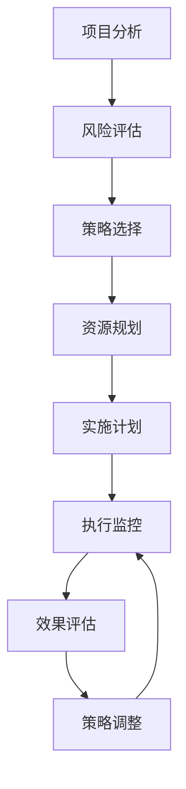

---
tags:
- Knowledge/SoftwareTesting
created: 2025-11-03
author:
- ln1
status: Done
---

# 06-综合测试策略

## 概述

本文档整合了软件测试各个阶段和方法的核心策略，为软件测试实践提供系统性的指导框架。基于前面章节的内容，我们将测试策略分为**预防性策略**、**发现性策略**和**评估性策略**三个层面。

## 1. 软件测试的整体策略框架

### 1.1 测试策略的三个层面

#### 预防性策略（Prevention Strategy）
- **目标**：在缺陷产生之前预防缺陷
- **方法**：[[04-静态测试方法|静态测试]]、需求评审、设计评审
- **时机**：开发生命周期的早期阶段
- **成本效益**：成本最低，效果最好

#### 发现性策略（Detection Strategy）  
- **目标**：尽早发现已存在的缺陷
- **方法**：[[05-动态测试方法|动态测试]]、各种测试技术
- **时机**：开发和测试阶段
- **成本效益**：发现越早，修复成本越低

#### 评估性策略（Assessment Strategy）
- **目标**：评估软件质量和风险
- **方法**：质量度量、风险评估、测试覆盖率分析
- **时机**：整个开发生命周期
- **成本效益**：为决策提供依据

### 1.2 测试策略的选择原则

根据[[03-软件测试实质#1-软件测试的基本原则|软件测试基本原则]]，制定以下策略选择原则：

1. **风险驱动**：优先测试高风险、高影响的功能
2. **成本效益**：平衡测试成本和质量收益
3. **时间约束**：在有限时间内最大化测试价值
4. **技术适配**：选择适合项目特点的测试技术

## 2. 基于开发模式的测试策略

### 2.1 传统开发模式测试策略

#### 瀑布模式测试策略
*参考：[[02-软件开发过程#33-瀑布模式|瀑布模式]]*

**特点**：
- 阶段性明确，测试集中在后期
- 重视文档和规范
- 测试团队相对独立

**测试策略**：
1. **需求阶段**：重点进行需求评审和[[04-静态测试方法#22-需求评审|需求静态测试]]
2. **设计阶段**：设计评审和架构分析
3. **编码阶段**：代码审查和[[04-静态测试方法#通用代码审查清单|静态代码分析]]
4. **测试阶段**：系统性的动态测试

**优势**：测试计划性强，文档完整
**风险**：缺陷发现较晚，修复成本高

#### 螺旋模式测试策略
*参考：[[02-软件开发过程#34-螺旋模式|螺旋模式]]*

**特点**：
- 迭代开发，风险驱动
- 每个循环都包含测试活动

**测试策略**：
1. **风险识别**：每个迭代开始时进行风险评估
2. **原型测试**：对原型进行快速验证
3. **增量测试**：对每个增量进行完整测试
4. **回归测试**：确保新功能不影响已有功能

### 2.2 敏捷开发模式测试策略

#### 敏捷测试核心理念
*参考：[[02-软件开发过程#35-敏捷软件开发|敏捷开发]]和[[03-软件测试实质#61-敏捷测试特征|敏捷测试特征]]*

**核心价值**：
- **持续质量反馈**：敏捷测试 = 持续的质量反馈
- **全员质量责任**：整个团队对测试负责
- **拥抱变化**：适应需求变更

**测试策略**：
1. **测试左移**：
   - 需求评审、设计评审
   - TDD（测试驱动开发）
   - ATDD（验收测试驱动开发）

2. **测试右移**：
   - 在线测试（Test in Production）
   - A/B测试
   - 实时监控和日志分析

3. **持续测试**：
   - 持续集成中的自动化测试
   - 快速反馈机制
   - 探索式测试（ET）

## 3. 基于测试类型的策略选择

### 3.1 静态测试策略

#### 文档测试策略
*参考：[[04-静态测试方法#测试产品说明书的方法|产品说明书测试]]*

**高级审查策略**：
1. **客户视角审查**：假装自己是客户
2. **标准符合性检查**：对照行业标准和规范
3. **同类产品对比**：研究类似软件的质量标准

**属性检查策略**：
- 完整性、准确性、精确性
- 一致性、贴切性、合理性
- 代码无关性、可测试性

#### 代码审查策略
*参考：[[04-静态测试方法#正式审查formal-review|正式审查]]*

**审查类型选择**：
1. **同事审查**：日常代码互查，适用于一般代码
2. **走查**：程序员主导，适用于复杂逻辑说明
3. **检验**：第三方主导，适用于关键代码审查

**工具辅助策略**：
- **Java项目**：CheckStyle + FindBugs + PMD
- **Python项目**：Pycharm + Pyflakes + PEP检查
- **通用**：静态分析工具 + 编码规范检查

### 3.2 动态测试策略

#### 黑盒测试策略选择
*参考：[[05-动态测试方法#动态黑盒测试|动态黑盒测试]]*

**基础策略组合**：
1. **等价类划分** + **边界值分析**：处理输入数据测试
2. **状态测试**：验证软件逻辑流程
3. **场景法**：测试业务流程

**高级策略组合**：
1. **判定表法**：多因素复杂组合
2. **因果图法**：复杂因果关系分析
3. **Pairwise方法**：大幅降低组合数量
4. **正交实验法**：科学的组合选择

#### 白盒测试策略选择
*参考：[[05-动态测试方法#动态白盒测试|动态白盒测试]]*

**覆盖测试策略**：
1. **语句覆盖**：基本要求，确保代码执行
2. **分支覆盖**：中等要求，覆盖决策分支
3. **条件覆盖**：较高要求，覆盖条件组合
4. **路径覆盖**：最高要求，覆盖所有路径

**单元测试策略**：
- **测试驱动开发（TDD）**：先写测试，后写代码
- **代码覆盖率目标**：语句覆盖≥80%，分支覆盖≥70%
- **重点关注**：边界条件、异常处理、内存管理

## 4. 基于项目特征的测试策略

### 4.1 项目规模导向策略

#### 小型项目（<10人月）
**特点**：资源有限，时间紧迫
**策略**：
- 重点：功能测试 + 边界值测试
- 方法：手工测试为主，简单自动化
- 文档：轻量级测试文档

#### 中型项目（10-100人月）
**特点**：团队协作，质量要求较高
**策略**：
- 重点：系统测试 + 集成测试 + 性能测试
- 方法：手工测试 + 自动化测试
- 文档：标准测试文档

#### 大型项目（>100人月）
**特点**：复杂系统，高质量要求
**策略**：
- 重点：全面测试策略，包括安全、性能、可靠性
- 方法：高度自动化，专业测试团队
- 文档：完整的测试管理体系

### 4.2 质量要求导向策略

#### 高可靠性系统（如航空、医疗）
**策略重点**：
- **静态测试**：严格的代码审查和标准符合性检查
- **动态测试**：高覆盖率测试，路径覆盖≥90%
- **专项测试**：故障注入测试、压力测试、长期稳定性测试

#### 高性能系统（如游戏、金融交易）
**策略重点**：
- **性能测试**：负载测试、压力测试、容量测试
- **优化测试**：算法效率测试、内存使用测试
- **并发测试**：多线程测试、竞争条件测试

#### 高安全性系统（如银行、政府）
**策略重点**：
- **安全测试**：渗透测试、漏洞扫描、权限测试
- **数据保护**：加密测试、数据完整性测试
- **合规测试**：法规符合性测试

## 5. 测试策略的实施框架

### 5.1 测试策略制定流程

### 5.2 策略实施的关键要素

#### 5.2.1 人员配置策略
- **测试经理**：制定测试策略，管理测试团队
- **测试设计师**：设计测试用例，选择测试方法
- **测试执行员**：执行测试，记录缺陷
- **自动化工程师**：开发和维护自动化测试

#### 5.2.2 工具选择策略
- **静态分析工具**：代码质量检查
- **测试管理工具**：测试用例管理、缺陷跟踪
- **自动化测试工具**：功能自动化、性能测试
- **持续集成工具**：自动化构建和测试

#### 5.2.3 度量和改进策略
- **过程度量**：测试覆盖率、缺陷发现率、测试效率
- **产品度量**：缺陷密度、可靠性指标、性能指标
- **持续改进**：定期回顾测试策略，根据项目反馈调整

## 6. 常见测试策略模式

### 6.1 V模型测试策略
**适用**：传统瀑布开发
**特点**：每个开发阶段对应相应的测试阶段
**优势**：测试计划性强，可追溯性好

### 6.2 W模型测试策略  
**适用**：重视早期测试的项目
**特点**：测试活动与开发活动并行
**优势**：缺陷发现更早，修复成本更低

### 6.3 H模型测试策略
**适用**：敏捷和迭代开发
**特点**：测试活动独立于开发活动
**优势**：灵活性高，适应变化能力强

## 7. 测试策略的风险管理

### 7.1 常见测试风险
*参考：[[03-软件测试实质#12-软件测试有风险|测试风险]]*

1. **技术风险**：测试技术选择不当、工具不稳定
2. **资源风险**：人员不足、时间不够、环境问题
3. **需求风险**：需求变更频繁、需求不明确
4. **质量风险**：缺陷遗漏、测试覆盖不足

### 7.2 风险应对策略

#### 预防措施
- **技术评估**：选择成熟稳定的测试技术和工具
- **资源规划**：合理估算测试工作量，预留缓冲时间
- **需求管理**：建立需求变更控制流程
- **质量保证**：建立多层次的质量检查机制

#### 应急措施
- **技术替代方案**：准备备选的测试方法和工具
- **资源调配**：建立资源共享和支援机制
- **优先级调整**：根据风险重新调整测试优先级
- **质量标准调整**：在时间压力下适当调整质量标准

## 8. 测试策略的效果评估

### 8.1 评估指标体系

#### 效率指标
- **缺陷发现效率**：单位时间发现的缺陷数量
- **测试执行效率**：测试用例执行速度
- **自动化率**：自动化测试用例占比

#### 效果指标  
- **缺陷发现率**：测试发现的缺陷占总缺陷的比例
- **缺陷逃逸率**：生产环境发现的缺陷比例
- **测试覆盖率**：代码覆盖率、需求覆盖率

#### 成本指标
- **测试成本占比**：测试成本占项目总成本的比例
- **缺陷修复成本**：不同阶段发现缺陷的修复成本
- **ROI**：测试投资回报率

### 8.2 持续改进机制

1. **定期评估**：每个项目结束后进行测试策略评估
2. **经验总结**：收集和分析测试过程中的经验教训
3. **最佳实践**：识别和推广有效的测试策略
4. **培训提升**：根据评估结果进行针对性培训

## 9. PDF重点补充：测试用例和配置管理

### 9.1 测试用例详解

**测试用例定义**：测试用例通常是指对一项特定的软件产品进行测试任务的描述，体现测试方案、方法、技术和策略。其内容包括测试目标、测试环境、输入数据、测试步骤、预期结果、测试脚本等，并形成文档。测试用例是为某个特殊目标而编制的一组测试输入、执行条件及预期结果，以便测试某个程序路径或核实是否满足某个特定需求。

### 9.2 测试实施前的确定事项

测试实施前应确定：
- 需要进行哪些测试内容
- 测试时间计划
- 测试的软硬件环境
- 测试方法和测试工具

### 9.3 配置管理

**测试资产**：被质量保证或测试团队开发的任何一种工作产品。

**配置管理和变更管理的任务**：管理谁变更了资产，以及何时变更了资产和为什么变更资产。此外，配置管理支持追踪工作产品的版本，创造和重新产生产品基线，并且支持并行的和多地域的开发。

## 10. PDF重点：自动化测试

### 10.1 自动化测试产生背景

**手工测试的局限性**：
1. 以往的测试无法做到覆盖所有代码路径
2. 简单的功能性测试用例在每一轮测试中都不能少，而且具有一定的机械性、重复性
3. 工作量往往较大
4. 许多与时序、死锁、资源冲突、多线程等有关的错误，通过手工测试很难捕捉到
5. 进行系统负载、性能测试时，需要模拟大量数据或大量并发用户等各种应用场合时，很难通过手工测试来进行
6. 难以进行长时间的可靠性测试

### 10.2 自动化测试优点

1. **回归测试方便**，缩短了软件测试周期
2. **能够执行繁琐的程序测试**，效率高
3. **测试覆盖率高**
4. **测试的一致性好**，具有可重复性
5. **测试的稳定性和可靠性高**
6. **能够执行手工无法做的测试工作**
7. **节省了人力资源**，降低了测试成本

### 10.3 自动化测试适用场合

**适合做自动化测试的系统或场合**：
- 单元测试、集成测试
- 协议或接口相关的功能测试
- 负载压力测试、性能测试
- 系统稳定性和可靠性测试
- 测试过程烦琐、执行动作很多的软件

**不适合做自动化测试的系统或场合**：
- 逻辑测试、验收测试、适应性测试、涉及到物理交互的测试
- 系统业务逻辑和交互过于复杂
- 需求频繁变动，稳定性不好的软件
- 开发周期很短的软件
- 一次性开发的软件

### 10.4 自动化测试原理和方法

**1. 代码分析——白盒测试方法**
- 分析被测对象就是对其代码进行语法扫描，找出不符合编码规则的地方
- 根据质量模型评价代码质量，生成系统的调用关系图

**2. 录制和回放——黑盒测试方法**
- **录制**：将用户的每一步操作都记录下来，并转换成脚本语言，描述运行过程和用户的操作
- **回放**：将脚本语言的描述转换为屏幕上的操作，然后将被测系统的输出与预期结果进行比较
- **关键点**：对象识别，获得类别、名称和属性值

**3. 脚本技术**
- 脚本是一种特殊的计算机程序，包含了数据和指令
- 脚本技术是围绕脚本程序的结构而进行的设计，可以实现测试用例所要求的数据输入、操作流程和验证点

**4. 对象识别技术**
- 按照屏幕的实际像素坐标来定位
- 通过寻找UI上的对象（如窗口、按钮、滚动条等）来确定操作的目标，也叫控件识别
- 通过图像识别算法对图片进行图像匹配和文字识别

**5. 虚拟用户技术**
- 通过模拟真实用户的数量和操作行为，对被测程序施加负载
- 以测量系统的性能指标，包括响应时间和吞吐量等

**6. 自动比较**
- 静态比较和动态比较
- 简单比较和复杂比较
- 敏感性测试比较和健壮性测试比较
- 比较过滤器

### 10.5 自动化测试脚本类型

**1. 线性脚本**
- 录制手工测试获得的脚本
- 录制动作有击键、移动、输入数据等

**2. 结构化脚本**
- 具有各种逻辑结构，包括选择、分支、循环迭代
- 还有函数调用功能

**3. 共享脚本**
- 可以被多个测试用例使用的脚本
- 允许其他脚本调用

**4. 数据驱动脚本**
- 将测试的输入存储在独立的数据文件中，而不是存储在脚本中
- 可以针对不同数据输入实现多个测试用例

**5. 关键字驱动脚本**
- 数据驱动脚本的逻辑扩展
- 将数据文件变成测试用例的描述，采用一些关键字指定要执行的任务

### 10.6 Mike Cohn测试金字塔模型

**软件产品需要最多的是单元测试，其次是接口测试，最后是UI（User Interface，界面）测试**

**在软件测试金字塔模型中**：
- 越往上需要集成得越多，修复缺陷的速度越慢，消耗的成本越高
- 越往下需要集成得越少，修复缺陷的速度越快，消耗的成本越低

**Google版本的软件测试金字塔模型**：
- 单元测试为小型测试
- 接口测试为中型测试
- UI测试为大型测试

## 总结

综合测试策略的制定需要考虑多个维度：

1. **开发模式适配**：根据瀑布、螺旋、敏捷等不同开发模式选择相应的测试策略
2. **技术方法组合**：静态测试与动态测试、黑盒测试与白盒测试的有机结合
3. **项目特征匹配**：根据项目规模、质量要求、风险等级选择合适的策略
4. **资源约束平衡**：在时间、人员、成本约束下优化测试策略
5. **持续改进**：建立测试策略的评估和改进机制

成功的测试策略不是一成不变的，而是需要根据项目实际情况和反馈不断调整和优化的动态过程。

---

**相关链接**：
- [[01-软件测试背景与概念]] - 理解测试的基本概念和缺陷成本
- [[02-软件开发过程]] - 了解不同开发模式下的测试策略
- [[03-软件测试实质]] - 掌握测试的基本原则和理念
- [[04-静态测试方法]] - 学习静态测试的具体策略
- [[05-动态测试方法]] - 掌握动态测试的各种技术

**重点概念标签**：
#测试策略 #风险管理 #质量保证 #测试规划 #持续改进 #敏捷测试 #测试左移 #测试右移